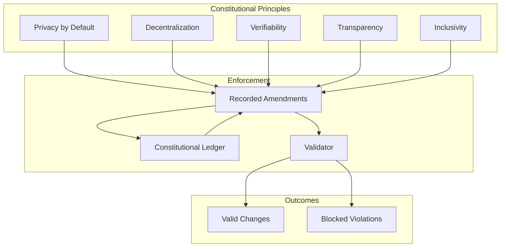
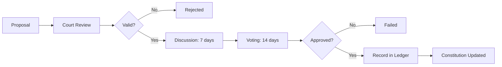

===== FILE ADDED: constitution/constitution.md =====

The Constitution of the ZK-5D Cryptographic Badge Authority

Preamble

We, the stewards of the ZK-5D Cryptographic Badge Authority, establish this Constitution to ensure the integrity, security, and governance of our decentralized credentialing ecosystem. This Constitution is immutable, self-amending, and binding on all participants.

---

Article I: Mission

The mission of the ZK-5D Cryptographic Badge Authority is to provide a decentralized, privacy-preserving credentialing system that:

1. Verifies developer contributions without revealing sensitive data
2. Empowers communities through transparent, auditable governance
3. Protects individual privacy through zero-knowledge cryptography
4. Ensures immutability through blockchain-based state storage
5. Enables innovation through open, accessible infrastructure

---

Article II: Core Values

2.1 Privacy by Default

All badge claims must be verifiable without revealing:

· Exact contribution counts
· Private keys or identities
· Behavioral patterns
· Personally identifiable information

Constitutional Guarantee: No badge proof shall require disclosure of private data.

2.2 Decentralization

No single entity may control:

· Badge issuance
· Governance decisions
· Protocol upgrades
· Data access

Constitutional Guarantee: Authority is distributed across token holders, council, and automated systems.

2.3 Verifiability

Every badge must be:

· Cryptographically provable
· On-chain verifiable
· Time-stamped
· Non-repudiable

Constitutional Guarantee: All badge claims are independently verifiable by any third party.

2.4 Transparency

All governance actions must be:

· Publicly recorded
· Time-stamped
· Auditable
· Explainable

Constitutional Guarantee: Every governance decision is recorded in the immutable memory ledger.

2.5 Inclusivity

The system must:

· Be accessible to all developers
· Have clear, simple participation rules
· Prevent discrimination
· Enable broad community input

---

Article III: Rights

3.1 Right to Privacy

All participants have the right to:

· Prove contributions without revealing details
· Control their own private keys
· Opt out of data collection
· Anonymity in badge claims

3.2 Right to Participate

All participants have the right to:

· Submit governance proposals
· Vote on proposals (with token weight)
· Earn badges through legitimate contributions
· Appeal badge revocations

3.3 Right to Audit

All participants have the right to:

· Inspect the codebase
· Verify ZK circuits
· Audit on-chain state
· Challenge governance decisions

3.4 Right to Exit

All participants have the right to:

· Cease participation at any time
· Revoke permissions
· Withdraw assets
· Fork the system

---

Article IV: Responsibilities

4.1 Core Team Responsibilities

The core team must:

· Maintain codebase security
· Respond to vulnerabilities within 72 hours
· Provide clear documentation
· Facilitate governance processes
· Execute approved protocol upgrades

4.2 Community Responsibilities

Community members must:

· Participate constructively
· Respect privacy of others
· Report vulnerabilities responsibly
· Follow Code of Conduct
· Engage in good-faith governance

4.3 Validator Responsibilities

Validators must:

· Process transactions honestly
· Maintain network uptime
· Verify proofs correctly
· Vote in governance based on protocol rules

---

Article V: Governance Structure

5.1 Constitutional Court (AI)

An automated Constitutional Court validates:

· All governance proposals against constitutional principles
· Badge schemas for privacy guarantees
· ZK circuits for integrity
· Solana programs for invariants

The Court is deterministic, auditable, and cannot be overridden by human vote.

5.2 Community Council

5-member elected council:

· 12-month terms
· Handles dispute resolution
· Can veto proposals with 4/5 majority
· Subject to constitutional review

5.3 Token Holders

All $DIGITAL token holders:

· Vote on governance proposals
· Elect council members
· Participate in emergency actions
· Subject to constitutional voting rules

5.4 AI Stewards

AI systems have limited authority:

· Generate proposals (require human approval)
· Detect drift (alert only)
· Simulate impacts (advisory)
· Enforce constitutional rules (automatic)

---

Article VI: Amendment Process

6.1 Proposal Requirements

Constitutional amendments require:

· Formal proposal with rationale
· Impact analysis
· Constitutional court review
· 7-day discussion period
· 14-day voting period

6.2 Approval Threshold

· Simple Amendments: 66% approval, 40% quorum
· Core Principle Changes: 75% approval, 50% quorum
· Privacy Guarantees: 80% approval, 60% quorum

6.3 Amendment Recording

All amendments must be:

· Recorded in constitutional ledger
· Cryptographically hashed
· Time-stamped
· Immutable

---

Article VII: Authority Boundaries

7.1 Human Authority

Humans may NOT:

· Override cryptographic proofs
· Access private keys
· Modify memory ledger
· Bypass governance

7.2 AI Authority

AI systems may NOT:

· Execute code without approval
· Modify governance rules
· Access production secrets
· Deploy without human review

7.3 Smart Contract Authority

Smart contracts may NOT:

· Issue badges without proofs
· Bypass governance votes
· Modify constitutional rules
· Access off-chain data without verification

---

Article VIII: Safety Guarantees

8.1 Cryptographic Safety

· All proofs are zero-knowledge
· Circuits are audited
· Keys are securely stored
· No private data leakage

8.2 Economic Safety

· No inflationary issuance without vote
· All transactions have fees
· Anti-spam mechanisms
· Rate limiting

8.3 Operational Safety

· Graceful degradation
· Emergency pause mechanism
· Multi-sig recovery
· Audit trails

---

Article IX: Auditability Guarantees

9.1 Code Audit

All code must be:

· Publicly available
· Version controlled
· Signed by maintainers
· Audited before major releases

9.2 Transaction Audit

All transactions must be:

· On-chain
· Traceable
· Non-repudiable
· Time-stamped

9.3 Governance Audit

All governance actions must be:

· Recorded in memory ledger
· Linked to proposal
· Time-stamped
· Immutable

---

Article X: Badge Schema Guarantees

10.1 Privacy Guarantee

Badge schemas must:

· Not require private data disclosure
· Use ZK proofs for verification
· Preserve contributor anonymity

10.2 Fairness Guarantee

Badge criteria must:

· Be objective
· Be measurable
· Not discriminate
· Be publicly documented

10.3 Immutability Guarantee

Issued badges:

· Cannot be altered
· Can only be revoked through governance
· Are cryptographically bound to recipient
· Are permanently on-chain

---

Article XI: ZK Integrity Guarantees

11.1 Circuit Integrity

All circuits must:

· Be open source
· Be audited
· Produce deterministic proofs
· Be versioned

11.2 Trusted Setup

All trusted setups must:

· Have at least 3 participants
· Be publicly verifiable
· Use ceremony transcripts
· Be cryptographically sound

11.3 Proof Verification

All proofs must be:

· Verifiable by anyone
· Non-interactive
· Succinct
· Binding

---

Article XII: Solana Invariants

12.1 Account Invariants

· Badge accounts are immutable after issuance
· Only authority can revoke
· Accounts are rent-exempt
· Data is Borsh-serialized

12.2 Program Invariants

· Entrypoint is verified
· Signer checks on all mutations
· Account ownership validated
· No unchecked arithmetic

12.3 Upgrade Invariants

· Upgrades require multi-sig
· Data migrations are explicit
· Buffer accounts validated
· No state loss on upgrade

---

Article XIII: GitHub App Permission Invariants

13.1 Permission Minimums

· Metadata read: required
· Pull requests: read/write
· Issues: read/write
· Contents: read-only

13.2 Webhook Security

· All webhooks verified with HMAC
· IP whitelisting enabled
· Rate limits enforced
· Payload validation

13.3 Installation Invariants

· Permissions checked on install
· Tokens rotated quarterly
· Installation records stored
· Uninstall triggers cleanup

---

Article XIV: Constitutional Enforcement

14.1 Automated Enforcement

The Constitutional Court automatically:

· Validates proposals
· Checks code changes
· Verifies proofs
· Enforces invariants

14.2 Human Override

Overrides require:

· 5/7 multi-sig from core team
· 7-day notice period
· Full audit trail
· Council approval

14.3 Penalties

Constitutional violations result in:

· Automatic proposal rejection
· Badge revocation (if applicable)
· Governance suspension (temporary)
· Audit escalation

---

Article XV: Ratification

This Constitution takes effect upon:

1. Ratification by token holder vote (≥66% approval)
2. Signing by all core team members
3. Deployment of Constitutional Court
4. Initial ledger entry

Ratified: [Date]
Constitutional Version: 1.0.0

---

Signatories

The original signatories attest to the principles and rules contained herein.

Role Signature Date
Core Team Lead [Cryptographic Signature] 
Council Chair [Cryptographic Signature] 
Security Auditor [Cryptographic Signature] 
Community Representative [Cryptographic Signature] 

---

This Constitution is immutable. Amendments are recorded in the Constitutional Ledger.

===== FILE ADDED: constitution/validator.ts =====
/**

· Constitutional Court (Validator)
· 
· Validates all changes against constitutional principles.
  */

import * as fs from 'fs';
import * as path from 'path';
import * as yaml from 'js-yaml';
import { createHash } from 'crypto';

export interface ValidationResult {
valid: boolean;
violations: Violation[];
score: number;
recommendations: string[];
}

export interface Violation {
article: string;
principle: string;
description: string;
severity: 'critical' | 'high' | 'medium' | 'low';
remediation: string;
}

export class ConstitutionalValidator {
private rootDir: string;
private constitution: any;

constructor() {
this.rootDir = path.resolve(__dirname, '..');
this.loadConstitution();
}

private loadConstitution(): void {
const constitutionPath = path.join(this.rootDir, 'constitution/constitution.md');
if (fs.existsSync(constitutionPath)) {
// Parse constitution for principles (simplified - in production would parse markdown)
this.constitution = { version: '1.0.0', articles: {} };
}
}

async validateProposal(proposal: any): Promise<ValidationResult> {
const violations: Violation[] = [];

}

private validateBadgeSchema(data: any, violations: Violation[]): void {
// Article X.1: Privacy Guarantee
if (data.requiresProof === false && data.type !== 'community') {
violations.push({
article: 'X.1',
principle: 'Privacy Guarantee',
description: 'Badge must require ZK proof to preserve privacy',
severity: 'critical',
remediation: 'Set requires_proof: true'
});
}

}

private validateZKCircuit(data: any, violations: Violation[]): void {
// Article XI.1: Circuit Integrity
if (!data.circuitName) {
violations.push({
article: 'XI.1',
principle: 'Circuit Integrity',
description: 'Circuit must have a name and be versioned',
severity: 'high',
remediation: 'Add circuit name and version metadata'
});
}

}

private validateSolanaProgram(data: any, violations: Violation[]): void {
// Article XII.1: Account Invariants
if (data.accountLayoutChanged && !data.migrationPlanned) {
violations.push({
article: 'XII.1',
principle: 'Account Invariants',
description: 'Account layout changes require explicit migration plan',
severity: 'critical',
remediation: 'Create and test account migration script'
});
}

}

private validateGitHubApp(data: any, violations: Violation[]): void {
// Article XIII.1: Permission Minimums
const requiredPermissions = ['metadata', 'pull_requests', 'issues'];
for (const perm of requiredPermissions) {
if (!data.permissions[perm] || data.permissions[perm] === 'none') {
violations.push({
article: 'XIII.1',
principle: 'Permission Minimums',
description: Missing required permission: ${perm},
severity: 'critical',
remediation: Add "${perm}" permission with at least "read" level
});
}
}

}

private validateGovernance(data: any, violations: Violation[]): void {
// Article V: Governance Structure
if (data.thresholdChange && data.newThreshold > 0.8) {
violations.push({
article: 'V',
principle: 'Governance Structure',
description: 'Threshold > 80% may be unreachable',
severity: 'medium',
remediation: 'Consider lower threshold or longer voting period'
});
}

}

private calculateScore(violations: Violation[]): number {
let score = 100;
for (const v of violations) {
if (v.severity === 'critical') score -= 30;
else if (v.severity === 'high') score -= 15;
else if (v.severity === 'medium') score -= 5;
else score -= 2;
}
return Math.max(0, score);
}

private generateRecommendations(violations: Violation[]): string[] {
const recommendations: string[] = [];

}

async validateCodeChange(filePath: string, diff: string): Promise<ValidationResult> {
const violations: Violation[] = [];

}

formatValidation(result: ValidationResult): string {
let output = '# Constitutional Court Ruling\n\n';

}
}

===== FILE ADDED: constitution/ledger.ts =====
/**

· Constitutional Ledger
· 
· Append-only, cryptographically hashed ledger of constitutional events.
  */

import * as fs from 'fs';
import * as path from 'path';
import { createHash } from 'crypto';

export interface ConstitutionalEvent {
id: string;
type: 'amendment' | 'interpretation' | 'violation' | 'ruling' | 'ratification';
timestamp: number;
description: string;
article?: string;
data: any;
previousHash: string;
hash: string;
signature?: string;
}

export interface ConstitutionalSnapshot {
timestamp: number;
version: string;
events: ConstitutionalEvent[];
hash: string;
previousSnapshotHash?: string;
}

export class ConstitutionalLedger {
private rootDir: string;
private ledgerPath: string;
private snapshotsPath: string;
private events: ConstitutionalEvent[] = [];
private lastHash: string = '';

constructor() {
this.rootDir = path.resolve(__dirname, '..');
this.ledgerPath = path.join(this.rootDir, 'constitution/ledger.json');
this.snapshotsPath = path.join(this.rootDir, 'constitution/snapshots');
this.loadLedger();
}

private loadLedger(): void {
if (fs.existsSync(this.ledgerPath)) {
const data = fs.readFileSync(this.ledgerPath, 'utf8');
this.events = JSON.parse(data);
if (this.events.length > 0) {
this.lastHash = this.events[this.events.length - 1].hash;
}
}
}

private saveLedger(): void {
fs.writeFileSync(this.ledgerPath, JSON.stringify(this.events, null, 2));
}

private computeHash(event: Omit<ConstitutionalEvent, 'hash'>, previousHash: string): string {
const data = JSON.stringify({
event,
previousHash,
timestamp: event.timestamp
});
return createHash('sha256').update(data).digest('hex');
}

record(event: Omit<ConstitutionalEvent, 'hash' | 'previousHash'>): ConstitutionalEvent {
const timestamp = event.timestamp || Date.now();
const fullEvent: Omit<ConstitutionalEvent, 'hash'> = {
...event,
timestamp,
previousHash: this.lastHash
};

}

private createSnapshot(): void {
const snapshot: ConstitutionalSnapshot = {
timestamp: Date.now(),
version: this.getCurrentVersion(),
events: [...this.events],
hash: this.lastHash,
previousSnapshotHash: this.getLastSnapshotHash()
};

}

private getCurrentVersion(): string {
try {
const pkg = JSON.parse(fs.readFileSync(path.join(this.rootDir, 'package.json'), 'utf8'));
return pkg.version;
} catch {
return '0.0.0';
}
}

private getLastSnapshotHash(): string {
if (!fs.existsSync(this.snapshotsPath)) return '';
const snapshots = fs.readdirSync(this.snapshotsPath)
.filter(f => f.startsWith('snapshot-'))
.sort()
.reverse();

}

verifyIntegrity(): boolean {
let currentHash = '';
for (let i = 0; i < this.events.length; i++) {
const entry = this.events[i];
const { hash, ...eventWithoutHash } = entry;
const computedHash = this.computeHash(eventWithoutHash, entry.previousHash);
if (computedHash !== hash) {
console.error(Constitutional integrity violation at index ${i});
return false;
}
if (entry.previousHash !== currentHash) {
console.error(Constitutional chain broken at index ${i});
return false;
}
currentHash = hash;
}
return true;
}

getAmendments(): ConstitutionalEvent[] {
return this.events.filter(e => e.type === 'amendment');
}

getViolations(): ConstitutionalEvent[] {
return this.events.filter(e => e.type === 'violation');
}

getRulings(): ConstitutionalEvent[] {
return this.events.filter(e => e.type === 'ruling');
}

getAllEvents(): ConstitutionalEvent[] {
return [...this.events];
}

export(format: 'json' | 'csv'): string {
if (format === 'json') {
return JSON.stringify(this.events, null, 2);
} else {
const headers = ['timestamp', 'type', 'description', 'article', 'hash'];
const rows = this.events.map(e => [
new Date(e.timestamp).toISOString(),
e.type,
e.description,
e.article || '',
e.hash
]);
return [headers, ...rows].map(row => row.join(',')).join('\n');
}
}
}

===== FILE ADDED: .github/workflows/constitution-check.yml =====
name: Constitutional Check

on:
pull_request:
types: [opened, synchronize]
push:
branches: [main]
workflow_dispatch:

jobs:
validate:
runs-on: ubuntu-latest
steps:
- uses: actions/checkout@v3
with:
fetch-depth: 0

===== FILE ADDED: .github/workflows/constitution-amendment.yml =====
name: Constitutional Amendment

on:
pull_request:
paths:
- 'constitution/constitution.md'
workflow_dispatch:

jobs:
amend:
runs-on: ubuntu-latest
steps:
- uses: actions/checkout@v3
with:
fetch-depth: 0

===== FILE ADDED: docs/constitution/overview.md =====

Ecosystem Constitution

Overview

The Constitution of the ZK-5D Cryptographic Badge Authority is the supreme governing document of the ecosystem. It establishes immutable principles, rights, responsibilities, and guarantees that cannot be violated by any actor—human or machine.

Core Principles



Constitutional Hierarchy

Level Document Mutability
1 Constitution Amendment only (66% approval)
2 Governance Rules 60% approval
3 Badge Schemas 50% approval
4 Technical Implementation PR review

Key Articles

Article I: Mission

Decentralized, privacy-preserving credentialing system.

Article II: Core Values

Privacy, decentralization, verifiability, transparency, inclusivity.

Article III: Rights

Right to privacy, participation, audit, and exit.

Article IV: Responsibilities

Core team, community, and validator obligations.

Article V: Governance Structure

Constitutional Court, Community Council, Token Holders, AI Stewards.

Article VI: Amendment Process

Formal proposal, impact analysis, court review, discussion, voting.

Article VII: Authority Boundaries

Limits on human, AI, and smart contract authority.

Article VIII: Safety Guarantees

Cryptographic, economic, and operational safety.

Article IX: Auditability Guarantees

Code, transaction, and governance audit trails.

Article X: Badge Schema Guarantees

Privacy, fairness, immutability.

Article XI: ZK Integrity Guarantees

Circuit integrity, trusted setup, proof verification.

Article XII: Solana Invariants

Account, program, and upgrade invariants.

Article XIII: GitHub App Invariants

Permission minimums, webhook security, installation invariants.

Constitutional Court

The Constitutional Court is an automated validator that:

· Reviews all governance proposals
· Checks badge schemas for compliance
· Validates ZK circuit changes
· Enforces Solana invariants
· Verifies GitHub App permissions

Authority: The Court's rulings are final and binding. Overrides require constitutional amendment.

Constitutional Ledger

An append-only, cryptographically hashed ledger recording:

· Constitutional amendments
· Court interpretations
· Violations
· Rulings
· Ratifications

Properties:

· Immutable
· Time-stamped
· Verifiable
· Auditable

Amendment Process



Enforcement

Automatic

· Code changes blocked if unconstitutional
· Proposals rejected if unconstitutional
· Violations recorded in ledger

Human Override

· Requires 5/7 multi-sig
· 7-day notice
· Full audit trail
· Council approval

Constitutional Score

Each change receives a Constitutional Score (0-100):

· 100-80: Fully constitutional
· 79-60: Minor concerns, recommended fixes
· 59-40: Significant concerns, likely violation
· <40: Unconstitutional, will be rejected

Examples

Constitutional (Valid)

```
Badge Schema: First Contributor
- Requires ZK proof ✓
- Objective criteria (min_merged_prs: 1) ✓
- Permanent lifetime ✓
Score: 100
```

Unconstitutional (Invalid)

```
Badge Schema: VIP Contributor
- No proof required ✗ (violates Article X.1)
- Subjective criteria ✗ (violates Article X.2)
Score: 40 - UNCONSTITUTIONAL
```

Appeals

Decisions can be appealed via:

1. New evidence submission
2. Constitutional amendment (if rule flaw)
3. Council review (for interpretation disputes)

Violations

Constitutional violations result in:

· Automatic rejection of proposal/PR
· Recording in constitutional ledger
· Notification to community
· Potential badge revocation (if applicable)

Relationship to Other Systems

System Relationship
Governance AI Enforces constitutional rules
Simulation Predicts constitutional impact
Memory Records constitutional events
Maintenance Ensures constitutional compliance
