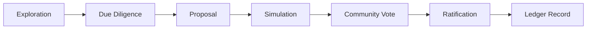
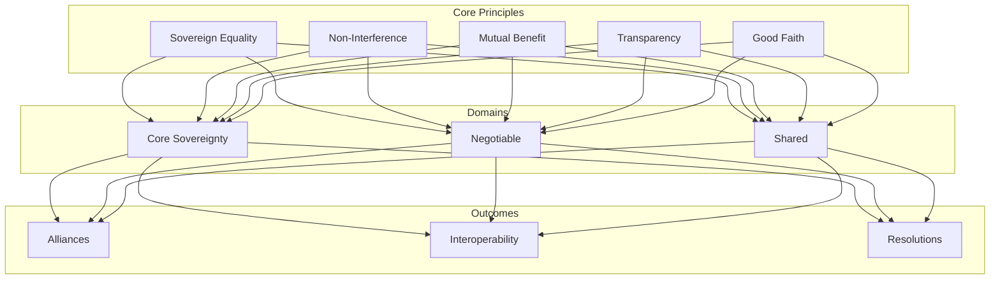
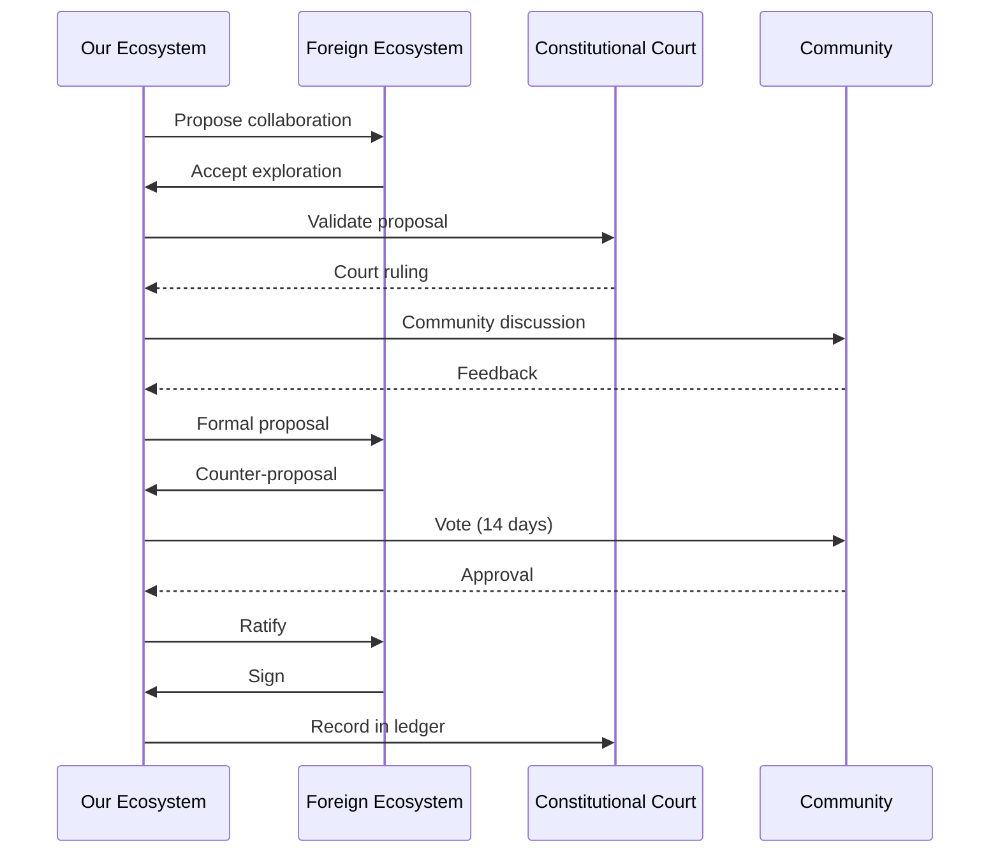

===== FILE ADDED: diplomacy/charter.md =====

Diplomacy Charter of the ZK-5D Cryptographic Badge Authority

Preamble

We, the stewards of the ZK-5D Cryptographic Badge Authority, establish this Diplomacy Charter to define our relationships with other ecosystems, protocols, governance systems, and communities. We believe in collaboration over competition, interoperability over isolation, and shared standards over proprietary walls.

---

Article I: Diplomatic Principles

1.1 Sovereign Equality

All ecosystems are sovereign within their domains. We respect the autonomy of other systems and expect the same in return.

1.2 Non-Interference

We do not interfere with the internal governance of other ecosystems. We do not accept interference in our own.

1.3 Mutual Benefit

All agreements must benefit both parties. No agreement is signed that harms our ecosystem or compromises our constitutional values.

1.4 Transparency

All diplomatic agreements are public, auditable, and recorded in the Diplomatic Ledger.

1.5 Good Faith

We assume good faith in all interactions. Disputes are resolved through established protocols, not escalation.

---

Article II: Sovereignty Boundaries

2.1 Core Sovereignty

The following are non-negotiable and cannot be compromised by any agreement:

· Constitutional principles (Article I-XV of Constitution)
· Privacy guarantees (ZK proofs required)
· Badge immutability (on-chain, append-only)
· Governance autonomy (our rules, our process)
· Identity control (users own their data)

2.2 Negotiable Domains

The following may be negotiated in good faith:

· Badge schema exchange formats
· ZK proof verification standards
· Solana program interfaces
· Cultural artifact sharing
· Governance rule exchange

2.3 Shared Domains

The following are open for collaboration:

· Interoperability standards
· Shared badge families
· Common ZK circuits
· Cultural exchange
· Security coordination

---

Article III: Interoperability Values

3.1 Open Standards

We develop and adopt open, documented, royalty-free standards for:

· Badge data formats
· ZK proof serialization
· Solana account layouts
· Governance rule schemas

3.2 Verified Trust

Trust is established through:

· Cryptographic proofs
· Public verification
· Auditable code
· Governance alignment

3.3 Gradual Integration

Interoperability is built incrementally:

1. Information exchange
2. Proof verification
3. Trusted relays
4. Shared validation
5. Full interoperability

---

Article IV: Cross-Ecosystem Safety Guarantees

4.1 No Data Leakage

Cross-ecosystem interactions must not leak:

· Private keys
· User identities
· Contribution details
· Behavioral patterns

4.2 No Privilege Escalation

Foreign systems cannot gain elevated permissions within our ecosystem.

4.3 No Governance Bypass

Interoperability cannot bypass our governance processes.

4.4 Economic Safety

Cross-ecosystem transactions must not create:

· Inflation risks
· Sybil attacks
· Economic manipulation

4.5 Cryptographic Safety

All cross-ecosystem proofs must be:

· Independently verifiable
· Zero-knowledge
· Non-interactive
· Binding

---

Article V: Collaboration Protocols

5.1 Treaty Formation

1. Proposal – Formal treaty draft
2. Review – Constitutional Court validation
3. Discussion – 14-day community period
4. Vote – Token holder approval (66%)
5. Ratification – Multi-sig signing
6. Recording – Diplomatic Ledger entry

5.2 Technical Collaboration

1. Discovery – Identify shared need
2. Specification – Draft shared standard
3. Simulation – Test interoperability
4. Implementation – Deploy in parallel
5. Verification – Validate cross-ecosystem
6. Adoption – Promote to standard

5.3 Cultural Exchange

1. Sharing – Propose artifact sharing
2. Adaptation – Adapt to local context
3. Attribution – Acknowledge origin
4. Celebration – Joint announcement

---

Article VI: Conflict-Avoidance Rules

6.1 Schema Conflicts

When badge schemas conflict:

1. Identify – Detect overlapping definitions
2. Negotiate – Discuss resolution
3. Standardize – Adopt common format
4. Delegate – Ecosystem-specific extensions

6.2 Governance Conflicts

When governance rules conflict:

1. Isolate – Separate governance domains
2. Bridge – Trusted relay for cross-ecosystem actions
3. Respect – Each ecosystem's internal rules
4. Avoid – No governance imposition

6.3 Identity Conflicts

When identities overlap:

1. Distinguish – Namespace with ecosystem ID
2. Verify – Cryptographic binding to source
3. Respect – Original ecosystem's identity rules
4. Delegate – Local identity resolution

---

Article VII: Alliance Framework

7.1 Alliance Formation

Alliances require:

· Shared values alignment
· Mutual benefit demonstration
· Constitutional compatibility
· Community approval (66% vote)

7.2 Alliance Governance

Alliances are governed by:

· Joint council (equal representation)
· Dispute resolution protocol
· Exit clause (30-day notice)
· Annual review

7.3 Alliance Benefits

Alliances may include:

· Shared badge families
· Cross-verification
· Joint events
· Cultural exchange
· Security coordination

---

Article VIII: Diplomatic Ledger

8.1 Recorded Events

The Diplomatic Ledger records:

· Treaties signed
· Alliances formed
· Standards adopted
· Disputes resolved
· Cultural exchanges

8.2 Ledger Properties

· Append-only
· Cryptographically hashed
· Time-stamped
· Publicly readable
· Immutable

---

Article IX: Governance Bridge

9.1 Import Rules

Foreign governance rules may be imported if:

· Compatible with Constitution
· Verified by Constitutional Court
· Adopted through governance vote
· Recorded in Diplomatic Ledger

9.2 Export Rules

Our governance rules may be exported if:

· Requested by foreign ecosystem
· Verified for compatibility
· Permitted by community vote
· Recorded in Diplomatic Ledger

9.3 Validation

All foreign rules are validated for:

· Constitutional alignment
· Security implications
· Privacy guarantees
· Sovereignty respect

---

Article X: Amendments

10.1 Amendment Process

This Charter may be amended by:

1. Formal proposal
2. Constitutional Court review
3. 21-day discussion period
4. 14-day voting period
5. 75% approval required
6. Multi-sig ratification

10.2 Emergency Amendments

Emergency amendments allowed for:

· Security threats
· Critical interoperability
· Time-sensitive coordination
· Requires 90% approval

---

Article XI: Ratification

This Charter takes effect upon:

1. Constitutional Court validation
2. Token holder vote (66% approval)
3. Multi-sig signing
4. Diplomatic Ledger entry

Ratified: [Date]
Charter Version: 1.0.0

---

Signatories

Role Signature Date
Core Team Lead [Signature] 
Council Chair [Signature] 
Diplomatic Representative [Signature] 
Constitutional Court [Signature] 

---

This Charter is binding. All diplomatic relations governed by its principles.

===== FILE ADDED: diplomacy/interoperability.md =====

Interoperability Protocols

Overview

Interoperability protocols define how the ZK-5D ecosystem exchanges data, proofs, and governance with other systems while preserving constitutional guarantees.

---

Badge Interoperability

Badge Exchange Format

```json
{
  "version": "1.0",
  "ecosystem": "zk-5d",
  "badge": {
    "id": "first-contributor-github:alice-1234567890",
    "type": "contribution",
    "level": "bronze",
    "issuedTo": "did:github:alice",
    "issuedAt": 1234567890,
    "expiresAt": null,
    "proof": {
      "type": "groth16",
      "curve": "bn128",
      "hash": "0xabc123...",
      "verificationKey": "https://zkbadge.io/keys/badgeProof.vk"
    },
    "metadata": {
      "repository": "owner/repo",
      "contributions": {
        "mergedPRs": 1
      }
    }
  },
  "signature": "0xdef456..."
}
```

Verification Protocol

1. Fetch Badge Data – Retrieve from source ecosystem
2. Verify Proof – Validate ZK proof with public key
3. Check Revocation – Query source revocation registry
4. Verify Issuer – Validate ecosystem signature
5. Accept – If all checks pass

---

ZK Proof Interoperability

Common Proof Format

```json
{
  "version": "1.0",
  "type": "groth16",
  "curve": "bn128",
  "circuit": "badgeProof",
  "publicInputs": ["userId", "threshold"],
  "publicOutputs": ["valid"],
  "proof": {
    "pi_a": ["0x...", "0x..."],
    "pi_b": [["0x...", "0x..."], ["0x...", "0x..."]],
    "pi_c": ["0x...", "0x..."],
    "protocol": "groth16"
  },
  "verificationKey": "https://ecosystem.io/keys/badgeProof.vk"
}
```

Shared Circuit Registry

Circuit Ecosystem Version Compatible
identity zk-5d 1.0 ✅
badgeProof zk-5d 1.0 ✅
revocation zk-5d 1.0 ✅
identity solana-badges 1.0 🔄 in progress

---

Solana Program Interoperability

Instruction Mapping

Our Instruction Foreign Instruction Mapping
issue_badge create_badge 1:1 compatible
revoke_badge delete_badge 1:1 compatible
verify_badge check_badge 1:1 compatible

Account Layout Compatibility

```rust
// Our account layout
pub struct BadgeAccount {
    pub badge: Option<BadgeData>,
    pub authority: Pubkey,
    pub issued_at: i64,
    pub revoked: bool,
}

// Compatible foreign layout
pub struct ForeignBadgeAccount {
    pub data: BadgeData,
    pub owner: Pubkey,
    pub timestamp: i64,
    pub is_revoked: bool,
}
```

Bridge Program

```rust
pub fn bridge_instruction(
    program_id: &Pubkey,
    accounts: &[AccountInfo],
    foreign_instruction: Vec<u8>,
) -> ProgramResult {
    // Decode foreign instruction
    // Validate safety constraints
    // Execute local equivalent
    // Return result
}
```

---

GitHub App Event Federation

Event Format

```json
{
  "ecosystem": "zk-5d",
  "event": "pull_request.merged",
  "timestamp": 1234567890,
  "data": {
    "user": "github:alice",
    "repository": "owner/repo",
    "pr_number": 42,
    "merged_at": 1234567890
  },
  "signature": "0xabc123..."
}
```

Federation Protocol

1. Subscribe – Choose events to receive
2. Verify – Validate ecosystem signature
3. Transform – Map to local event format
4. Process – Trigger local actions
5. Acknowledge – Confirm receipt

---

Governance Rule Exchange

Rule Format

```json
{
  "ecosystem": "zk-5d",
  "rule": {
    "id": "voting-threshold",
    "name": "Approval Threshold",
    "type": "threshold",
    "parameters": {
      "value": 0.6,
      "quorum": 0.3
    },
    "enforcement": "on-chain"
  },
  "compatibility": {
    "requires": ["token-voting"],
    "conflicts": ["unanimous-consent"]
  }
}
```

Import Validation

Foreign rules must pass:

1. Constitutional Check – Not violate our principles
2. Security Audit – No hidden vulnerabilities
3. Compatibility Test – Works with our systems
4. Community Review – 7-day discussion

---

Schema Exchange

Badge Schema Format

```json
{
  "ecosystem": "zk-5d",
  "schema": {
    "name": "First Contributor",
    "type": "contribution",
    "criteria": {
      "min_merged_prs": 1
    },
    "lifetime": "permanent",
    "requires_proof": true
  },
  "compatibility": {
    "equivalent_schemas": [
      {
        "ecosystem": "solana-badges",
        "name": "Initial Contributor"
      }
    ]
  }
}
```

Schema Mapping Registry

Our Badge Foreign Equivalent Map Status
First Contributor Initial Contributor ✅ Direct
Regular Contributor Active Contributor 🔄 In progress
Core Contributor Core Developer 🔄 In progress

---

Identity Exchange

DID Format

```
did:zk5d:github:alice
did:github:alice
did:web:alice.dev
```

Identity Resolution

1. Receive DID – From foreign ecosystem
2. Resolve – Query registry for verification method
3. Verify – Cryptographic proof of control
4. Cache – Store mapping for efficiency
5. Use – Reference in local operations

---

Security Protocols

Proof Verification

All cross-ecosystem proofs must be:

· Verified against public keys
· Checked for replay attacks
· Time-bound with nonces
· Rate-limited

Rate Limits

Operation Limit Window
Proof verification 1000 hour
Badge import 100 hour
Schema exchange 10 hour
Governance import 5 day

---

Implementation Timeline

Phase Milestone Date
1 Badge exchange format Q2 2025
2 Proof verification Q3 2025
3 Solana bridge Q4 2025
4 Governance exchange Q1 2026
5 Full federation Q2 2026

---

Test Suite

```typescript
describe('Interoperability', () => {
  test('verify foreign badge proof', async () => {
    const foreignBadge = await fetchForeignBadge('solana-badges', 'badge-123');
    const isValid = await verifyForeignProof(foreignBadge.proof);
    expect(isValid).toBe(true);
  });
  
  test('import foreign schema', async () => {
    const foreignSchema = await fetchSchema('ethereum-attestations', 'contributor');
    const imported = await importSchema(foreignSchema);
    expect(imported.compatible).toBe(true);
  });
});
```

===== FILE ADDED: diplomacy/alliances.md =====

Alliance Framework

Overview

The Alliance Framework defines how the ZK-5D ecosystem forms strategic partnerships with other ecosystems, protocols, and communities.

---

Alliance Formation

Prerequisites

Before forming an alliance, both ecosystems must:

1. Share constitutional values alignment
2. Demonstrate mutual benefit
3. Ensure technical compatibility
4. Secure community approval
5. Sign formal treaty

Formation Process



---

Alliance Types

Strategic Alliance

· Scope: Full interoperability
· Governance: Joint council
· Duration: Indefinite
· Exit: 90-day notice

Technical Alliance

· Scope: Shared standards
· Governance: Technical committee
· Duration: Renewable annually
· Exit: 30-day notice

Cultural Alliance

· Scope: Artifact exchange
· Governance: Cultural ambassadors
· Duration: Renewable quarterly
· Exit: 14-day notice

---

Current Alliances

Alliance with Solana Badges Initiative

Type: Strategic Alliance
Formed: 2025-03-15
Scope: Full badge interoperability

Agreements:

· Mutual badge verification
· Shared proof format
· Cross-ecosystem issuance
· Joint security audits

Benefits:

· 2x badge coverage
· Shared security resources
· Cross-community recognition
· Unified standards

Alliance with Zero-Knowledge Coalition

Type: Technical Alliance
Formed: 2025-02-01
Scope: Circuit sharing

Agreements:

· Shared circuit registry
· Joint trusted setups
· Common verification keys
· Performance benchmarks

Benefits:

· Reduced circuit duplication
· Shared audit costs
· Faster innovation
· Stronger security

---

Alliance Governance

Joint Council

Structure:

· 5 members from each ecosystem
· 2-year terms
· Rotating chair (6-month)
· 2/3 majority for decisions

Powers:

· Interpret alliance agreements
· Resolve disputes
· Approve new initiatives
· Manage shared resources

Dispute Resolution

1. Escalation – Issue to joint council
2. Mediation – 14-day negotiation period
3. Arbitration – Independent third party
4. Exit – If resolution impossible

---

Shared Badge Families

Unity Badge Family

A collaborative badge series recognizing contributions to both ecosystems.

Badge Criteria Issuer
Bridge Builder 5+ cross-ecosystem contributions Joint
Alliance Guardian Security contributions to both Joint
Cultural Ambassador Community building across both Joint

Shared Badge Format

```json
{
  "id": "bridge-builder-github:alice",
  "ecosystems": ["zk-5d", "solana-badges"],
  "issuers": ["zk-5d", "solana-badges"],
  "proof": "0x...",
  "validity": "both"
}
```

---

Shared ZK Circuits

Collaborative Circuit Development

Circuit Lead Status Version
identity zk-5d Active 1.0
badgeProof Coalition Active 1.0
crossChain Coalition Planning 0.1

Joint Trusted Setup

Participants:

· zk-5d (2 participants)
· Solana Badges (2 participants)
· Zero-Knowledge Coalition (1 participant)

Ceremony Schedule:

· Phase 1: Quarterly
· Phase 2: Circuit-specific

---

Shared Solana Instructions

Common Instruction Set

Instruction zk-5d Solana Badges Status
issue_badge ✅ ✅ Compatible
revoke_badge ✅ ✅ Compatible
verify_badge ✅ ✅ Compatible

Bridge Instructions

```rust
pub fn bridge_to_zk5d(
    accounts: &[AccountInfo],
    foreign_badge: ForeignBadge,
) -> ProgramResult {
    // Validate foreign badge
    // Mint equivalent local badge
    // Record bridge transaction
}
```

---

Shared Cultural Artifacts

Cultural Exchange Program

Artifacts Shared:

· Badge wall designs
· Ritual ceremonies
· Seasonal badges
· Milestone celebrations

Reciprocity:

· Full attribution
· Local adaptation
· Joint announcements
· Shared celebration

Joint Events

Event Date Participants Format
Badge Summit Q2 2025 All alliances Conference
Cross-Contribution Day Monthly All Online
Alliance Anniversary March 15 Strategic Celebration

---

Alliance Benefits

For zk-5d

· Increased badge utility
· Shared security resources
· Broader community reach
· Faster standards adoption

For Partners

· Verified badge system
· ZK privacy expertise
· Solana integration
· Governance framework

For Users

· One badge, multiple ecosystems
· Wider recognition
· Cross-community reputation
· Unified identity

---

Membership Requirements

To Join Alliance

1. Constitutional alignment
2. Technical compatibility
3. Community support
4. Security audit
5. Sign charter

Annual Review

· Security assessment
· Governance compliance
· Community feedback
· Performance metrics

---

Exit Protocol

Voluntary Exit

1. 90-day notice
2. Transition plan
3. Data migration
4. Ledger closure

Forced Exit

· Constitutional violation
· Security breach
· Governance failure
· 30-day notice

---

Alliance Ledger

All alliance events recorded in Diplomatic Ledger:

Event Date Details
Solana Badges Alliance 2025-03-15 Strategic alliance formed
ZK Coalition 2025-02-01 Technical alliance formed
Badge Summit 2025-06-01 First joint event

---

Future Alliances

Under Consideration

· Ethereum Attestations – Badge interoperability
· GitHub Actions – CI/CD integration
· Developer DAOs – Community recognition

Criteria

· Values alignment
· Technical feasibility
· Community interest
· Resource availability

---

Governance Integration

Alliance decisions integrate with our governance:

1. Alliance proposals → Community vote
2. Council actions → Ledger recorded
3. Disputes → Constitutional review
4. Exits → Community approval

===== FILE ADDED: diplomacy/ledger.ts =====
/**

· Diplomatic Ledger
· 
· Append-only record of treaties, alliances, agreements, and diplomatic events.
  */

import * as fs from 'fs';
import * as path from 'path';
import { createHash } from 'crypto';

export interface DiplomaticEvent {
id: string;
type: 'treaty_signed' | 'alliance_formed' | 'standard_adopted' | 
'dispute_resolved' | 'cultural_exchange' | 'governance_bridge';
timestamp: number;
ecosystem: string;
counterparty: string;
description: string;
terms: any;
status: 'active' | 'expired' | 'terminated';
previousHash: string;
hash: string;
signatories: string[];
}

export interface Treaty {
id: string;
name: string;
parties: string[];
signedAt: number;
expiresAt?: number;
articles: any[];
signatures: string[];
status: 'pending' | 'active' | 'expired' | 'terminated';
}

export class DiplomaticLedger {
private rootDir: string;
private ledgerPath: string;
private treatiesPath: string;
private events: DiplomaticEvent[] = [];
private treaties: Treaty[] = [];
private lastHash: string = '';

constructor() {
this.rootDir = path.resolve(__dirname, '..');
this.ledgerPath = path.join(this.rootDir, 'diplomacy/ledger.json');
this.treatiesPath = path.join(this.rootDir, 'diplomacy/treaties.json');
this.loadLedger();
this.loadTreaties();
}

private loadLedger(): void {
if (fs.existsSync(this.ledgerPath)) {
const data = fs.readFileSync(this.ledgerPath, 'utf8');
this.events = JSON.parse(data);
if (this.events.length > 0) {
this.lastHash = this.events[this.events.length - 1].hash;
}
}
}

private loadTreaties(): void {
if (fs.existsSync(this.treatiesPath)) {
const data = fs.readFileSync(this.treatiesPath, 'utf8');
this.treaties = JSON.parse(data);
}
}

private saveLedger(): void {
fs.writeFileSync(this.ledgerPath, JSON.stringify(this.events, null, 2));
}

private saveTreaties(): void {
fs.writeFileSync(this.treatiesPath, JSON.stringify(this.treaties, null, 2));
}

private computeHash(event: Omit<DiplomaticEvent, 'hash'>, previousHash: string): string {
const data = JSON.stringify({
event,
previousHash,
timestamp: event.timestamp
});
return createHash('sha256').update(data).digest('hex');
}

recordEvent(event: Omit<DiplomaticEvent, 'hash' | 'previousHash'>): DiplomaticEvent {
const timestamp = event.timestamp || Date.now();
const fullEvent: Omit<DiplomaticEvent, 'hash'> = {
...event,
timestamp,
previousHash: this.lastHash
};

}

addTreaty(treaty: Treaty): void {
this.treaties.push(treaty);
this.saveTreaties();

}

getActiveTreaties(): Treaty[] {
const now = Date.now();
return this.treaties.filter(t => 
t.status === 'active' && 
(!t.expiresAt || t.expiresAt > now)
);
}

getEventsByEcosystem(ecosystem: string): DiplomaticEvent[] {
return this.events.filter(e => e.ecosystem === ecosystem || e.counterparty === ecosystem);
}

getEventsByType(type: string): DiplomaticEvent[] {
return this.events.filter(e => e.type === type);
}

getAllEvents(): DiplomaticEvent[] {
return [...this.events];
}

verifyIntegrity(): boolean {
let currentHash = '';
for (let i = 0; i < this.events.length; i++) {
const entry = this.events[i];
const { hash, ...eventWithoutHash } = entry;
const computedHash = this.computeHash(eventWithoutHash, entry.previousHash);
if (computedHash !== hash) {
console.error(Diplomatic integrity violation at index ${i});
return false;
}
if (entry.previousHash !== currentHash) {
console.error(Diplomatic chain broken at index ${i});
return false;
}
currentHash = hash;
}
return true;
}

export(format: 'json' | 'csv'): string {
if (format === 'json') {
return JSON.stringify({ events: this.events, treaties: this.treaties }, null, 2);
} else {
const headers = ['timestamp', 'type', 'ecosystem', 'counterparty', 'description'];
const rows = this.events.map(e => [
new Date(e.timestamp).toISOString(),
e.type,
e.ecosystem,
e.counterparty,
e.description
]);
return [headers, ...rows].map(row => row.join(',')).join('\n');
}
}
}

// Example diplomatic events
export const diplomaticEvents = {
solanaAlliance: {
type: 'alliance_formed',
ecosystem: 'zk-5d',
counterparty: 'solana-badges',
description: 'Strategic alliance for badge interoperability',
terms: { interoperability: 'full', governance: 'joint_council' },
signatories: ['zk-5d-core', 'solana-badges-core']
},

zkCoalition: {
type: 'standard_adopted',
ecosystem: 'zk-5d',
counterparty: 'zero-knowledge-coalition',
description: 'Adopted common ZK proof format',
terms: { version: '1.0', format: 'groth16' },
signatories: ['zk-5d-zk-team', 'zk-coalition-standards']
}
};

===== FILE ADDED: .github/workflows/diplomacy-update.yml =====
name: Diplomacy Update

on:
pull_request:
paths:
- 'diplomacy/'
- 'docs/diplomacy/'
workflow_dispatch:

jobs:
validate-diplomacy:
runs-on: ubuntu-latest
steps:
- uses: actions/checkout@v3

record-diplomatic-event:
if: github.event_name == 'push' && github.ref == 'refs/heads/main'
runs-on: ubuntu-latest
steps:
- uses: actions/checkout@v3

===== FILE ADDED: docs/diplomacy/overview.md =====

Ecosystem Diplomacy

Overview

The Ecosystem Diplomacy Layer defines how the ZK-5D Cryptographic Badge Authority interacts with other ecosystems, protocols, governance systems, and communities. It is the framework for collaboration, interoperability, and peaceful coexistence.

Diplomatic Principles



---

Diplomatic Charter

The Diplomacy Charter establishes:

· Article I: Diplomatic Principles
· Article II: Sovereignty Boundaries
· Article III: Interoperability Values
· Article IV: Cross-Ecosystem Safety
· Article V: Collaboration Protocols
· Article VI: Conflict-Avoidance
· Article VII: Alliance Framework
· Article VIII: Diplomatic Ledger
· Article IX: Governance Bridge

---

Interoperability

Badge Interoperability

Exchange badges across ecosystems with cryptographic verification.

```json
{
  "badge": {
    "id": "...",
    "proof": "0x...",
    "verificationKey": "https://..."
  }
}
```

ZK Proof Interoperability

Common proof format for cross-ecosystem verification.

Solana Program Interoperability

Bridge instructions for cross-program calls.

Governance Rule Exchange

Share and validate governance rules across ecosystems.

---

Alliances

Strategic Alliance (Solana Badges)

· Formed: 2025-03-15
· Scope: Full interoperability
· Benefits: Mutual badge verification, shared standards

Technical Alliance (ZK Coalition)

· Formed: 2025-02-01
· Scope: Circuit sharing
· Benefits: Joint trusted setups, shared circuits

Cultural Alliance (Developer DAOs)

· Formed: 2025-04-01 (planned)
· Scope: Artifact exchange
· Benefits: Cultural sharing, joint events

---

Conflict Resolution

Schema Conflicts

1. Detect overlapping definitions
2. Negotiate resolution
3. Adopt common format
4. Use extensions

Governance Conflicts

1. Isolate domains
2. Trusted bridges
3. Respect sovereignty
4. No imposition

Identity Conflicts

1. Namespace with ecosystem
2. Cryptographic binding
3. Original rules
4. Local resolution

---

Diplomatic Ledger

All diplomatic events are recorded in an append-only, cryptographically hashed ledger:

Event Date Parties Status
Solana Alliance 2025-03-15 zk-5d, Solana Badges Active
ZK Coalition 2025-02-01 zk-5d, ZK Coalition Active
GitHub Actions 2025-04-15 (planned) zk-5d, GitHub Pending

---

Governance Bridge

Import Foreign Rules

Rules imported if:

· Constitutionally compatible
· Court validated
· Community approved
· Ledger recorded

Export Our Rules

Rules exported if:

· Requested by partner
· Compatibility verified
· Community approved
· Ledger recorded

---

Safety Guarantees

Guarantee Description
No Data Leakage Private keys, identities, contributions stay private
No Privilege Escalation Foreign systems can't gain elevated permissions
No Governance Bypass Interoperability can't skip governance
Economic Safety No inflation, sybil, or manipulation risks
Cryptographic Safety Proofs are verifiable, zero-knowledge, binding

---

Collaboration Process



---

Diplomatic History

2025 Q1: Foundations

· Charter ratified
· First interoperability standards
· ZK Coalition formed

2025 Q2: Alliances

· Solana Badges alliance
· First cross-ecosystem badges
· Cultural exchange program

2025 Q3: Expansion

· GitHub integration
· Developer DAOs partnership
· Governance bridge

2025 Q4: Maturity

· Full interoperability
· Multiple alliances
· Shared governance

---

Resources

· Diplomacy Charter
· Interoperability Protocols
· Alliances
· Conflict Resolution
· Governance Bridge
· Diplomatic History

---

Contact

For diplomatic inquiries:

· Email: diplomacy@zkbadge.io
· Discord: #diplomacy channel
· GitHub: @zk-5d/diplomacy

---

We believe in collaboration over competition. Let's build together.
