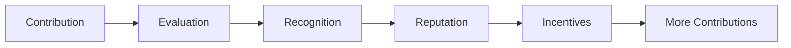
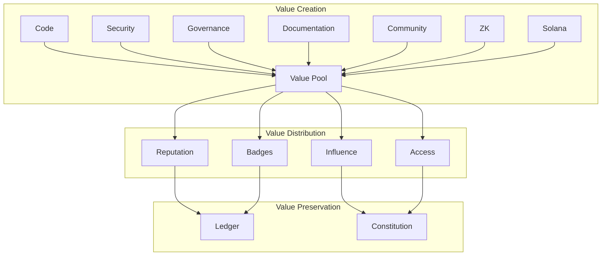
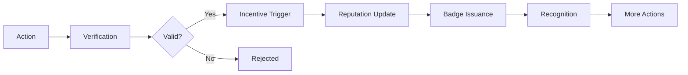
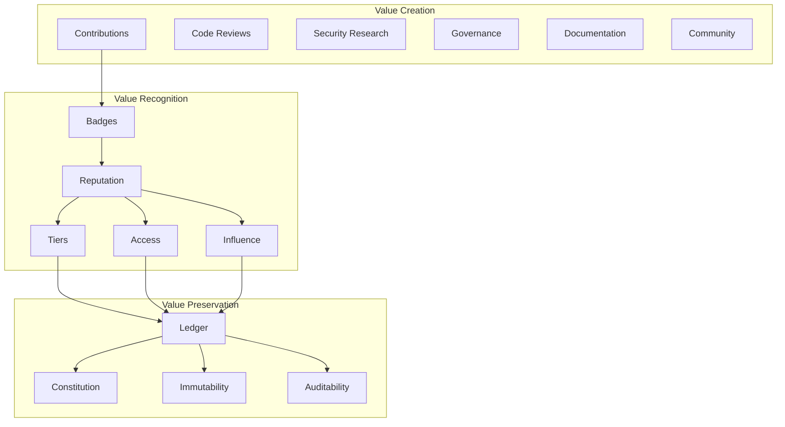
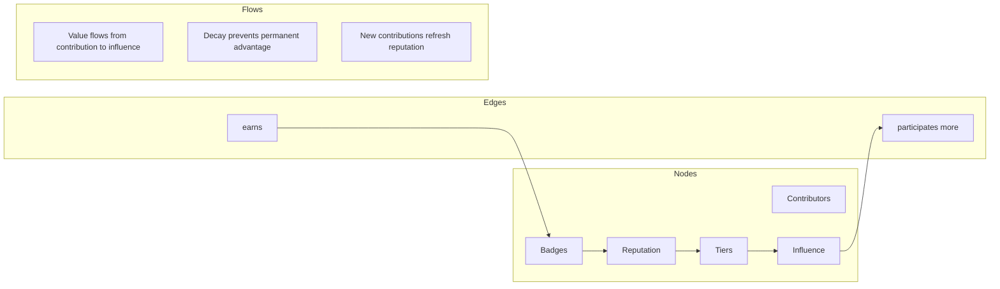

===== FILE ADDED: economy/value-model.md =====

Value Model

Definition of Value

In the ZK-5D ecosystem, value is the measure of contribution to the common good—the sum of all actions that strengthen, secure, and grow our collective capacity to recognize developer achievement while preserving privacy.

Value is not a token. It cannot be traded. It is earned through participation, recognized through reputation, and preserved through constitutional guarantees.

---

Value Creation

Primary Value Sources

Source Description Value Weight
Code Contribution Writing, reviewing, testing code High
Security Research Finding vulnerabilities, improving safety Very High
Governance Participation Voting, proposing, discussing Medium
Documentation Writing docs, tutorials, guides Medium
Community Support Helping others, mentoring Medium
ZK Innovation Improving circuits, proofs Very High
Solana Integration Program development, optimization High
Cultural Creation Artifacts, stories, rituals Medium
Diplomacy Building alliances, interoperability High

Value Creation Flow



---

Value Preservation

Immutability

· Badges are permanent on Solana
· Reputation is append-only
· Contributions recorded forever

Constitutional Protection

· Value cannot be arbitrarily destroyed
· Reputation requires governance for revocation
· Economic rules require amendment

Cryptographic Integrity

· Proofs verify contribution authenticity
· Hashes prevent tampering
· Ledger chain ensures auditability

---

Value Destruction

Legitimate Value Loss

Cause Mechanism Governance Required
Badge Expiration Automatic after lifetime No
Reputation Decay Time-based reduction No
Governance Vote Council or token vote Yes (66%)
Constitutional Violation Automatic revocation No (Court)
Security Breach Emergency pause Yes (Multi-sig)

Value Destruction Prevention

· Reputation decay is slow (1% per month)
· Expired badges retain historical record
· Revocation requires due process
· Appeals process available

---

Value Recognition

Badge Recognition

· Type: Contribution category
· Level: Bronze → Silver → Gold → Platinum
· Time: Issuance timestamp
· Scope: Repository/organization

Reputation Score

```
Reputation = Σ (Badge Value × Level Multiplier × Time Factor)
```

Multipliers:

Level Multiplier
Bronze 1x
Silver 2.5x
Gold 5x
Platinum 10x

Time Factor: 0.99 ^ months since issuance (decay)

---

Value Reward Mechanisms

Intrinsic Rewards

· Recognition: Badge on profile, badge wall
· Status: Supporter tiers (Seeker → Elder)
· Influence: Governance voting weight
· Access: Special channels, early features

Extrinsic Rewards (Non-Token)

· Priority Support: Faster response for high-reputation
· Council Eligibility: Reputation threshold for governance
· Diplomatic Access: Alliance events, partnerships
· Cultural Recognition: Featured artifacts, stories

---

Value Metrics

Ecosystem Health Metrics

Metric Target Measurement
Contribution Diversity 30% new badges Quarterly
Governance Participation 30% quorum Per proposal
Reputation Distribution Pareto (80/20) Annual
Badge Wall Size 10% growth Monthly
Security Incidents 0 critical Continuous

Individual Metrics

Metric Calculation Purpose
Contribution Score Weighted badge sum Recognition
Governance Score Participation × vote weight Influence
Stewardship Score Mentoring, helping others Leadership
Cultural Score Artifact creation, stories Community

---

Value Flow



---

Economic Principles

1. Non-Token Economy

Value is not monetized. Reputation cannot be bought. Influence must be earned.

2. Meritocratic But Inclusive

High contributors gain influence, but everyone can participate. No barriers to entry.

3. Decaying Influence

Reputation decays over time. New contributors can rise. No permanent aristocracy.

4. Constitutional Constraints

Economic rules cannot violate constitutional principles. Privacy preserved always.

5. Transparent Metrics

All value calculations are public, auditable, and verifiable.

---

Value Alignment

Aligned Incentives

· Individual: Recognition, influence, access
· Community: Health, security, growth
· Ecosystem: Interoperability, standards, alliances

Anti-Incentives (Prevented)

· Gaming: Sybil resistance, proof requirements
· Hoarding: Decay prevents permanent advantage
· Exclusion: Low barriers, mentorship rewards
· Centralization: Distributed governance, council limits

---

Economic Evolution

Phase Focus Metrics
Genesis (2025) Contribution recognition Badge issuance
Growth (2026) Reputation systems Participation
Maturity (2027) Economic optimization Efficiency
Expansion (2028+) Cross-ecosystem Interoperability

---

Value Model Governance

Changes to value model require:

1. Economic policy proposal
2. Constitutional Court validation
3. 14-day discussion
4. 14-day voting
5. 66% approval
6. Ledger recording

---

Value is not what you take. It's what you give. This is our economy.

===== FILE ADDED: economy/reputation.ts =====
/**

· Reputation Primitives
· 
· Defines reputation types, calculations, and evolution.
  */

import * as fs from 'fs';
import * as path from 'path';

export interface ReputationScore {
contribution: number;
governance: number;
stewardship: number;
cultural: number;
technical: number;
diplomatic: number;
total: number;
lastUpdated: number;
}

export interface ReputationEvent {
id: string;
userId: string;
type: 'badge_earned' | 'badge_revoked' | 'governance_vote' | 'proposal_created' |
'mentorship' | 'artifact_created' | 'circuit_contribution' | 'solana_contribution' |
'diplomatic_action';
timestamp: number;
value: number;
metadata: any;
}

export class ReputationSystem {
private rootDir: string;
private reputationPath: string;
private eventsPath: string;
private reputation: Map<string, ReputationScore> = new Map();
private events: ReputationEvent[] = [];

constructor() {
this.rootDir = path.resolve(__dirname, '..');
this.reputationPath = path.join(this.rootDir, 'economy/reputation.json');
this.eventsPath = path.join(this.rootDir, 'economy/reputation-events.json');
this.load();
}

private load(): void {
if (fs.existsSync(this.reputationPath)) {
const data = JSON.parse(fs.readFileSync(this.reputationPath, 'utf8'));
for (const [userId, score] of Object.entries(data)) {
this.reputation.set(userId, score as ReputationScore);
}
}

}

private save(): void {
const data: Record<string, ReputationScore> = {};
for (const [userId, score] of this.reputation.entries()) {
data[userId] = score;
}
fs.writeFileSync(this.reputationPath, JSON.stringify(data, null, 2));
fs.writeFileSync(this.eventsPath, JSON.stringify(this.events, null, 2));
}

recordEvent(event: Omit<ReputationEvent, 'id'>): ReputationEvent {
const fullEvent: ReputationEvent = {
...event,
id: ${event.userId}-${event.type}-${Date.now()}
};
this.events.push(fullEvent);
this.updateReputation(fullEvent);
this.save();
return fullEvent;
}

private updateReputation(event: ReputationEvent): void {
let score = this.reputation.get(event.userId) || this.zeroScore();
score.lastUpdated = Date.now();

}

private applyDecay(score: ReputationScore): void {
const monthsSinceUpdate = (Date.now() - score.lastUpdated) / (1000 * 60 * 60 * 24 * 30);
if (monthsSinceUpdate > 0) {
const decayFactor = Math.pow(0.99, monthsSinceUpdate);
score.contribution *= decayFactor;
score.governance *= decayFactor;
score.stewardship *= decayFactor;
score.cultural *= decayFactor;
score.technical *= decayFactor;
score.diplomatic *= decayFactor;
score.total *= decayFactor;
}
}

private zeroScore(): ReputationScore {
return {
contribution: 0,
governance: 0,
stewardship: 0,
cultural: 0,
technical: 0,
diplomatic: 0,
total: 0,
lastUpdated: Date.now()
};
}

getReputation(userId: string): ReputationScore | null {
return this.reputation.get(userId) || null;
}

getUserEvents(userId: string): ReputationEvent[] {
return this.events.filter(e => e.userId === userId);
}

getTopContributors(limit: number = 10): Array<{ userId: string; score: ReputationScore }> {
const entries = Array.from(this.reputation.entries());
return entries
.sort((a, b) => b[1].total - a[1].total)
.slice(0, limit)
.map(([userId, score]) => ({ userId, score }));
}

getContributionLeaderboard(): Array<{ userId: string; score: number }> {
return Array.from(this.reputation.entries())
.sort((a, b) => b[1].contribution - a[1].contribution)
.slice(0, 20)
.map(([userId, score]) => ({ userId, score: score.contribution }));
}

getGovernanceLeaderboard(): Array<{ userId: string; score: number }> {
return Array.from(this.reputation.entries())
.sort((a, b) => b[1].governance - a[1].governance)
.slice(0, 20)
.map(([userId, score]) => ({ userId, score: score.governance }));
}

getTier(userId: string): 'Seeker' | 'Builder' | 'Steward' | 'Guardian' | 'Elder' {
const score = this.reputation.get(userId);
if (!score) return 'Seeker';

}

getBadgeWeight(badgeLevel: string): number {
const weights: Record<string, number> = {
bronze: 1,
silver: 2.5,
gold: 5,
platinum: 10
};
return weights[badgeLevel] || 1;
}

getVoteWeight(userId: string): number {
const score = this.reputation.get(userId);
if (!score) return 1;

}

export(): string {
return JSON.stringify({
reputation: Array.from(this.reputation.entries()),
events: this.events
}, null, 2);
}
}

export const reputationEvents = {
badgeEarned: (userId: string, badgeLevel: string): Omit<ReputationEvent, 'id'> => ({
userId,
type: 'badge_earned',
timestamp: Date.now(),
value: new ReputationSystem().getBadgeWeight(badgeLevel),
metadata: { badgeLevel }
}),

governanceVote: (userId: string): Omit<ReputationEvent, 'id'> => ({
userId,
type: 'governance_vote',
timestamp: Date.now(),
value: 0.5,
metadata: {}
}),

mentorship: (mentorId: string, menteeId: string): Omit<ReputationEvent, 'id'> => ({
userId: mentorId,
type: 'mentorship',
timestamp: Date.now(),
value: 2,
metadata: { menteeId }
}),

circuitContribution: (userId: string, circuitName: string): Omit<ReputationEvent, 'id'> => ({
userId,
type: 'circuit_contribution',
timestamp: Date.now(),
value: 10,
metadata: { circuitName }
})
};

===== FILE ADDED: economy/incentives.md =====

Incentive Structures

Overview

Incentives shape behavior. Our incentive system is designed to align individual actions with ecosystem health, constitutional values, and long-term sustainability—without using monetary tokens.

---

Incentive Principles

1. Align with Values – All incentives promote privacy, decentralization, and transparency
2. Avoid Gaming – Hard to exploit, easy to verify
3. Distribute Broadly – Not just code, but all contributions matter
4. Decay Naturally – No permanent advantage
5. Constitutional Bound – Cannot violate core principles

---

Contribution Incentives

Code Contributions

Action Incentive Value
Merged PR Badge + Reputation Bronze badge (1 point)
10+ PRs Badge upgrade Silver badge (2.5x)
50+ PRs Badge upgrade Gold badge (5x)
Critical bug fix Special recognition Highlight on badge wall

Security Research

Action Incentive Value
Valid security report Security Researcher badge Gold badge (5x)
Critical finding Priority recognition Featured in security report
Audit participation Reputation boost +20 reputation

Documentation

Action Incentive Value
New guide/tutorial Documentation badge Bronze badge
Major doc overhaul Docs Champion badge Silver badge
Translation Cultural reputation +5 reputation

---

Governance Incentives

Voting

Action Incentive Value
Vote on proposal Governance reputation +0.5 per vote
Vote in 80%+ proposals Active voter badge Bronze badge
Long-term voting record Consistent voter badge Silver badge

Proposal Creation

Action Incentive Value
Create proposal Governance reputation +1 per proposal
Proposal passes Bonus reputation +5
Proposal implemented Stewardship reputation +10

Discussion Participation

Action Incentive Value
Constructive comment Reputation (capped) +0.1 per comment
Top-voted comment Recognition Featured in summary
Thread moderation Stewardship +2 per thread

---

Stability Incentives

Long-term Participation

Duration Incentive
6 months Stability badge (bronze)
1 year Stability badge (silver)
2 years Stability badge (gold)
5 years Founding member recognition

Consistency

Pattern Incentive
Monthly contributions Consistency badge
No long breaks Stability multiplier (1.1x)
Cross-category contributions Versatility recognition

---

Schema Incentives

Badge Creation

Action Incentive Value
Propose new badge Recognition Badge listed with creator
Schema adopted Cultural reputation +10
Schema widely used Stewardship badge Silver badge

Schema Improvement

Action Incentive Value
Identify schema issue Issue credit Mention in release notes
Propose fix Contribution Bronze badge
Implement fix Technical reputation +5

---

ZK Incentives

Circuit Development

Action Incentive Value
New circuit ZK Contributor badge Gold badge
Circuit optimization Performance recognition Named in docs
Circuit audit Security reputation +20 reputation

Trusted Setup Participation

Action Incentive
Participate in ceremony Cryptography Contributor badge
Verify transcript Verification credit
Document process Documentation recognition

---

Solana Incentives

Program Development

Action Incentive Value
New instruction Solana Developer badge Silver badge
Gas optimization Efficiency award Featured in newsletter
Security audit Guardian recognition Security badge

Account Management

Action Incentive
Migration assistance Migration Helper badge
Documentation Documentation credit
Tooling Tooling recognition

---

Documentation Incentives

Writing

Action Incentive Value
New page Documentation badge Bronze
Major update Contributor recognition +5 reputation
Translation Cultural recognition +10 reputation

Review

Action Incentive
Technical review Reviewer credit
Accuracy check Quality badge
Consistency check Style guardian

---

Diplomacy Incentives

Alliance Building

Action Incentive Value
Initiate contact Diplomatic reputation +5
Negotiate agreement Alliance badge Silver badge
Maintain relationship Ambassador recognition +20 reputation

Interoperability

Action Incentive
Implement bridge Bridge Builder badge
Test cross-ecosystem Interoperability recognition
Document process Standardization credit

---

Incentive Multipliers

Synergy Bonuses

Combination Multiplier
Code + Docs 1.2x
Security + ZK 1.5x
Governance + Diplomacy 1.3x
Mentorship + Community 1.4x

Reputation Tier Multipliers

Tier All Incentives Multiplier
Seeker 1.0x
Builder 1.1x
Steward 1.2x
Guardian 1.3x
Elder 1.5x

---

Anti-Gaming Mechanisms

Sybil Resistance

· GitHub identity required
· Cryptographic proofs
· Rate limiting

Self-Dealing Prevention

· Cannot vote for own proposals
· Mentorship requires third-party verification
· Code review requires separate approver

Inflation Protection

· Reputation decays naturally
· No infinite accumulation
· Contribution caps per period

---

Incentive Flow



---

Incentive Governance

Changes to incentives require:

1. Economic policy proposal
2. Simulation of effects
3. 14-day discussion
4. 14-day voting
5. 66% approval

---

Incentive Examples

Example 1: New Contributor

1. Opens first PR → First Contributor badge (bronze, 1 point)
2. PR merged → +1 reputation
3. Leaves helpful comment → +0.1 reputation
4. Repeats for 10 PRs → Regular Contributor badge (silver, 2.5x multiplier)

Example 2: Security Researcher

1. Finds vulnerability → Reports via security channel
2. Validated → Security Researcher badge (gold, 5x multiplier)
3. Disclosure coordinated → +20 reputation
4. Featured in security report → Cultural recognition

Example 3: Governance Participant

1. Creates proposal → +1 governance reputation
2. Discussion engagement → +0.5 reputation
3. Proposal passes → +5 bonus
4. Implementation → +10 stewardship

---

Incentives align action with values. They grow the good we want to see.

===== FILE ADDED: economy/ledger.ts =====
/**

· Economic Ledger
· 
· Append-only record of economic events: contributions, reputation changes, incentives.
  */

import * as fs from 'fs';
import * as path from 'path';
import { createHash } from 'crypto';

export interface EconomicEvent {
id: string;
type: 'contribution' | 'reputation_change' | 'incentive_trigger' | 
'badge_issued' | 'badge_revoked' | 'policy_enacted';
timestamp: number;
userId: string;
description: string;
value: number;
metadata: any;
previousHash: string;
hash: string;
}

export class EconomicLedger {
private rootDir: string;
private ledgerPath: string;
private events: EconomicEvent[] = [];
private lastHash: string = '';

constructor() {
this.rootDir = path.resolve(__dirname, '..');
this.ledgerPath = path.join(this.rootDir, 'economy/ledger.json');
this.loadLedger();
}

private loadLedger(): void {
if (fs.existsSync(this.ledgerPath)) {
const data = fs.readFileSync(this.ledgerPath, 'utf8');
this.events = JSON.parse(data);
if (this.events.length > 0) {
this.lastHash = this.events[this.events.length - 1].hash;
}
}
}

private saveLedger(): void {
fs.writeFileSync(this.ledgerPath, JSON.stringify(this.events, null, 2));
}

private computeHash(event: Omit<EconomicEvent, 'hash'>, previousHash: string): string {
const data = JSON.stringify({
event,
previousHash,
timestamp: event.timestamp
});
return createHash('sha256').update(data).digest('hex');
}

record(event: Omit<EconomicEvent, 'hash' | 'previousHash'>): EconomicEvent {
const timestamp = event.timestamp || Date.now();
const fullEvent: Omit<EconomicEvent, 'hash'> = {
...event,
timestamp,
previousHash: this.lastHash
};

}

getEventsByUser(userId: string): EconomicEvent[] {
return this.events.filter(e => e.userId === userId);
}

getEventsByType(type: string): EconomicEvent[] {
return this.events.filter(e => e.type === type);
}

getEventsByDateRange(start: Date, end: Date): EconomicEvent[] {
const startTime = start.getTime();
const endTime = end.getTime();
return this.events.filter(e => e.timestamp >= startTime && e.timestamp <= endTime);
}

getAllEvents(): EconomicEvent[] {
return [...this.events];
}

verifyIntegrity(): boolean {
let currentHash = '';
for (let i = 0; i < this.events.length; i++) {
const entry = this.events[i];
const { hash, ...eventWithoutHash } = entry;
const computedHash = this.computeHash(eventWithoutHash, entry.previousHash);
if (computedHash !== hash) {
console.error(Economic integrity violation at index ${i});
return false;
}
if (entry.previousHash !== currentHash) {
console.error(Economic chain broken at index ${i});
return false;
}
currentHash = hash;
}
return true;
}

getTotalValueByUser(userId: string): number {
return this.events
.filter(e => e.userId === userId)
.reduce((sum, e) => sum + e.value, 0);
}

getValueByType(type: string): number {
return this.events
.filter(e => e.type === type)
.reduce((sum, e) => sum + e.value, 0);
}

getTimeline(interval: 'day' | 'week' | 'month'): Map<string, number> {
const timeline = new Map<string, number>();

}

export(format: 'json' | 'csv'): string {
if (format === 'json') {
return JSON.stringify(this.events, null, 2);
} else {
const headers = ['timestamp', 'type', 'userId', 'description', 'value'];
const rows = this.events.map(e => [
new Date(e.timestamp).toISOString(),
e.type,
e.userId,
e.description,
e.value
]);
return [headers, ...rows].map(row => row.join(',')).join('\n');
}
}
}

===== FILE ADDED: docs/economy/overview.md =====

Ecosystem Economy

Overview

The ZK-5D economy is a non-token, governance-aligned, public-good economic system. It defines how value is created, recognized, and preserved without using cryptocurrency tokens. Value is measured in reputation, influence, and recognition.

---

Core Principles



---

What We Value

Contributions

· Code – Pull requests, reviews, tests
· Security – Vulnerabilities, audits, fixes
· Governance – Proposals, votes, discussion
· Documentation – Guides, tutorials, translations
· Community – Mentoring, support, events
· ZK – Circuits, proofs, trusted setups
· Solana – Programs, instructions, tools
· Culture – Artifacts, stories, rituals
· Diplomacy – Alliances, interoperability

---

Reputation System

Reputation Types

Type Source Use
Contribution Badges, code, docs Primary measure
Governance Voting, proposals Influence weight
Stewardship Mentoring, support Leadership recognition
Cultural Artifacts, stories Community identity
Technical ZK, Solana Expertise badge
Diplomatic Alliances Interoperability

Reputation Tiers

Tier Reputation Privileges
Seeker 0-4 View badges
Builder 5-9 Issue badges
Steward 10-24 Propose governance
Guardian 25-49 Vote on proposals
Elder 50+ Council eligibility

---

Incentive Structures

Contribution Incentives

Action Reward
Merged PR Bronze badge
10+ PRs Silver badge
Security report Gold badge
Mentorship Reputation + stewardship

Governance Incentives

Action Reward
Vote on proposal +0.5 reputation
Create proposal +1 reputation
Proposal passes +5 bonus
Active voter Active voter badge

Stability Incentives

Duration Reward
6 months Stability badge (bronze)
1 year Stability badge (silver)
2 years Stability badge (gold)

---

Value Flow Graph



---

Economic Ledger

All economic events are recorded in an append-only, cryptographically hashed ledger:

Event Description Value
badge_issued New badge earned +1 to +10
reputation_change Reputation update Variable
incentive_trigger Incentive awarded +0.1 to +5
policy_enacted Economic rule change N/A

---

Economic Policy

Policy Types

Policy Purpose
Value Model What constitutes value
Incentive Structure How to reward contributions
Reputation Rules Calculation, decay, tiers
Flow Rules How value propagates

Policy Process

1. Proposal – Formal policy change
2. Simulation – Impact analysis
3. Discussion – 14-day community input
4. Vote – Token holder approval
5. Ledger – Immutable record

---

Economic Metrics

Ecosystem Health

Metric Target Current
Active Contributors 100+ Tracking
Governance Participation 30% quorum Tracking
Reputation Distribution Pareto (80/20) Tracking
Badge Diversity 10+ families 5 families
Cross-Ecosystem Value Growing Initiated

Individual Metrics

Metric Calculation
Contribution Score Weighted badge sum
Governance Score Votes × participation
Stewardship Score Mentoring × quality
Cultural Score Artifacts × reach

---

Anti-Gaming

Prevention Mechanisms

· Sybil resistance – GitHub identity required
· Proof requirements – ZK proofs for badges
· Decay – No permanent advantage
· Rate limits – No spamming
· Human review – Council oversight

Gaming Detection

· Pattern analysis – Automated detection
· Community flagging – Report mechanism
· Council review – Manual verification

---

Economic Evolution

Phase Focus Timeline
Genesis Contribution recognition 2026
Growth Reputation systems 2027
Maturity Economic optimization 2028
Expansion Cross-ecosystem 2028+

---

Governance of Economy

Economic changes require:

1. Constitutional Court validation
2. Community discussion (14 days)
3. Token holder vote (66% approval)
4. Ledger recording

---

Resources

· Value Model – What we value and why
· Reputation – How reputation works
· Incentives – How we reward
· Flow Graph – Value propagation
· Simulations – Policy impact
· Economic History – Our journey

---

Value is not extracted. It is created, recognized, and preserved. This is our economy.
