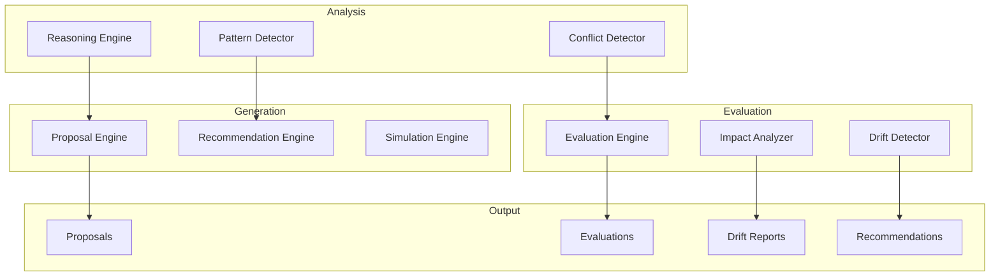

===== FILE ADDED: governance-ai/reasoning-engine.ts =====
/**

· Governance Reasoning Engine
· 
· Interprets governance rules, evaluates consistency, and explains logic.
  */

import * as fs from 'fs';
import * as path from 'path';
import * as yaml from 'js-yaml';

export interface Rule {
id: string;
name: string;
description: string;
type: 'voting' | 'quorum' | 'threshold' | 'council' | 'dispute' | 'badge';
parameters: Record<string, any>;
source: string;
active: boolean;
}

export interface RuleExplanation {
ruleId: string;
plainLanguage: string;
implications: string[];
examples: string[];
}

export interface ConsistencyCheck {
ruleId: string;
status: 'consistent' | 'conflict' | 'redundant' | 'outdated';
message: string;
conflictsWith?: string[];
}

export class GovernanceReasoningEngine {
private rootDir: string;
private rules: Rule[] = [];

constructor() {
this.rootDir = path.resolve(__dirname, '..');
this.loadRules();
}

private loadRules(): void {
const governancePath = path.join(this.rootDir, '.gitdigital-governance.yml');
const badgesPath = path.join(this.rootDir, '.gitdigital-badges.yml');

}

explainRule(ruleId: string): RuleExplanation | null {
const rule = this.rules.find(r => r.id === ruleId);
if (!rule) return null;

}

checkConsistency(): ConsistencyCheck[] {
const results: ConsistencyCheck[] = [];

}

detectDrift(historicalRules: Rule[][]): RuleDrift[] {
const drifts: RuleDrift[] = [];

}

getAllRules(): Rule[] {
return this.rules;
}

getRuleById(id: string): Rule | undefined {
return this.rules.find(r => r.id === id);
}

getRulesByType(type: string): Rule[] {
return this.rules.filter(r => r.type === type);
}
}

interface RuleDrift {
ruleId: string;
type: 'added' | 'modified' | 'removed';
description: string;
changes?: string[];
timestamp: number;
}

===== FILE ADDED: governance-ai/proposal-engine.ts =====
/**

· Governance Proposal Engine
· 
· Generates proposals for new governance rules, modifications, and deprecations.
  */

import { Rule, GovernanceReasoningEngine } from './reasoning-engine';

export interface Proposal {
id: string;
title: string;
description: string;
type: 'new_rule' | 'modify_rule' | 'deprecate_rule' | 'permission_change' | 'badge_governance';
targetRule?: string;
currentState?: any;
proposedState: any;
rationale: string;
impact: string[];
requiredApprovals: number;
discussionDays: number;
votingDays: number;
generatedBy: 'ai' | 'human';
timestamp: number;
}

export class GovernanceProposalEngine {
private reasoningEngine: GovernanceReasoningEngine;

constructor() {
this.reasoningEngine = new GovernanceReasoningEngine();
}

async generateProposals(): Promise<Proposal[]> {
const proposals: Proposal[] = [];
const rules = this.reasoningEngine.getAllRules();
const consistency = this.reasoningEngine.checkConsistency();

}

private createConflictResolutionProposal(issue: any): Proposal {
const targetRule = this.reasoningEngine.getRuleById(issue.ruleId);

}

private generateMissingRuleProposals(): Proposal[] {
const proposals: Proposal[] = [];
const rules = this.reasoningEngine.getAllRules();

}

private generateOptimizationProposals(): Proposal[] {
const proposals: Proposal[] = [];
const rules = this.reasoningEngine.getAllRules();
const badgeRules = rules.filter(r => r.type === 'badge');

}

private generateBadgeGovernanceProposals(): Proposal[] {
const proposals: Proposal[] = [];
const badgeRules = this.reasoningEngine.getAllRules().filter(r => r.type === 'badge');

}

private suggestResolution(issue: any): any {
// Simple resolution logic - adjust conflicting parameters
if (issue.ruleId === 'quorum-threshold') {
return {
quorum: 0.3,
threshold: 0.6,
note: 'Keep quorum lower than threshold to ensure proposals can pass'
};
}
return {};
}

formatProposal(proposal: Proposal): string {
let output = # ${proposal.title}\n\n;
output += **Type:** ${proposal.type}\n;
output += **Generated:** ${new Date(proposal.timestamp).toISOString()}\n;
output += **Required Approvals:** ${(proposal.requiredApprovals * 100)}%\n;
output += **Discussion:** ${proposal.discussionDays} days\n;
output += **Voting:** ${proposal.votingDays} days\n\n;

}
}

===== FILE ADDED: governance-ai/evaluation-engine.ts =====
/**

· Governance Evaluation Engine
· 
· Evaluates proposed rules for conflicts, cascading effects, and implications.
  */

import { Rule, GovernanceReasoningEngine } from './reasoning-engine';
import { Proposal } from './proposal-engine';

export interface EvaluationResult {
proposalId: string;
status: 'pass' | 'fail' | 'warning';
conflicts: Conflict[];
cascadingEffects: Effect[];
zkImplications: string[];
solanaImplications: string[];
githubImplications: string[];
releaseImplications: string[];
score: number;
recommendations: string[];
}

export interface Conflict {
type: 'direct' | 'indirect' | 'semantic';
description: string;
affectedRule: string;
severity: 'high' | 'medium' | 'low';
}

export interface Effect {
type: string;
description: string;
probability: number;
severity: 'high' | 'medium' | 'low';
}

export class GovernanceEvaluationEngine {
private reasoningEngine: GovernanceReasoningEngine;

constructor() {
this.reasoningEngine = new GovernanceReasoningEngine();
}

async evaluateProposal(proposal: Proposal): Promise<EvaluationResult> {
const conflicts: Conflict[] = [];
const cascadingEffects: Effect[] = [];
const zkImplications: string[] = [];
const solanaImplications: string[] = [];
const githubImplications: string[] = [];
const releaseImplications: string[] = [];

}

formatEvaluation(result: EvaluationResult): string {
let output = # Governance Proposal Evaluation\n\n;
output += **Status:** ${result.status.toUpperCase()}\n;
output += **Score:** ${result.score}/100\n\n;

}
}

===== FILE ADDED: .github/workflows/governance-proposal.yml =====
name: Governance Proposal Generation

on:
schedule:
- cron: '0 0 * * 1'  # Weekly
workflow_dispatch:
pull_request:
paths:
- '.gitdigital-*.yml'

jobs:
generate-proposals:
runs-on: ubuntu-latest
steps:
- uses: actions/checkout@v3
with:
fetch-depth: 0

===== FILE ADDED: .github/workflows/governance-drift.yml =====
name: Governance Drift Detection

on:
schedule:
- cron: '0 0 * * *'  # Daily
workflow_dispatch:

jobs:
detect-drift:
runs-on: ubuntu-latest
steps:
- uses: actions/checkout@v3
with:
fetch-depth: 0

===== FILE ADDED: docs/governance-ai/overview.md =====

Governance AI Layer

Overview

The Governance AI Layer is a deterministic, auditable reasoning system that automatically analyzes governance rules, generates proposals, evaluates impacts, and detects drift across the ecosystem.

Capabilities



Components

1. Reasoning Engine

· Interprets governance rules in plain language
· Detects rule contradictions
· Explains rule logic with examples
· Maintains rule knowledge base

2. Proposal Engine

· Generates new governance rules
· Proposes rule modifications
· Identifies missing rules
· Suggests optimizations

3. Evaluation Engine

· Checks for conflicts with existing rules
· Analyzes cascading effects
· Assesses ZK/Solana implications
· Provides impact scores

4. Impact Analyzer

· Identifies affected components
· Estimates migration requirements
· Predicts version bumps
· Assesses risk levels

5. Drift Detector

· Detects rule instability
· Identifies overused/underused rules
· Tracks rule evolution patterns
· Flags contradictions

6. Recommendation Engine

· Suggests rule simplifications
· Proposes permission refinements
· Recommends schema improvements
· Prioritizes actions

Automated Workflows

Workflow Trigger Output
governance-proposal.yml Weekly / PR AI-generated proposals
governance-evaluation.yml On proposal Impact assessment
governance-simulation.yml On change Simulation results
governance-drift.yml Daily Drift alerts
governance-report.yml Monthly Comprehensive report

Rule Types

Voting Rules

· Quorum requirements
· Approval thresholds
· Voting periods
· Proposal types

Council Rules

· Member terms
· Veto powers
· Dispute resolution

Badge Rules

· Issuance criteria
· Revocation procedure
· Lifetime rules
· Proof requirements

Example Outputs

Generated Proposal

```markdown
# Simplify Core Contributor Badge Criteria

**Type:** modify_rule
**Target:** badge-core-contributor
**Required Approvals:** 60%

## Description
Current criteria (50 merged PRs + 20 reviews) may be too strict.
Proposal reduces to 35 merged PRs + 15 reviews.

## Rationale
Lower threshold encourages more participation while maintaining quality.

## Impact
- More badge holders
- Increased community engagement
- No breaking changes
```

Drift Alert

```markdown
⚠️ Governance Drift Detected

- **Council term increased** (12 → 24 months) - High impact
- **Emergency proposal threshold changed** (50% → 40%) - Medium impact
- **Quorum requirement** (30% → 35%) - Low impact
```

Integration

With Simulation Layer

· Governance changes simulated before implementation
· Impact predictions guide approval requirements

With Memory Layer

· All AI-generated proposals recorded
· Historical decisions inform future suggestions

With Release Layer

· Governance implications included in release notes
· Version bumps guided by impact analysis

Governance of AI

The AI system itself is governed by:

· Transparency: All decisions are logged and explainable
· Auditability: Every proposal has clear rationale
· Human Oversight: AI proposals require human approval
· Feedback Loop: Accepted/rejected proposals improve future suggestions

Configuration

The AI can be configured via .gitdigital-ai.yml:

```yaml
proposal:
  enabled: true
  frequency: weekly
  max_proposals: 5

evaluation:
  thresholds:
    critical: 70
    warning: 50

drift:
  sensitivity: medium
  notify_on: [added, modified, removed]
```

Future Enhancements

· Learning from rejections: Improve proposal quality
· Cross-repository analysis: Detect patterns across org
· Natural language interface: Accept plain English requests
· Automated execution: Self-implement approved changes
