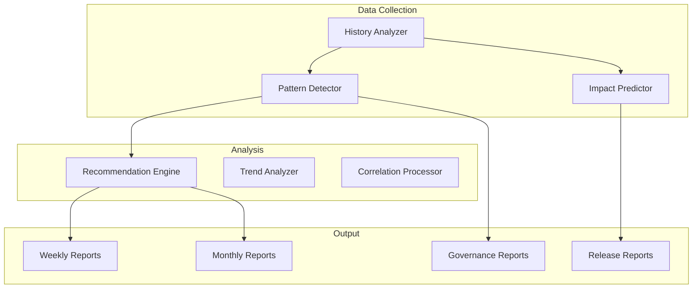

===== FILE ADDED: intelligence/history-analyzer.ts =====
#!/usr/bin/env ts-node

import * as fs from 'fs';
import * as path from 'path';
import { execSync } from 'child_process';
import { parse } from 'parse-git-log';

interface Release {
version: string;
date: Date;
type: 'major' | 'minor' | 'patch';
commits: Array<{
hash: string;
message: string;
type: string;
scope: string;
}>;
}

interface GovernanceDecision {
id: string;
date: Date;
type: string;
description: string;
votesFor: number;
votesAgainst: number;
approved: boolean;
}

interface BadgeChange {
badge: string;
changeType: 'added' | 'modified' | 'removed';
date: Date;
release: string;
}

interface ZKChange {
circuit: string;
changeType: 'added' | 'modified';
date: Date;
release: string;
constraints: number;
}

interface SolanaChange {
instruction: string;
changeType: 'added' | 'modified' | 'removed';
date: Date;
release: string;
}

interface DependencyUpdate {
package: string;
from: string;
to: string;
date: Date;
release: string;
}

interface DriftCorrection {
type: string;
description: string;
date: Date;
automated: boolean;
}

export interface HistoryAnalysis {
releases: Release[];
governanceDecisions: GovernanceDecision[];
badgeChanges: BadgeChange[];
zkChanges: ZKChange[];
solanaChanges: SolanaChange[];
dependencyUpdates: DependencyUpdate[];
driftCorrections: DriftCorrection[];
metrics: {
totalReleases: number;
avgReleaseFrequency: number;
majorReleases: number;
minorReleases: number;
patchReleases: number;
governanceApprovalRate: number;
badgeChangeFrequency: number;
zkChangeFrequency: number;
solanaChangeFrequency: number;
dependencyUpdateFrequency: number;
driftCorrectionFrequency: number;
};
trends: {
releaseVelocity: 'increasing' | 'stable' | 'decreasing';
governanceActivity: 'increasing' | 'stable' | 'decreasing';
instabilityZones: string[];
};
}

class HistoryAnalyzer {
private rootDir: string;
private analysis: HistoryAnalysis;

constructor() {
this.rootDir = path.resolve(__dirname, '..');
this.analysis = {
releases: [],
governanceDecisions: [],
badgeChanges: [],
zkChanges: [],
solanaChanges: [],
dependencyUpdates: [],
driftCorrections: [],
metrics: {
totalReleases: 0,
avgReleaseFrequency: 0,
majorReleases: 0,
minorReleases: 0,
patchReleases: 0,
governanceApprovalRate: 0,
badgeChangeFrequency: 0,
zkChangeFrequency: 0,
solanaChangeFrequency: 0,
dependencyUpdateFrequency: 0,
driftCorrectionFrequency: 0
},
trends: {
releaseVelocity: 'stable',
governanceActivity: 'stable',
instabilityZones: []
}
};
}

async analyze(): Promise<HistoryAnalysis> {
console.log('📊 Analyzing ecosystem history...');

}

private async analyzeReleases(): Promise<void> {
console.log('  📦 Analyzing release history...');

}

private async analyzeGovernanceDecisions(): Promise<void> {
console.log('  ⚖️ Analyzing governance decisions...');

}

private async analyzeBadgeChanges(): Promise<void> {
console.log('  🏅 Analyzing badge schema changes...');

}

private async analyzeZKChanges(): Promise<void> {
console.log('  🔐 Analyzing ZK circuit changes...');

}

private async analyzeSolanaChanges(): Promise<void> {
console.log('  ⚡ Analyzing Solana program changes...');

}

private async analyzeDependencyUpdates(): Promise<void> {
console.log('  📦 Analyzing dependency updates...');

}

private async analyzeDriftCorrections(): Promise<void> {
console.log('  🔧 Analyzing drift corrections...');

}

private calculateMetrics(): void {
// Additional metrics calculated from collected data
// Already calculated in individual methods
}

private detectTrends(): void {
console.log('  📈 Detecting trends...');

}

private getPreviousTag(currentTag: string, allTags: string[]): string | null {
const index = allTags.indexOf(currentTag);
return index < allTags.length - 1 ? allTags[index + 1] : null;
}

private findReleaseForDate(date: Date): string {
const sorted = [...this.analysis.releases].sort((a, b) => a.date.getTime() - b.date.getTime());
let closest: Release | null = null;
let minDiff = Infinity;

}

private extractGovernanceType(message: string): string {
if (message.includes('badge')) return 'badge_schema';
if (message.includes('upgrade')) return 'protocol_upgrade';
if (message.includes('emergency')) return 'emergency';
if (message.includes('council')) return 'council';
return 'general';
}

saveReport(): void {
const reportPath = path.join(this.rootDir, 'intelligence/history-analysis.json');
fs.writeFileSync(reportPath, JSON.stringify(this.analysis, null, 2));
console.log(✅ History analysis saved to ${reportPath});
}
}

if (require.main === module) {
const analyzer = new HistoryAnalyzer();
analyzer.analyze().then(() => analyzer.saveReport());
}

===== FILE ADDED: intelligence/pattern-detector.ts =====
#!/usr/bin/env ts-node

import * as fs from 'fs';
import * as path from 'path';
import { HistoryAnalysis } from './history-analyzer';

interface Pattern {
id: string;
type: string;
description: string;
frequency: number;
severity: 'low' | 'medium' | 'high' | 'critical';
affectedSurfaces: string[];
rootCauses: string[];
recommendations: string[];
}

export interface PatternReport {
timestamp: string;
patterns: Pattern[];
summary: {
totalPatterns: number;
criticalPatterns: number;
highPatterns: number;
mostFrequent: string;
instabilityScore: number;
};
}

class PatternDetector {
private rootDir: string;
private history: HistoryAnalysis | null = null;
private patterns: Pattern[] = [];

constructor() {
this.rootDir = path.resolve(__dirname, '..');
}

async detect(): Promise<PatternReport> {
console.log('🔍 Detecting patterns...');

}

private async loadHistory(): Promise<void> {
const historyPath = path.join(this.rootDir, 'intelligence/history-analysis.json');
if (fs.existsSync(historyPath)) {
this.history = JSON.parse(fs.readFileSync(historyPath, 'utf8'));
}
}

private async detectRecurringIssues(): Promise<void> {
if (!this.history) return;

}

private async detectUnstableSurfaces(): Promise<void> {
if (!this.history) return;

}

private async detectHighChurnPackages(): Promise<void> {
if (!this.history) return;

}

private async detectGovernanceHotspots(): Promise<void> {
if (!this.history) return;

}

private async detectZKSolanaMismatches(): Promise<void> {
if (!this.history) return;

}

private async detectWorkflowFailures(): Promise<void> {
const workflowLogs = path.join(this.rootDir, 'logs/workflow-failures.log');
if (!fs.existsSync(workflowLogs)) return;

}

private generateReport(): PatternReport {
const critical = this.patterns.filter(p => p.severity === 'critical').length;
const high = this.patterns.filter(p => p.severity === 'high').length;
const mostFrequent = this.patterns.sort((a, b) => b.frequency - a.frequency)[0];

}

saveReport(): void {
const report = this.generateReport();
const reportPath = path.join(this.rootDir, 'intelligence/patterns.json');
fs.writeFileSync(reportPath, JSON.stringify(report, null, 2));
console.log(✅ Pattern detection saved to ${reportPath});
}
}

if (require.main === module) {
const detector = new PatternDetector();
detector.detect().then(() => detector.saveReport());
}

===== FILE ADDED: intelligence/recommendation-engine.ts =====
#!/usr/bin/env ts-node

import * as fs from 'fs';
import * as path from 'path';
import { HistoryAnalysis } from './history-analyzer';
import { PatternReport } from './pattern-detector';

interface Recommendation {
id: string;
category: 'stability' | 'performance' | 'security' | 'governance' | 'docs' | 'testing';
title: string;
description: string;
priority: 'low' | 'medium' | 'high' | 'critical';
effort: 'small' | 'medium' | 'large' | 'xlarge';
impact: string;
affectedSurfaces: string[];
implementation: string;
}

export interface RecommendationReport {
timestamp: string;
recommendations: Recommendation[];
summary: {
total: number;
critical: number;
high: number;
byCategory: Record<string, number>;
bySurface: Record<string, number>;
};
}

class RecommendationEngine {
private rootDir: string;
private history: HistoryAnalysis | null = null;
private patterns: PatternReport | null = null;
private recommendations: Recommendation[] = [];

constructor() {
this.rootDir = path.resolve(__dirname, '..');
}

async generate(): Promise<RecommendationReport> {
console.log('💡 Generating recommendations...');

}

private async loadData(): Promise<void> {
const historyPath = path.join(this.rootDir, 'intelligence/history-analysis.json');
const patternsPath = path.join(this.rootDir, 'intelligence/patterns.json');

}

private async generateStabilityRecommendations(): Promise<void> {
if (!this.history || !this.patterns) return;

}

private async generatePerformanceRecommendations(): Promise<void> {
// ZK proof generation performance
this.recommendations.push({
id: 'zk-performance-optimization',
category: 'performance',
title: 'Optimize ZK proof generation',
description: 'ZK proof generation currently takes 5-10 seconds, which could be optimized',
priority: 'medium',
effort: 'large',
impact: 'Reduced latency for badge issuance, better user experience',
affectedSurfaces: ['zk'],
implementation: 'Explore parallel witness generation, batch proof generation, or hardware acceleration'
});

}

private async generateSecurityRecommendations(): Promise<void> {
// Webhook security
this.recommendations.push({
id: 'webhook-ip-whitelist',
category: 'security',
title: 'Implement IP whitelisting for GitHub webhooks',
description: 'Restrict webhook endpoint to GitHub IP ranges',
priority: 'medium',
effort: 'small',
impact: 'Reduced attack surface for webhook endpoint',
affectedSurfaces: ['github'],
implementation: 'Fetch GitHub IP ranges from API and validate webhook source IP'
});

}

private async generateGovernanceRecommendations(): Promise<void> {
if (!this.patterns) return;

}

private async generateDocsRecommendations(): Promise<void> {
if (!this.history) return;

}

private async generateTestingRecommendations(): Promise<void> {
if (!this.history) return;

}

private generateReport(): RecommendationReport {
const byCategory: Record<string, number> = {};
const bySurface: Record<string, number> = {};

}

saveReport(): void {
const report = this.generateReport();
const reportPath = path.join(this.rootDir, 'intelligence/recommendations.json');
fs.writeFileSync(reportPath, JSON.stringify(report, null, 2));
console.log(✅ Recommendations saved to ${reportPath});
}
}

if (require.main === module) {
const engine = new RecommendationEngine();
engine.generate().then(() => engine.saveReport());
}

===== FILE ADDED: .github/workflows/intelligence-weekly.yml =====
name: Weekly Intelligence Report

on:
schedule:
- cron: '0 3 * * 1'  # 3 AM every Monday
workflow_dispatch:

jobs:
intelligence:
runs-on: ubuntu-latest
steps:
- uses: actions/checkout@v3
with:
fetch-depth: 0

===== FILE ADDED: docs/intelligence/overview.md =====

Ecosystem Intelligence Layer

Overview

The Ecosystem Intelligence Layer is a learning, adaptive system that analyzes the entire ZK-5D badge authority ecosystem, detects patterns, predicts impacts, and generates actionable recommendations.

Components

Capabilities

1. History Analysis

· Release frequency and velocity
· Governance decision patterns
· Badge schema evolution
· ZK circuit changes
· Solana program changes
· Dependency update patterns
· Drift correction history

2. Pattern Detection

· Recurring issues
· Unstable surfaces
· High-churn packages
· Governance hotspots
· ZK/Solana mismatches
· Workflow failures

3. Impact Prediction

· Cascading effects of changes
· Required version bumps
· Required circuit rebuilds
· Required Solana migrations
· Governance implications

4. Recommendation Generation

· Stability improvements
· Performance optimizations
· Security hardening
· Governance simplification
· Documentation coverage
· Testing improvements

Data Sources

Source Frequency Retention
Git history Real-time Permanent
Release tags On release Permanent
Governance logs On change Permanent
Drift corrections Daily 1 year
Workflow logs On run 90 days
Dependency updates On change Permanent

Intelligence Reports

Weekly Report

· Release velocity
· New patterns detected
· Open recommendations
· Instability score
· Security posture

Monthly Report

· Long-term trends
· Governance effectiveness
· Stability improvements
· Performance metrics
· Documentation coverage

Release Report

· Compatibility analysis
· Upgrade path recommendations
· Risk assessment
· Testing requirements
· Governance implications

Metrics Dashboard

Available at /intelligence/dashboard:

Metric Description Alert Threshold
Instability Score 0-100, higher = less stable 50
Governance Efficiency % of proposals approved <60%
Drift Detection Rate % of drift caught <95%
Recommendation Adoption % implemented <70%
ZK/Solana Sync % of coordinated releases <80%

Learning Capabilities

The intelligence system improves over time:

1. New patterns are added to detection logic
2. Successful recommendations are reinforced
3. Failed predictions are analyzed and corrected
4. Governance rules evolve based on outcomes

Integration

With Maintenance System

· Drift patterns trigger corrections
· High instability triggers reviews
· Security patterns trigger scans

With Governance System

· Hotspots trigger rule reviews
· Approval patterns optimize processes
· Decision outcomes inform future rules

With Release System

· Impact predictions inform versioning
· Compatibility analysis guides timing
· Risk assessment influences governance

Future Enhancements

· ML Models: Predict failure rates, optimal release timing
· Automated Testing: Generate tests for detected patterns
· Self-Healing: Auto-apply safe recommendations
· Cross-Project Insights: Learn from other ZK badge implementations
