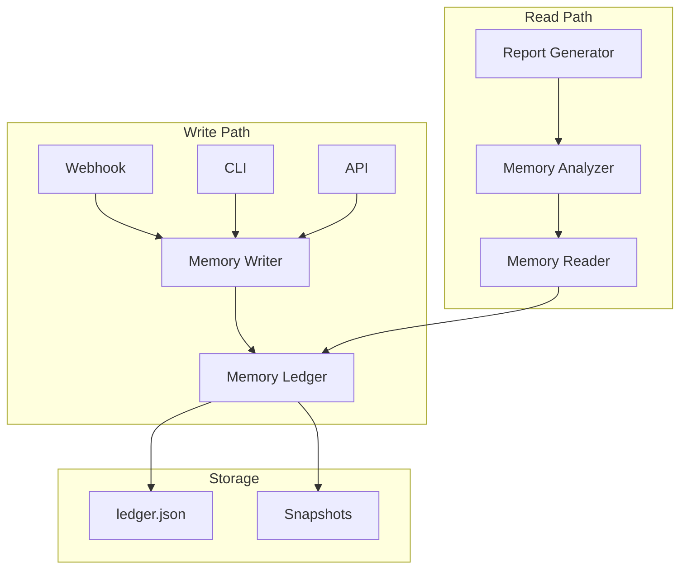

===== FILE ADDED: memory/event-types.ts =====
/**

· Ecosystem Memory Event Types
· 
· This file defines all possible event types that can be recorded
· in the append-only memory ledger.
  */

export type EventType =
| 'governance_change'
| 'badge_schema_change'
| 'zk_circuit_update'
| 'solana_program_migration'
| 'github_app_permission_change'
| 'release_event'
| 'drift_correction'
| 'dependency_update'
| 'intelligence_report'
| 'maintenance_event'
| 'security_incident'
| 'api_change'
| 'documentation_update'
| 'test_change'
| 'config_change';

export interface BaseEvent {
id: string;
type: EventType;
timestamp: number;
hash: string;
previousHash: string;
version: string;
surface: string;
description: string;
actor: string;
governanceApproved: boolean;
}

export interface GovernanceChangeEvent extends BaseEvent {
type: 'governance_change';
data: {
ruleId: string;
oldRule: string;
newRule: string;
votesFor: number;
votesAgainst: number;
quorum: number;
proposalId: string;
};
}

export interface BadgeSchemaChangeEvent extends BaseEvent {
type: 'badge_schema_change';
data: {
badgeName: string;
changeType: 'added' | 'modified' | 'removed';
oldSchema?: any;
newSchema: any;
criteriaChanges: string[];
requiresProof: boolean;
lifetime: string;
};
}

export interface ZKCircuitUpdateEvent extends BaseEvent {
type: 'zk_circuit_update';
data: {
circuitName: string;
oldConstraints?: number;
newConstraints: number;
changeType: 'added' | 'modified';
wasmSize: number;
r1csSize: number;
trustedSetup: boolean;
proofTimeMs: number;
};
}

export interface SolanaProgramMigrationEvent extends BaseEvent {
type: 'solana_program_migration';
data: {
oldProgramId: string;
newProgramId: string;
migrationStrategy: 'upgrade' | 'replacement' | 'new_accounts';
accountMigration: boolean;
instructionChanges: string[];
stateChanges: string[];
auditReport: string;
};
}

export interface GitHubAppPermissionChangeEvent extends BaseEvent {
type: 'github_app_permission_change';
data: {
permissionType: string;
oldPermission: string;
newPermission: string;
webhookEventsAdded: string[];
webhookEventsRemoved: string[];
reason: string;
};
}

export interface ReleaseEvent extends BaseEvent {
type: 'release_event';
data: {
version: string;
releaseType: 'major' | 'minor' | 'patch';
components: string[];
breakingChanges: boolean;
changelog: string;
governanceApprovalId?: string;
securityAudit: boolean;
};
}

export interface DriftCorrectionEvent extends BaseEvent {
type: 'drift_correction';
data: {
driftType: string;
severity: string;
correction: string;
automated: boolean;
filesChanged: string[];
verification: string;
};
}

export interface DependencyUpdateEvent extends BaseEvent {
type: 'dependency_update';
data: {
packageName: string;
oldVersion: string;
newVersion: string;
updateType: 'major' | 'minor' | 'patch';
vulnerabilityFixes: string[];
breaking: boolean;
testsPassed: boolean;
};
}

export interface IntelligenceReportEvent extends BaseEvent {
type: 'intelligence_report';
data: {
reportType: string;
patternsDetected: number;
recommendations: number;
instabilityScore: number;
reportPath: string;
};
}

export interface MaintenanceEvent extends BaseEvent {
type: 'maintenance_event';
data: {
maintenanceType: string;
durationMs: number;
affectedServices: string[];
outcome: 'success' | 'failure' | 'partial';
errorMessage?: string;
};
}

export interface SecurityIncidentEvent extends BaseEvent {
type: 'security_incident';
data: {
severity: 'critical' | 'high' | 'medium' | 'low';
type: string;
description: string;
affectedComponents: string[];
mitigation: string;
postMortem: string;
};
}

export interface APIChangeEvent extends BaseEvent {
type: 'api_change';
data: {
endpoint: string;
method: string;
changeType: 'added' | 'modified' | 'deprecated' | 'removed';
oldResponse?: any;
newResponse?: any;
breaking: boolean;
documented: boolean;
};
}

export type MemoryEvent =
| GovernanceChangeEvent
| BadgeSchemaChangeEvent
| ZKCircuitUpdateEvent
| SolanaProgramMigrationEvent
| GitHubAppPermissionChangeEvent
| ReleaseEvent
| DriftCorrectionEvent
| DependencyUpdateEvent
| IntelligenceReportEvent
| MaintenanceEvent
| SecurityIncidentEvent
| APIChangeEvent;

export interface MemoryEntry {
event: MemoryEvent;
hash: string;
previousHash: string;
timestamp: number;
signature?: string;
}

export interface MemorySnapshot {
timestamp: number;
version: string;
events: MemoryEntry[];
hash: string;
previousSnapshotHash?: string;
}

===== FILE ADDED: memory/ledger.ts =====
/**

· Append-Only Memory Ledger
· 
· This file implements the core memory storage system with cryptographic
· hashing to ensure integrity and immutability.
  */

import * as fs from 'fs';
import * as path from 'path';
import * as crypto from 'crypto';
import { MemoryEntry, MemorySnapshot, MemoryEvent } from './event-types';

export class MemoryLedger {
private rootDir: string;
private ledgerPath: string;
private snapshotsPath: string;
private events: MemoryEntry[] = [];
private lastHash: string = '';

constructor() {
this.rootDir = path.resolve(__dirname, '..');
this.ledgerPath = path.join(this.rootDir, 'memory/ledger.json');
this.snapshotsPath = path.join(this.rootDir, 'memory/snapshots');
this.loadLedger();
}

private loadLedger(): void {
if (fs.existsSync(this.ledgerPath)) {
const data = fs.readFileSync(this.ledgerPath, 'utf8');
this.events = JSON.parse(data);
if (this.events.length > 0) {
this.lastHash = this.events[this.events.length - 1].hash;
}
}
}

private saveLedger(): void {
fs.writeFileSync(this.ledgerPath, JSON.stringify(this.events, null, 2));
}

private computeHash(event: MemoryEvent, previousHash: string): string {
const data = JSON.stringify({
event,
previousHash,
timestamp: Date.now()
});
return crypto.createHash('sha256').update(data).digest('hex');
}

append(event: MemoryEvent): MemoryEntry {
const timestamp = Date.now();
const hash = this.computeHash(event, this.lastHash);

}

private createSnapshot(): void {
const snapshot: MemorySnapshot = {
timestamp: Date.now(),
version: this.getCurrentVersion(),
events: [...this.events],
hash: this.lastHash,
previousSnapshotHash: this.getLastSnapshotHash()
};

}

private getCurrentVersion(): string {
try {
const pkg = JSON.parse(fs.readFileSync(path.join(this.rootDir, 'package.json'), 'utf8'));
return pkg.version;
} catch {
return '0.0.0';
}
}

private getLastSnapshotHash(): string {
if (!fs.existsSync(this.snapshotsPath)) return '';
const snapshots = fs.readdirSync(this.snapshotsPath)
.filter(f => f.startsWith('snapshot-'))
.sort()
.reverse();

}

verifyIntegrity(): boolean {
let currentHash = '';
for (let i = 0; i < this.events.length; i++) {
const entry = this.events[i];
const computedHash = this.computeHash(entry.event, entry.previousHash);
if (computedHash !== entry.hash) {
console.error(Integrity violation at index ${i});
return false;
}
if (entry.previousHash !== currentHash) {
console.error(Chain broken at index ${i});
return false;
}
currentHash = entry.hash;
}
return true;
}

getAllEvents(): MemoryEntry[] {
return [...this.events];
}

getEventsByType(type: string): MemoryEntry[] {
return this.events.filter(e => e.event.type === type);
}

getEventsBySurface(surface: string): MemoryEntry[] {
return this.events.filter(e => e.event.surface === surface);
}

getEventsByDateRange(start: Date, end: Date): MemoryEntry[] {
const startTime = start.getTime();
const endTime = end.getTime();
return this.events.filter(e => e.timestamp >= startTime && e.timestamp <= endTime);
}

getEventsByVersion(version: string): MemoryEntry[] {
return this.events.filter(e => e.event.version === version);
}

export(format: 'json' | 'csv'): string {
if (format === 'json') {
return JSON.stringify(this.events, null, 2);
} else {
const headers = ['timestamp', 'type', 'surface', 'description', 'hash'];
const rows = this.events.map(e => [
new Date(e.timestamp).toISOString(),
e.event.type,
e.event.surface,
e.event.description,
e.hash
]);
return [headers, ...rows].map(row => row.join(',')).join('\n');
}
}
}

===== FILE ADDED: memory/writer.ts =====
/**

· Memory Writer
· 
· Automatically records events to the memory ledger when they occur
· in the ecosystem.
  */

import { execSync } from 'child_process';
import * as fs from 'fs';
import * as path from 'path';
import { MemoryLedger } from './ledger';
import {
MemoryEvent,
ReleaseEvent,
BadgeSchemaChangeEvent,
ZKCircuitUpdateEvent,
DriftCorrectionEvent
} from './event-types';

export class MemoryWriter {
private ledger: MemoryLedger;
private rootDir: string;

constructor() {
this.ledger = new MemoryLedger();
this.rootDir = path.resolve(__dirname, '..');
}

async recordRelease(version: string, releaseType: 'major' | 'minor' | 'patch'): Promise<void> {
const changelog = this.getChangelogForVersion(version);
const event: ReleaseEvent = {
id: release-${version}-${Date.now()},
type: 'release_event',
timestamp: Date.now(),
hash: '',
previousHash: '',
version: '1.0',
surface: 'release',
description: Release v${version} (${releaseType}),
actor: process.env.GITHUB_ACTOR || 'system',
governanceApproved: releaseType === 'major',
data: {
version,
releaseType,
components: ['api', 'github-app', 'zk', 'solana', 'cli'],
breakingChanges: releaseType === 'major',
changelog,
securityAudit: releaseType === 'major'
}
};

}

async recordBadgeSchemaChange(
badgeName: string,
changeType: 'added' | 'modified' | 'removed',
newSchema: any,
oldSchema?: any
): Promise<void> {
const event: BadgeSchemaChangeEvent = {
id: badge-${badgeName}-${Date.now()},
type: 'badge_schema_change',
timestamp: Date.now(),
hash: '',
previousHash: '',
version: this.getCurrentVersion(),
surface: 'badges',
description: ${changeType} badge schema: ${badgeName},
actor: process.env.GITHUB_ACTOR || 'system',
governanceApproved: changeType === 'removed',
data: {
badgeName,
changeType,
oldSchema,
newSchema,
criteriaChanges: this.detectCriteriaChanges(oldSchema, newSchema),
requiresProof: newSchema?.requiresProof || false,
lifetime: newSchema?.lifetime || 'permanent'
}
};

}

async recordZKCircuitUpdate(
circuitName: string,
changeType: 'added' | 'modified',
newConstraints: number,
oldConstraints?: number
): Promise<void> {
const circuitPath = path.join(this.rootDir, src/zk/circuits/${circuitName}.circom);
const wasmPath = path.join(this.rootDir, src/zk/circuits/compiled/${circuitName}_js/${circuitName}.wasm);
const r1csPath = path.join(this.rootDir, src/zk/circuits/compiled/${circuitName}.r1cs);

}

async recordDriftCorrection(
driftType: string,
severity: string,
correction: string,
filesChanged: string[]
): Promise<void> {
const event: DriftCorrectionEvent = {
id: drift-${driftType}-${Date.now()},
type: 'drift_correction',
timestamp: Date.now(),
hash: '',
previousHash: '',
version: this.getCurrentVersion(),
surface: 'maintenance',
description: Corrected ${driftType} drift: ${correction},
actor: process.env.GITHUB_ACTOR || 'system',
governanceApproved: false,
data: {
driftType,
severity,
correction,
automated: true,
filesChanged,
verification: 'tests passed'
}
};

}

async recordDependencyUpdate(
packageName: string,
oldVersion: string,
newVersion: string,
breaking: boolean
): Promise<void> {
const updateType = this.getUpdateType(oldVersion, newVersion);
const event: any = {
id: dep-${packageName}-${Date.now()},
type: 'dependency_update',
timestamp: Date.now(),
hash: '',
previousHash: '',
version: this.getCurrentVersion(),
surface: 'dependencies',
description: Updated ${packageName}: ${oldVersion} → ${newVersion},
actor: process.env.GITHUB_ACTOR || 'system',
governanceApproved: breaking,
data: {
packageName,
oldVersion,
newVersion,
updateType,
vulnerabilityFixes: [],
breaking,
testsPassed: true
}
};

}

private getChangelogForVersion(version: string): string {
try {
const changelogPath = path.join(this.rootDir, 'CHANGELOG.md');
if (!fs.existsSync(changelogPath)) return '';

}

private getCurrentVersion(): string {
try {
const pkg = JSON.parse(fs.readFileSync(path.join(this.rootDir, 'package.json'), 'utf8'));
return pkg.version;
} catch {
return '0.0.0';
}
}

private detectCriteriaChanges(oldSchema: any, newSchema: any): string[] {
if (!oldSchema || !newSchema) return [];
const changes: string[] = [];

}

private estimateProofTime(constraints: number): number {
// Rough estimate: 5ms per 1000 constraints + overhead
return Math.max(200, Math.min(10000, constraints / 200));
}

private getUpdateType(oldVersion: string, newVersion: string): 'major' | 'minor' | 'patch' {
const oldParts = oldVersion.split('.').map(Number);
const newParts = newVersion.split('.').map(Number);

}
}

===== FILE ADDED: memory/reader.ts =====
/**

· Memory Reader
· 
· Provides querying capabilities for the memory ledger.
  */

import { MemoryLedger } from './ledger';
import { MemoryEvent, MemoryEntry } from './event-types';

export interface QueryOptions {
eventType?: string;
surface?: string;
startDate?: Date;
endDate?: Date;
version?: string;
actor?: string;
governanceApproved?: boolean;
limit?: number;
}

export interface QueryResult {
events: MemoryEntry[];
total: number;
queryTime: number;
}

export class MemoryReader {
private ledger: MemoryLedger;

constructor() {
this.ledger = new MemoryLedger();
}

query(options: QueryOptions): QueryResult {
const startTime = Date.now();
let events = this.ledger.getAllEvents();

}

getReleaseHistory(): MemoryEntry[] {
return this.ledger.getEventsByType('release_event');
}

getBadgeEvolution(badgeName?: string): MemoryEntry[] {
const events = this.ledger.getEventsByType('badge_schema_change');
if (badgeName) {
return events.filter(e => (e.event as any).data?.badgeName === badgeName);
}
return events;
}

getZKCircuitHistory(circuitName?: string): MemoryEntry[] {
const events = this.ledger.getEventsByType('zk_circuit_update');
if (circuitName) {
return events.filter(e => (e.event as any).data?.circuitName === circuitName);
}
return events;
}

getGovernanceChanges(): MemoryEntry[] {
return this.ledger.getEventsByType('governance_change');
}

getDriftCorrections(): MemoryEntry[] {
return this.ledger.getEventsByType('drift_correction');
}

getEventsByDateRange(start: Date, end: Date): MemoryEntry[] {
return this.ledger.getEventsByDateRange(start, end);
}

getEventsByVersion(version: string): MemoryEntry[] {
return this.ledger.getEventsByVersion(version);
}

getEventsBySurface(surface: string): MemoryEntry[] {
return this.ledger.getEventsBySurface(surface);
}

getTimeline(interval: 'day' | 'week' | 'month'): Map<string, number> {
const events = this.ledger.getAllEvents();
const timeline = new Map<string, number>();

}

getEventTypeDistribution(): Map<string, number> {
const events = this.ledger.getAllEvents();
const distribution = new Map<string, number>();

}

getSurfaceActivity(): Map<string, number> {
const events = this.ledger.getAllEvents();
const activity = new Map<string, number>();

}

exportToCSV(): string {
const events = this.ledger.getAllEvents();
const headers = ['timestamp', 'type', 'surface', 'description', 'actor', 'hash'];
const rows = events.map(e => [
new Date(e.timestamp).toISOString(),
e.event.type,
e.event.surface,
e.event.description,
e.event.actor,
e.hash
]);
return [headers, ...rows].map(row => row.join(',')).join('\n');
}
}

===== FILE ADDED: memory/analyzer.ts =====
/**

· Memory Analyzer
· 
· Analyzes the memory ledger to detect patterns, trends, and insights.
  */

import { MemoryLedger } from './ledger';
import { MemoryReader } from './reader';
import { MemoryEntry } from './event-types';

export interface TrendAnalysis {
period: string;
totalEvents: number;
eventTypeBreakdown: Record<string, number>;
surfaceBreakdown: Record<string, number>;
governanceApprovalRate: number;
driftCorrectionRate: number;
}

export interface EvolutionAnalysis {
surface: string;
changes: MemoryEntry[];
frequency: number;
trend: 'increasing' | 'stable' | 'decreasing';
instabilityScore: number;
}

export interface CompatibilityAnalysis {
zkVersions: string[];
solanaVersions: string[];
compatiblePairs: Array<{ zk: string; solana: string; timestamp: number }>;
mismatchCount: number;
}

export class MemoryAnalyzer {
private ledger: MemoryLedger;
private reader: MemoryReader;

constructor() {
this.ledger = new MemoryLedger();
this.reader = new MemoryReader();
}

analyzeTrends(period: 'week' | 'month' | 'quarter' | 'year'): TrendAnalysis[] {
const now = new Date();
const intervals: TrendAnalysis[] = [];

}

analyzeSurfaceEvolution(surface: string): EvolutionAnalysis {
const events = this.reader.getEventsBySurface(surface);
const changes = events;

}

analyzeGovernanceDrift(): { rule: string; driftEvents: MemoryEntry[] }[] {
const governanceChanges = this.reader.getGovernanceChanges();
const drifts = this.reader.getDriftCorrections();

}

analyzeSchemaEvolution(badgeName?: string): {
badge: string;
versions: MemoryEntry[];
criteriaChanges: string[];
lifetimeChanges: string[];
}[] {
const badgeEvents = this.reader.getBadgeEvolution(badgeName);
const result: { badge: string; versions: MemoryEntry[]; criteriaChanges: string[]; lifetimeChanges: string[] }[] = [];

}

analyzeZKCompatibility(): CompatibilityAnalysis {
const zkEvents = this.reader.getZKCircuitHistory();
const solanaEvents = this.reader.getEventsByType('solana_program_migration');

}

getSummary(): {
totalEvents: number;
eventTypes: Record<string, number>;
surfaces: Record<string, number>;
governanceRate: number;
driftRate: number;
earliestEvent: Date | null;
latestEvent: Date | null;
} {
const events = this.ledger.getAllEvents();
const eventTypes: Record<string, number> = {};
const surfaces: Record<string, number> = {};

}
}

===== FILE ADDED: .github/workflows/memory-on-release.yml =====
name: Record Release in Memory

on:
release:
types: [published]
workflow_dispatch:

jobs:
record-release:
runs-on: ubuntu-latest
steps:
- uses: actions/checkout@v3
with:
fetch-depth: 0

===== FILE ADDED: .github/workflows/memory-quarterly.yml =====
name: Quarterly Memory Report

on:
schedule:
- cron: '0 0 1 1,4,7,10 *'  # First day of quarter
workflow_dispatch:

jobs:
generate-report:
runs-on: ubuntu-latest
steps:
- uses: actions/checkout@v3
with:
fetch-depth: 0

===== FILE ADDED: docs/memory/overview.md =====

Ecosystem Memory Layer

Overview

The Ecosystem Memory Layer is an append-only, cryptographically-verified ledger that records every significant event in the ZK-5D badge authority ecosystem. It provides a permanent, queryable history of the project's evolution.

Core Principles

Append-Only

Once written, events cannot be modified or deleted. This ensures an immutable audit trail.

Cryptographic Integrity

Each event is hashed with SHA-256, forming a chain where each event references the previous hash. Tampering breaks the chain.

Time-Indexed

All events are timestamped and can be queried by date ranges.

Event-Typed

Events are categorized by type for efficient querying and analysis.

Architecture



Event Types

Type Description When Triggered
governance_change Changes to governance rules GitDigital PR approval
badge_schema_change Badge definition changes Schema update PR
zk_circuit_update ZK circuit modifications Circuit compilation
solana_program_migration Solana program upgrades Program deployment
github_app_permission_change GitHub App permission changes Manifest update
release_event Version releases Tag creation
drift_correction Auto-corrections Maintenance runs
dependency_update Package updates Dependency PR merge
intelligence_report Generated insights Weekly analysis
security_incident Security events Incident response

Memory Structure

Ledger Format

```json
{
  "events": [
    {
      "event": { ... },
      "hash": "abc123...",
      "previousHash": "def456...",
      "timestamp": 1234567890
    }
  ]
}
```

Event Format

```json
{
  "id": "event-unique-id",
  "type": "release_event",
  "timestamp": 1234567890,
  "hash": "abc123...",
  "previousHash": "def456...",
  "version": "1.0.0",
  "surface": "release",
  "description": "Release v1.0.0",
  "actor": "github-actions",
  "governanceApproved": false,
  "data": {
    "version": "1.0.0",
    "releaseType": "major",
    "components": ["api", "solana", "zk"]
  }
}
```

Querying

Using MemoryReader

```typescript
const reader = new MemoryReader();

// Get all releases
const releases = reader.getReleaseHistory();

// Get badge evolution
const badgeHistory = reader.getBadgeEvolution('First Contributor');

// Get events by date range
const recent = reader.getEventsByDateRange(
  new Date('2024-01-01'),
  new Date('2024-12-31')
);

// Get timeline
const timeline = reader.getTimeline('month');
```

Query Options

```typescript
const results = reader.query({
  eventType: 'release_event',
  surface: 'api',
  startDate: new Date('2024-01-01'),
  governanceApproved: true,
  limit: 10
});
```

Analysis

Trend Analysis

```typescript
const analyzer = new MemoryAnalyzer();

// Get monthly trends
const trends = analyzer.analyzeTrends('month');

// Analyze specific surface
const evolution = analyzer.analyzeSurfaceEvolution('zk');

// Check governance drift
const governanceDrift = analyzer.analyzeGovernanceDrift();
```

Reports

Quarterly and annual reports are automatically generated:

· Quarterly Report: Event summary, trends, governance metrics
· Annual Report: Long-term evolution, stability analysis, compatibility history

Integrity Verification

```typescript
const ledger = new MemoryLedger();
const isValid = ledger.verifyIntegrity();
console.log(`Ledger integrity: ${isValid ? '✅ valid' : '❌ corrupted'}`);
```

Export

```typescript
const ledger = new MemoryLedger();

// Export as JSON
const json = ledger.export('json');

// Export as CSV for analysis
const csv = ledger.export('csv');
```

Snapshots

Snapshots are created every 100 events to enable efficient historical analysis without replaying the entire chain.

Governance Alignment

All memory operations are governance-aligned:

· Events requiring governance approval are marked
· Governance changes trigger memory recording
· Audit trail for all decisions

Retention

Memory is permanent. Snapshots are retained indefinitely. Raw events are never deleted.

Security

· Cryptographic hash chain prevents tampering
· Events are immutable once written
· Signatures optional for critical events
· Access controlled via governance roles 
