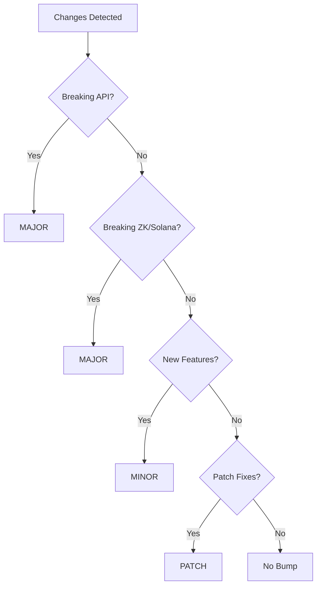

===== FILE ADDED: release/versioning-rules.md =====

Semantic Versioning Rules

Overview

The ZK-5D Cryptographic Badge Authority uses semantic versioning (SemVer) across all components. Version numbers follow MAJOR.MINOR.PATCH format.

Component Versioning Strategy

Component Version Source Sync Strategy
API package.json (root) Monorepo root version
GitHub App app.manifest.json Syncs with root
ZK Worker package.json Syncs with root
Solana Program Cargo.toml Independent major version
CLI package.json Syncs with root
Shared Utils package.json Syncs with root

Version Bump Triggers

MAJOR Version (X.0.0)

API:

· Breaking API changes (removed endpoints, changed response format)
· Authentication flow changes
· Permission structure changes

GitHub App:

· Permission changes (new required permissions)
· Webhook event changes
· Installation flow changes

ZK Circuits:

· Circuit constraint changes
· Trusted setup changes
· Proof format changes

Solana Program:

· Account layout changes
· Instruction format changes
· Breaking state changes

Badge Schemas:

· Removing badge types
· Changing badge criteria
· Changing 5D model structure

Governance:

· Voting threshold changes
· Council structure changes
· Proposal lifecycle changes

MINOR Version (0.X.0)

API:

· New endpoints
· New optional fields
· New badge types

ZK Circuits:

· New circuit types
· Performance improvements

Solana Program:

· New instructions
· New account types
· Non-breaking state additions

Badge Schemas:

· New badge types
· New badge levels

Governance:

· New proposal types
· New voting mechanisms

PATCH Version (0.0.X)

Any Component:

· Bug fixes
· Documentation updates
· Performance improvements
· Security patches (non-breaking)
· Dependency updates

Breaking Change Detection

Automated Detection

```yaml
# .github/workflows/detect-breaking.yml
name: Detect Breaking Changes
on:
  pull_request:
    branches: [main]
jobs:
  detect:
    runs-on: ubuntu-latest
    steps:
      - uses: actions/checkout@v3
      - name: Check API changes
        run: |
          npx openapi-diff v1.0.0 openapi.yaml
      - name: Check Solana program
        run: |
          cargo build-bpf
          # Compare account layouts
```

Manual Flagging

PRs must be labeled with breaking change type:

· breaking:api - API breaking change
· breaking:zk - ZK circuit breaking change
· breaking:solana - Solana program breaking change
· breaking:badge - Badge schema breaking change
· breaking:governance - Governance rule breaking change

Version Bump Decision Tree



Solana Program Versioning

Solana programs use independent versioning to manage on-chain compatibility:

```toml
# Cargo.toml
[package]
name = "zkbadge-program"
version = "1.2.3"  # Independent from monorepo
```

Program Upgrade Policy

Change Type Version Bump Requires Audit
Bug fix PATCH No
New instruction MINOR No
New account type MINOR Yes
Account layout change MAJOR Yes
Instruction format change MAJOR Yes

ZK Circuit Versioning

Circuits have their own version metadata:

```json
{
  "version": "1.0.0",
  "circuits": {
    "identity": "1.0.0",
    "badgeProof": "1.0.0",
    "revocation": "1.0.0"
  }
}
```

Release Candidate Process

For MAJOR releases:

1. vX.0.0-rc.1 - Release candidate
2. 7-day testing period
3. Governance vote (if required)
4. Final release

Version Compatibility Matrix

Root Version Solana Program ZK Circuits API Version Status
1.0.x 1.0.x 1.0.x v1 ✅ Supported
1.1.x 1.0.x 1.0.x v1 ✅ Supported
2.0.x 2.0.x 2.0.x v2 ⚠️ Migration required

===== FILE ADDED: release/changelog-template.md =====

Changelog

All notable changes to the ZK-5D Cryptographic Badge Authority will be documented in this file.

The format is based on Keep a Changelog,
and this project adheres to Semantic Versioning.

[Unreleased]

Added

· New features in development

Changed

· Changes to existing functionality

Deprecated

· Soon-to-be removed features

Removed

· Removed features

Fixed

· Bug fixes

Security

· Security updates

Governance

· Changes to governance rules

---

[1.0.0] - 2024-01-15

Added

API

· Initial REST API with badge issuance and verification
· JWT authentication with role-based permissions
· Rate limiting on all endpoints
· Health check endpoint

GitHub App

· Webhook handler for PR merged events
· Installation and uninstallation handlers
· Permission validation for installations
· Support for 5 GitHub event types

ZK System

· Identity circuit for GitHub user binding
· Badge proof circuit for contribution verification
· Revocation circuit for badge status checking
· Groth16 prover and verifier with snarkjs

Solana Program

· IssueBadge instruction with account creation
· RevokeBadge instruction with authority checks
· VerifyBadge instruction with expiration validation
· Borsh serialization for account data

Badge Engine

· First Contributor badge schema
· Regular Contributor badge schema
· Core Contributor badge schema
· Bug Hunter badge schema
· Review Master badge schema

Governance

· GitDigital integration for badge schema changes
· Proposal system with 7-day voting period
· Council with 5 members for dispute resolution
· Audit logging for all governance actions

Deployment

· Docker multi-stage builds for API, worker, and CLI
· Railway configuration with auto-scaling
· Fly.io configuration with health checks
· Solana program deployment scripts

Changed

· Initial release

Fixed

· Initial release

Security

· Webhook signature verification with HMAC-SHA256
· JWT tokens with 24-hour expiration
· Rate limiting to prevent abuse
· Non-root user in Docker containers

Governance

· Initial governance structure defined
· Multi-sig requirements for production deployments
· Council election process documented

---

[Unreleased]

Added

· [API] New endpoint for batch badge verification
· [ZK] Support for Poseidon hash in identity circuit
· [Solana] Governance account for on-chain proposals
· [Badge] Security Researcher badge type

Changed

· [API] Rate limit increased to 200 requests per 15 minutes
· [ZK] Improved witness generation performance

Fixed

· [GitHub] Webhook signature timing attack vulnerability

Governance

· [Change] Council term increased from 6 to 12 months
· [New] Emergency proposal type with 24-hour voting

---

[0.1.0] - 2024-01-01

Added

· Initial alpha release
· Basic badge issuance flow
· Local development environment
· Unit test coverage for badge engine

---

Legend

· [API] - REST API changes
· [GitHub] - GitHub App changes
· [ZK] - ZK circuit and prover changes
· [Solana] - Solana program changes
· [Badge] - Badge schema changes
· [CLI] - CLI tool changes
· [Docs] - Documentation changes
· [Governance] - Governance rule changes
· [Security] - Security-related changes

===== FILE ADDED: release/release-notes-template.md =====

Release Notes - ZK-5D Cryptographic Badge Authority v{version}

Release Summary

Release Date: {date}
Release Type: {major/minor/patch}
Governance Approval: {yes/no}
Security Audit: {yes/no/pending}

This release introduces {summary of major changes}.

Compatibility

Component Version Compatible
API {version} ✅
Solana Program {solana_version} ✅
ZK Circuits {zk_version} ✅
GitHub App {github_version} ✅
CLI {cli_version} ✅

Migration Notes

{migration_instructions}

What's New

{component_name} {component_version}

🚀 New Features

{list of new features with emojis}

🔧 Improvements

{list of improvements}

🐛 Bug Fixes

{list of bug fixes}

🔒 Security

{list of security updates}

📝 Governance

{list of governance changes}

Detailed Changes

API Changes

{api_changes_table}

Endpoint Method Change Type Description
/api/badges/{id} GET Added New badge details endpoint

ZK Circuit Changes

{zk_changes}

· identity.circom: {changes}
· badgeProof.circom: {changes}
· revocation.circom: {changes}

Solana Program Changes

{solana_changes}

· New instructions: {new_instructions}
· Modified instructions: {modified_instructions}
· Account layout changes: {account_changes}

Badge Schema Changes

{badge_schema_changes}

Badge Change Impact
{badge_name} {change_type} {impact_description}

Deployment Instructions

Prerequisites

· Node.js 20+
· Solana CLI 1.16+
· Docker 20.10+

Upgrade Steps

```bash
# 1. Pull latest images
docker pull zkbadge/api:{version}
docker pull zkbadge/worker:{version}

# 2. Update Solana program (if applicable)
solana program deploy target/deploy/zkbadge_program.so --upgrade-authority <authority>

# 3. Update environment variables
# Check .env.example for new required variables

# 4. Deploy API
flyctl deploy --config config/deploy/fly/fly.toml

# 5. Run migrations
npm run migrate
```

Rollback Procedure

```bash
# Rollback to previous version
flyctl releases list
flyctl releases rollback v{previous_version}
```

Governance Impact

Required Actions

· {governance_actions}

Voting Results (if applicable)

· Proposal ID: {proposal_id}
· Votes For: {votes_for}
· Votes Against: {votes_against}
· Voter Turnout: {turnout}%

Known Issues

{known_issues}

Contributors

{contributors_list}

Support

For questions or issues:

· GitHub Issues: https://github.com/your-org/ZK-5D-Cryptographic-Badge-Authority-app/issues
· Discord: https://discord.gg/zkbadge
· Email: support@zkbadge.io

---

Next Release: {next_release_date} (estimated)

===== FILE ADDED: release/bump-versions.ts =====
#!/usr/bin/env ts-node

import * as fs from 'fs';
import * as path from 'path';
import { execSync } from 'child_process';

interface VersionBump {
component: string;
oldVersion: string;
newVersion: string;
bumpType: 'major' | 'minor' | 'patch';
}

class VersionBumper {
private rootDir: string;
private bumpType: string;
private dryRun: boolean;
private changes: VersionBump[] = [];

constructor(bumpType: string, dryRun: boolean = false) {
this.rootDir = path.resolve(__dirname, '..');
this.bumpType = bumpType;
this.dryRun = dryRun;
}

async bumpAll(): Promise<void> {
console.log(🚀 Bumping versions (${this.bumpType})...);

}

private async bumpRootPackage(): Promise<void> {
const packagePath = path.join(this.rootDir, 'package.json');
const pkg = JSON.parse(fs.readFileSync(packagePath, 'utf8'));
const oldVersion = pkg.version;
const newVersion = this.getNewVersion(oldVersion);

}

private async bumpApiVersion(): Promise<void> {
const apiConfigPath = path.join(this.rootDir, 'src/config/appConfig.ts');
let content = fs.readFileSync(apiConfigPath, 'utf8');

}

private async bumpGitHubAppManifest(): Promise<void> {
const manifestPath = path.join(this.rootDir, 'app.manifest.json');
const manifest = JSON.parse(fs.readFileSync(manifestPath, 'utf8'));
const oldVersion = manifest.version;
const newVersion = this.getNewVersion(oldVersion);

}

private async bumpSolanaProgram(): Promise<void> {
const cargoPath = path.join(this.rootDir, 'src/zk/solana/program/Cargo.toml');
let content = fs.readFileSync(cargoPath, 'utf8');

}

private async bumpZkCircuits(): Promise<void> {
const versionPath = path.join(this.rootDir, 'src/zk/circuits/version.json');
let versionFile = { version: '1.0.0', circuits: {} };

}

private async bumpCliVersion(): Promise<void> {
const cliPackagePath = path.join(this.rootDir, 'package.json');
const pkg = JSON.parse(fs.readFileSync(cliPackagePath, 'utf8'));
const oldVersion = pkg.version;
const newVersion = this.getNewVersion(oldVersion);

}

private getNewVersion(currentVersion: string): string {
const [major, minor, patch] = currentVersion.split('.').map(Number);

}

private printSummary(): void {
console.log('\n📋 Version Bump Summary:');
console.log('─'.repeat(50));

}

private async commitChanges(): Promise<void> {
console.log('\n💾 Committing version changes...');

}
}

// CLI execution
const bumpType = process.argv[2];
const dryRun = process.argv.includes('--dry-run');

if (!bumpType || .includes(bumpType)) {
console.error('Usage: ts-node bump-versions.ts <major|minor|patch> [--dry-run]');
process.exit(1);
}

const bumper = new VersionBumper(bumpType, dryRun);
bumper.bumpAll().catch(console.error);

===== FILE ADDED: release/generate-changelog.ts =====
#!/usr/bin/env ts-node

import * as fs from 'fs';
import * as path from 'path';
import { execSync } from 'child_process';

interface Commit {
hash: string;
message: string;
type: string;
scope: string;
description: string;
breaking: boolean;
}

class ChangelogGenerator {
private rootDir: string;
private lastTag: string;
private currentVersion: string;
private commits: Commit[] = [];

constructor() {
this.rootDir = path.resolve(__dirname, '..');
this.lastTag = this.getLastTag();
this.currentVersion = this.getCurrentVersion();
}

private getLastTag(): string {
try {
const tags = execSync('git tag --sort=-v:refname', { cwd: this.rootDir })
.toString()
.trim()
.split('\n')
.filter(t => t.startsWith('v'));

}

private getCurrentVersion(): string {
const pkg = JSON.parse(fs.readFileSync(path.join(this.rootDir, 'package.json'), 'utf8'));
return pkg.version;
}

private fetchCommits(): void {
const range = this.lastTag ? ${this.lastTag}..HEAD : 'HEAD';

}

private parseCommit(message: string): Partial<Commit> | null {
// Parse conventional commit format: type(scope): description
const conventionalMatch = message.match(/^(\w+)(?:([^)]+))?:\s*(.+)$/);

}

private groupBySurface(): Map<string, Commit[]> {
const groups = new Map<string, Commit[]>();

}

private groupByType(commits: Commit[]): Map<string, Commit[]> {
const groups = new Map<string, Commit[]>();
const typeOrder = ['Added', 'Changed', 'Fixed', 'Removed', 'Security', 'Governance'];

}

generate(): string {
this.fetchCommits();

}

write(): void {
const changelog = this.generate();
const changelogPath = path.join(this.rootDir, 'CHANGELOG.md');

}
}

// CLI execution
const generator = new ChangelogGenerator();
generator.write();

===== FILE ADDED: release/generate-release-notes.ts =====
#!/usr/bin/env ts-node

import * as fs from 'fs';
import * as path from 'path';
import { execSync } from 'child_process';

interface ReleaseNotes {
version: string;
date: string;
type: string;
governanceApproval: boolean;
securityAudit: boolean;
summary: string;
components: Record<string, string>;
changes: Record<string, any>;
migrationInstructions: string;
knownIssues: string[];
contributors: string[];
}

class ReleaseNotesGenerator {
private rootDir: string;
private version: string;
private notes: ReleaseNotes;

constructor() {
this.rootDir = path.resolve(__dirname, '..');
this.version = this.getVersion();
this.notes = this.initializeNotes();
}

private getVersion(): string {
const pkg = JSON.parse(fs.readFileSync(path.join(this.rootDir, 'package.json'), 'utf8'));
return pkg.version;
}

private initializeNotes(): ReleaseNotes {
return {
version: this.version,
date: new Date().toISOString().split('T')[0],
type: this.determineReleaseType(),
governanceApproval: false,
securityAudit: false,
summary: '',
components: {},
changes: {},
migrationInstructions: '',
knownIssues: [],
contributors: []
};
}

private determineReleaseType(): string {
const versionParts = this.version.split('.');
const commits = this.getCommits();

}

private getCommits(): any[] {
try {
const log = execSync(
git log ${this.getLastTag()}..HEAD --pretty=format:"%s",
{ cwd: this.rootDir, encoding: 'utf8' }
);

}

private getLastTag(): string {
try {
const tags = execSync('git tag --sort=-v:refname', { cwd: this.rootDir })
.toString()
.trim()
.split('\n')
.filter(t => t.startsWith('v'));

}

private hasBreakingChanges(commits: any[]): boolean {
return commits.some(c => c.message.includes('BREAKING CHANGE'));
}

private hasNewFeatures(commits: any[]): boolean {
return commits.some(c => c.type === 'feat');
}

private getContributors(): string[] {
try {
const contributors = execSync(
git log ${this.getLastTag()}..HEAD --format="%an" | sort -u,
{ cwd: this.rootDir, encoding: 'utf8' }
);

}

private collectChanges(): void {
const changelogPath = path.join(this.rootDir, 'CHANGELOG.md');
if (fs.existsSync(changelogPath)) {
const content = fs.readFileSync(changelogPath, 'utf8');
const versionSection = content.match(
new RegExp(## \\[${this.version}\\] - [\\d-]+([\\s\\S]*?)(?=\n## \\[|$))
);

}

private parseChanges(section: string): Record<string, any> {
const changes: Record<string, any> = {};
const surfaces = ['API', 'ZK', 'Solana', 'Badges', 'GitHub App', 'CLI', 'Governance'];

}

private generateSummary(): string {
const type = this.notes.type;
const changesCount = Object.keys(this.notes.changes).length;

}

private generateComponentVersions(): void {
// Root version
this.notes.components['API'] = this.version;
this.notes.components['CLI'] = this.version;

}

private generateMigrationInstructions(): string {
if (this.notes.type !== 'major') {
return 'No migration required. Standard upgrade process applies.';
}

}

generateMarkdown(): string {
this.notes.contributors = this.getContributors();
this.collectChanges();
this.notes.summary = this.generateSummary();
this.generateComponentVersions();
this.notes.migrationInstructions = this.generateMigrationInstructions();

}

write(): void {
const markdown = this.generateMarkdown();
const releasePath = path.join(this.rootDir, RELEASE_NOTES_v${this.version}.md);
fs.writeFileSync(releasePath, markdown);
console.log(✅ Generated release notes for version ${this.version});
}
}

// CLI execution
const generator = new ReleaseNotesGenerator();
generator.write();

===== FILE ADDED: .github/workflows/release.yml =====
name: Release

on:
workflow_dispatch:
inputs:
release_type:
description: 'Release type'
required: true
type: choice
options:
- major
- minor
- patch
dry_run:
description: 'Dry run (no actual release)'
required: false
type: boolean
default: false

jobs:
validate:
runs-on: ubuntu-latest
steps:
- uses: actions/checkout@v3
with:
fetch-depth: 0

governance-gate:
needs: validate
runs-on: ubuntu-latest
if: github.event.inputs.release_type == 'major'
steps:
- name: Check governance approval
run: |
echo "Major release requires governance approval"
# Check for approval label or PR approval
# This would integrate with GitDigital
APPROVED=$(curl -s https://api.gitdigital.io/proposals/active | jq '.[] | select(.title | contains("Release")) | .status')
if [ "$APPROVED" != "approved" ]; then
echo "No governance approval found"
exit 1
fi

bump-versions:
needs: [validate, governance-gate]
runs-on: ubuntu-latest
if: github.event.inputs.dry_run != true
steps:
- uses: actions/checkout@v3
with:
token: ${{ secrets.GITHUB_TOKEN }}

generate-changelog:
needs: bump-versions
runs-on: ubuntu-latest
steps:
- uses: actions/checkout@v3
with:
fetch-depth: 0

generate-release-notes:
needs: generate-changelog
runs-on: ubuntu-latest
steps:
- uses: actions/checkout@v3
with:
fetch-depth: 0

create-github-release:
needs: generate-release-notes
runs-on: ubuntu-latest
steps:
- uses: actions/checkout@v3
with:
fetch-depth: 0

publish-docker:
needs: create-github-release
runs-on: ubuntu-latest
steps:
- uses: actions/checkout@v3

publish-npm:
needs: create-github-release
runs-on: ubuntu-latest
steps:
- uses: actions/checkout@v3

===== FILE ADDED: .github/workflows/governance-release-gate.yml =====
name: Governance Release Gate

on:
pull_request:
types: [labeled, synchronize]
paths:
- 'src/badges/badgeSchemas.ts'
- 'src/zk/circuits/*.circom'
- 'src/zk/solana/program/src/**'
- '.gitdigital-badges.yml'
- '.gitdigital-governance.yml'

jobs:
check-governance-requirements:
runs-on: ubuntu-latest
if: contains(github.event.pull_request.labels.*.name, 'governance-required')

===== FILE UPDATED: package.json =====
{
"name": "zk-5d-cryptographic-badge-authority",
"version": "1.0.0",
"description": "Zero-Knowledge Cryptographic Badge Authority for GitHub",
"main": "dist/index.js",
"scripts": {
"build": "tsc",
"build:circuits": "bash scripts/build-circuits.sh",
"dev": "nodemon --exec ts-node src/index.ts",
"start": "node dist/index.js",
"test": "jest --coverage",
"test:unit": "jest tests/unit --coverage",
"test:integration": "jest tests/integration --coverage",
"test:e2e": "jest tests/e2e --coverage",
"lint": "eslint src//*.ts",
"format": "prettier --write \"src//*.ts\"",
"circuits:compile": "circom src/zk/circuits/identity.circom --r1cs --wasm --sym -o src/zk/circuits/compiled && circom src/zk/circuits/badgeProof.circom --r1cs --wasm --sym -o src/zk/circuits/compiled && circom src/zk/circuits/revocation.circom --r1cs --wasm --sym -o src/zk/circuits/compiled",
"circuits:verify": "snarkjs r1cs info src/zk/circuits/compiled/identity.r1cs",
"solana:build": "cd src/zk/solana/program && cargo build-bpf",
"solana:test": "cd src/zk/solana/program && cargo test-bpf",
"solana:deploy": "solana program deploy src/zk/solana/program/target/deploy/zkbadge_program.so",
"badge:issue": "ts-node scripts/issue-badges.ts",
"docker:build": "docker build -t zk-badge-authority .",
"docker:up": "docker-compose up -d",
"docker:down": "docker-compose down",
"release:major": "npx ts-node release/bump-versions.ts major",
"release:minor": "npx ts-node release/bump-versions.ts minor",
"release:patch": "npx ts-node release/bump-versions.ts patch",
"release:changelog": "npx ts-node release/generate-changelog.ts",
"release:notes": "npx ts-node release/generate-release-notes.ts",
"prerelease": "npm run test && npm run build && npm run circuits:compile && npm run solana:build"
},
"keywords": ["zk-snarks", "solana", "github", "badges", "cryptography"],
"author": "ZK-5D Badge Authority",
"license": "MIT",
"dependencies": {
"@octokit/auth-app": "^6.0.0",
"@octokit/rest": "^20.0.0",
"@solana/web3.js": "^1.87.0",
"@solana/spl-token": "^0.3.8",
"axios": "^1.6.2",
"borsh": "^0.10.0",
"circomlibjs": "^0.1.7",
"cors": "^2.8.5",
"dotenv": "^16.3.1",
"express": "^4.18.2",
"express-rate-limit": "^7.0.0",
"helmet": "^7.1.0",
"ioredis": "^5.3.2",
"jsonwebtoken": "^9.0.2",
"rate-limit-redis": "^4.0.0",
"snarkjs": "^0.7.0",
"winston": "^3.11.0"
},
"devDependencies": {
"@types/cors": "^2.8.17",
"@types/express": "^4.17.21",
"@types/jest": "^29.5.10",
"@types/jsonwebtoken": "^9.0.5",
"@types/node": "^20.10.4",
"@typescript-eslint/eslint-plugin": "^6.13.2",
"@typescript-eslint/parser": "^6.13.2",
"eslint": "^8.55.0",
"jest": "^29.7.0",
"nodemon": "^3.0.2",
"prettier": "^3.1.0",
"ts-jest": "^29.1.1",
"ts-node": "^10.9.2",
"typescript": "^5.3.2"
},
"engines": {
"node": ">=20.0.0",
"npm": ">=10.0.0"
}
}

===== FILE ADDED: src/zk/circuits/version.json =====
{
"version": "1.0.0",
"circuits": {
"identity": "1.0.0",
"badgeProof": "1.0.0",
"revocation": "1.0.0"
},
"trustedSetup": {
"phase1": "pot14_final.ptau",
"phase2": {
"identity": "identity_final.zkey",
"badgeProof": "badgeProof_final.zkey",
"revocation": "revocation_final.zkey"
}
}
}

===== FILE UPDATED: app.manifest.json =====
{
"name": "ZK-5D Cryptographic Badge Authority",
"short_name": "ZK Badge Auth",
"description": "Decentralized badge issuance with zero-knowledge proofs",
"version": "1.0.0",
"author": "ZK-5D Badge Authority",
"repository": "https://github.com/your-org/ZK-5D-Cryptographic-Badge-Authority-app",
"license": "MIT",
"github_app": {
"id": "zk-badge-authority",
"name": "ZK Badge Authority",
"webhook_url": "https://api.zkbadge.io/webhook",
"permissions": {
"metadata": "read",
"pull_requests": "write",
"issues": "write",
"contents": "read",
"actions": "read"
},
"events": [
"pull_request",
"issues",
"push",
"release",
"workflow_run"
]
},
"solana": {
"program_id": "ZKBadge1111111111111111111111111111111111",
"network": "devnet"
}
}
