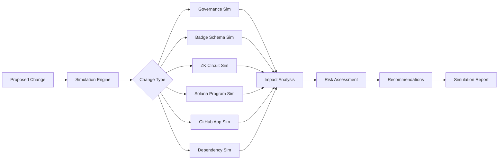

===== FILE ADDED: simulation/types.ts =====
/**

· Simulation Types
· 
· Defines the core types for the ecosystem simulation engine.
  */

export interface SimulationInput {
id: string;
type: SimulationType;
timestamp: number;
proposedBy: string;
description: string;
data: any;
}

export interface SimulationOutput {
id: string;
inputId: string;
timestamp: number;
impacts: Impact[];
riskLevel: 'low' | 'medium' | 'high' | 'critical';
requiredActions: RequiredAction[];
compatibility: CompatibilityMatrix;
recommendations: string[];
summary: string;
impactGraph: string; // Mermaid diagram
}

export interface Impact {
type: ImpactType;
surface: string;
severity: 'low' | 'medium' | 'high' | 'critical';
description: string;
affectedComponents: string[];
estimatedEffort: 'small' | 'medium' | 'large' | 'xlarge';
}

export interface RequiredAction {
action: string;
priority: 'immediate' | 'prerequisite' | 'post-release' | 'optional';
description: string;
estimatedTime: string;
assignTo: string[];
}

export interface CompatibilityMatrix {
api: { current: string; required: string; compatible: boolean };
zk: { current: string; required: string; compatible: boolean };
solana: { current: string; required: string; compatible: boolean };
github: { current: string; required: string; compatible: boolean };
}

export type SimulationType =
| 'governance_change'
| 'badge_schema'
| 'zk_circuit'
| 'solana_program'
| 'github_app_permission'
| 'dependency_update'
| 'release_cycle'
| 'drift_projection';

export type ImpactType =
| 'breaking_change'
| 'migration_required'
| 'circuit_rebuild'
| 'account_migration'
| 'test_failure'
| 'doc_outdated'
| 'performance_degradation'
| 'security_vulnerability'
| 'governance_violation';

export interface GovernanceSimInput extends SimulationInput {
type: 'governance_change';
data: {
ruleId: string;
oldRule: string;
newRule: string;
thresholdChange: boolean;
quorumChange: boolean;
vetoPowerChange: boolean;
};
}

export interface BadgeSchemaSimInput extends SimulationInput {
type: 'badge_schema';
data: {
badgeName: string;
changeType: 'added' | 'modified' | 'removed';
oldCriteria?: Record<string, any>;
newCriteria: Record<string, any>;
requiresProof?: boolean;
lifetime?: string;
};
}

export interface ZKCircuitSimInput extends SimulationInput {
type: 'zk_circuit';
data: {
circuitName: string;
oldConstraints?: number;
newConstraints: number;
changeType: 'added' | 'modified';
wasmSize?: number;
};
}

export interface SolanaProgramSimInput extends SimulationInput {
type: 'solana_program';
data: {
oldProgramId?: string;
newProgramId?: string;
instructionChanges: string[];
stateChanges: string[];
accountLayoutChanged: boolean;
};
}

export interface GitHubAppSimInput extends SimulationInput {
type: 'github_app_permission';
data: {
permissionType: string;
oldPermission: string;
newPermission: string;
webhookEventsAdded: string[];
webhookEventsRemoved: string[];
};
}

export interface DependencySimInput extends SimulationInput {
type: 'dependency_update';
data: {
packageName: string;
oldVersion: string;
newVersion: string;
updateType: 'major' | 'minor' | 'patch';
};
}

export interface ReleaseCycleSimInput extends SimulationInput {
type: 'release_cycle';
data: {
targetVersion: string;
releaseType: 'major' | 'minor' | 'patch';
components: string[];
targetDate: string;
};
}

export interface DriftProjectionSimInput extends SimulationInput {
type: 'drift_projection';
data: {
timeHorizon: 'month' | 'quarter' | 'year';
currentDriftRate: number;
projectedChanges: number;
};
}

export type SimulationInputUnion =
| GovernanceSimInput
| BadgeSchemaSimInput
| ZKCircuitSimInput
| SolanaProgramSimInput
| GitHubAppSimInput
| DependencySimInput
| ReleaseCycleSimInput
| DriftProjectionSimInput;

===== FILE ADDED: simulation/engine.ts =====
/**

· Simulation Engine
· 
· Core engine that runs deterministic simulations and generates outputs.
  */

import * as crypto from 'crypto';
import {
SimulationInput,
SimulationOutput,
SimulationType,
Impact,
RequiredAction,
CompatibilityMatrix,
SimulationInputUnion,
GovernanceSimInput,
BadgeSchemaSimInput,
ZKCircuitSimInput,
SolanaProgramSimInput,
GitHubAppSimInput,
DependencySimInput,
ReleaseCycleSimInput,
DriftProjectionSimInput
} from './types';

export class SimulationEngine {
private inputs: Map<string, SimulationInput> = new Map();
private outputs: Map<string, SimulationOutput> = new Map();

async runSimulation(input: SimulationInputUnion): Promise<SimulationOutput> {
const id = this.generateId(input);
const impacts: Impact[] = [];
const requiredActions: RequiredAction[] = [];

}

private generateId(input: SimulationInput): string {
const hash = crypto.createHash('sha256')
.update(JSON.stringify({
type: input.type,
timestamp: input.timestamp,
description: input.description
}))
.digest('hex');
return ${input.type}-${hash.substring(0, 8)};
}

private async simulateGovernanceChange(input: GovernanceSimInput): Promise<SimulationOutput> {
const impacts: Impact[] = [];
const requiredActions: RequiredAction[] = [];

}

private async simulateBadgeSchema(input: BadgeSchemaSimInput): Promise<SimulationOutput> {
const impacts: Impact[] = [];
const requiredActions: RequiredAction[] = [];

}

private async simulateZKCircuit(input: ZKCircuitSimInput): Promise<SimulationOutput> {
const impacts: Impact[] = [];
const requiredActions: RequiredAction[] = [];

}

private async simulateSolanaProgram(input: SolanaProgramSimInput): Promise<SimulationOutput> {
const impacts: Impact[] = [];
const requiredActions: RequiredAction[] = [];

}

private async simulateGitHubApp(input: GitHubAppSimInput): Promise<SimulationOutput> {
const impacts: Impact[] = [];
const requiredActions: RequiredAction[] = [];

}

private async simulateDependencyUpdate(input: DependencySimInput): Promise<SimulationOutput> {
const impacts: Impact[] = [];
const requiredActions: RequiredAction[] = [];

}

private async simulateReleaseCycle(input: ReleaseCycleSimInput): Promise<SimulationOutput> {
const impacts: Impact[] = [];
const requiredActions: RequiredAction[] = [];

}

private async simulateDriftProjection(input: DriftProjectionSimInput): Promise<SimulationOutput> {
const impacts: Impact[] = [];
const requiredActions: RequiredAction[] = [];

}

private generateImpactGraph(impacts: Impact[]): string {
let graph = 'graph TD\n';
const nodes: Set<string> = new Set();

}

private sanitizeId(id: string): string {
return id.replace(/[^a-zA-Z0-9]/g, '_');
}

private getCompatibilityMatrix(): CompatibilityMatrix {
return {
api: { current: '1.0', required: '1.0', compatible: true },
zk: { current: '1.0', required: '1.0', compatible: true },
solana: { current: '1.0', required: '1.0', compatible: true },
github: { current: '1.0', required: '1.0', compatible: true }
};
}

private generateRecommendations(impacts: Impact[], riskLevel: string): string[] {
const recommendations: string[] = [];

}
}

===== FILE ADDED: .github/workflows/simulation-on-pr.yml =====
name: Simulation on Pull Request

on:
pull_request:
types: [opened, synchronize, labeled]
paths:
- '.gitdigital-badges.yml'
- 'src/badges/badgeSchemas.ts'
- 'src/zk/circuits/*.circom'
- 'src/zk/solana/program/src/**'
- 'app.manifest.json'
- 'package.json'

jobs:
simulate:
runs-on: ubuntu-latest
steps:
- uses: actions/checkout@v3
with:
fetch-depth: 0

===== FILE ADDED: docs/simulation/overview.md =====

Ecosystem Simulation Layer

Overview

The Ecosystem Simulation Layer is a deterministic, governance-aligned engine that models the future impact of proposed changes across the entire ZK-5D badge authority ecosystem. It helps teams understand risks, required actions, and compatibility implications before implementing changes.

Purpose

· Risk Assessment: Identify breaking changes before they happen
· Impact Analysis: Understand cascading effects across components
· Planning: Estimate effort and timeline for changes
· Governance: Determine required approval levels
· Compatibility: Validate version compatibility across surfaces

How It Works



Simulation Types

1. Governance Change Simulation

Models changes to voting thresholds, quorum requirements, and veto powers.

Inputs:

· Rule ID
· Old rule definition
· New rule definition
· Threshold change flag
· Quorum change flag

Outputs:

· Impact on existing proposals
· Required governance actions
· Risk level

2. Badge Schema Simulation

Models additions, modifications, or removals of badge types.

Inputs:

· Badge name
· Change type
· Old criteria (for modifications)
· New criteria
· Proof requirement
· Lifetime

Outputs:

· Affected badge holders
· Required migrations
· ZK circuit impacts

3. ZK Circuit Simulation

Models changes to Circom circuits.

Inputs:

· Circuit name
· Old constraint count
· New constraint count
· WASM size change

Outputs:

· Trusted setup requirement
· Performance impact
· Proving time estimates

4. Solana Program Simulation

Models program upgrades and instruction changes.

Inputs:

· Old program ID
· New program ID
· Instruction changes
· State changes
· Account layout changes

Outputs:

· Account migration requirements
· Client update needs
· Validator coordination

5. GitHub App Permission Simulation

Models permission and webhook changes.

Inputs:

· Permission type
· Old permission level
· New permission level
· Webhook events added/removed

Outputs:

· Re-installation requirements
· Event handler updates

6. Dependency Update Simulation

Models package upgrades.

Inputs:

· Package name
· Old version
· New version
· Update type

Outputs:

· Breaking change detection
· Test failure prediction
· Vulnerability assessment

Running Simulations

Via GitHub Actions (Automatic)

Simulations run automatically on PRs that touch sensitive files:

· Badge schema files → badge schema simulation
· Circuit files → ZK circuit simulation
· Solana program → Solana simulation
· Manifest → GitHub App simulation
· package.json → dependency simulation

Via CLI (Manual)

```bash
# Run simulation for a specific type
npx ts-node simulation/simulation-runner.ts \
  --type badge_schema \
  --input .gitdigital-badges.yml

# Run with specific inputs
npx ts-node simulation/simulation-runner.ts \
  --type zk_circuit \
  --circuit identity \
  --old-constraints 256 \
  --new-constraints 512
```

Via API

```bash
curl -X POST https://api.zkbadge.io/simulate \
  -H "Content-Type: application/json" \
  -d '{
    "type": "governance_change",
    "data": {
      "ruleId": "voting_threshold",
      "thresholdChange": true,
      "newThreshold": 0.75
    }
  }'
```

Understanding Simulation Reports

Risk Levels

Level Description Required Action
Low Minor impact, safe to proceed Standard review
Medium Some impact, needs testing Peer review, integration tests
High Significant impact, breaking changes Governance approval, staging deployment
Critical Severe impact, potential data loss Full security review, multi-sig approval

Impact Types

Type Description Example
breaking_change API/client breaking Endpoint removal
migration_required Data migration needed Account layout change
circuit_rebuild ZK circuit recompile New constraints
account_migration Solana account update Field addition
test_failure Tests need updates Dependency change
doc_outdated Documentation updates API change
performance_degradation Slower operations Larger circuits
security_vulnerability New risks Permission escalation
governance_violation Rule breaking Threshold bypass

Compatibility Matrix

The simulation outputs a compatibility matrix showing version requirements:

```json
{
  "api": { "current": "1.0", "required": "1.1", "compatible": false },
  "zk": { "current": "1.0", "required": "1.0", "compatible": true },
  "solana": { "current": "1.0", "required": "2.0", "compatible": false },
  "github": { "current": "1.0", "required": "1.0", "compatible": true }
}
```

Integration with Other Systems

With Governance System

· Simulation results inform governance approval
· Required actions include governance votes

With Release System

· Release cycle simulations guide versioning
· Impact analysis determines version bump

With Memory System

· Simulation results recorded in memory ledger
· Historical simulations inform future predictions

With Intelligence System

· Pattern detection improves simulation accuracy
· Historical data calibrates impact estimates

Best Practices

1. Run simulations before major changes: Always simulate before merging PRs with significant changes
2. Review impact graphs: Understand cascading effects across components
3. Follow recommendations: Simulation recommendations are based on historical patterns
4. Update simulations: As the ecosystem evolves, simulation parameters should be calibrated
5. Record results: Always commit simulation outputs for historical reference

Limitations

· Simulations are deterministic but not exhaustive
· External dependencies may have unknown impacts
· Human factors not modeled
· Performance impacts are estimates

Future Enhancements

· Machine learning-based impact prediction
· Real-time simulation during PR reviews
· Interactive impact visualization
· Cross-repository dependency simulation
· Automated migration script generation
