===== FILE ADDED: docs/architecture/system-overview.md =====

System Overview

Vision

The ZK-5D Cryptographic Badge Authority is a decentralized, privacy-preserving credentialing system that issues verifiable badges based on GitHub contributions. Using zero-knowledge proofs, it validates developer contributions without revealing sensitive data, storing badge state on Solana with governance via GitDigital.

Core Components

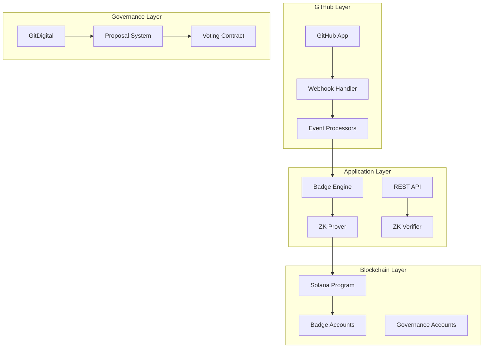

Key Principles

Privacy First

· Zero-knowledge proofs verify contributions without revealing exact counts
· Identity is cryptographically bound but not exposed
· Proofs are non-interactive and publicly verifiable

Decentralized Authority

· No single entity controls badge issuance
· Solana stores immutable badge state
· GitDigital governs schema changes
· Multi-sig controls critical operations

Verifiable Credentials

· Every badge has a cryptographic proof
· On-chain storage ensures immutability
· Revocation is transparent and auditable
· 5D model provides rich metadata

Developer Experience

· Automatic badge issuance from GitHub events
· REST API for integration
· CLI for administration
· Comprehensive documentation

System Boundaries

Trust Boundaries

· GitHub API: Trusted for contribution data
· Solana: Trusted for state storage
· ZK Circuits: Trusted for proof generation
· GitDigital: Trusted for governance

Security Boundaries

· Webhook Signature: Verified with HMAC
· JWT Tokens: Signed with HS256
· Solana Program: Authority checks
· ZK Proofs: Cryptographic verification

Performance Characteristics

Component Latency Throughput Scaling
GitHub Webhook <100ms 1000/sec Horizontal
Badge Engine <50ms 500/sec Horizontal
ZK Proof Generation 5-10s 10/min Vertical (CPU)
ZK Verification 500ms 100/sec Horizontal
Solana TX 500ms 50/sec Network-limited
API <200ms 1000/sec Horizontal

Dependencies

External Services

· GitHub API (contribution data)
· Solana RPC (on-chain state)
· PostgreSQL (audit logs)
· Redis (caching, rate limiting)

Internal Components

· Circom (circuit compilation)
· snarkjs (proof generation)
· Solana BPF (program deployment)
· Node.js runtime

Deployment Topology

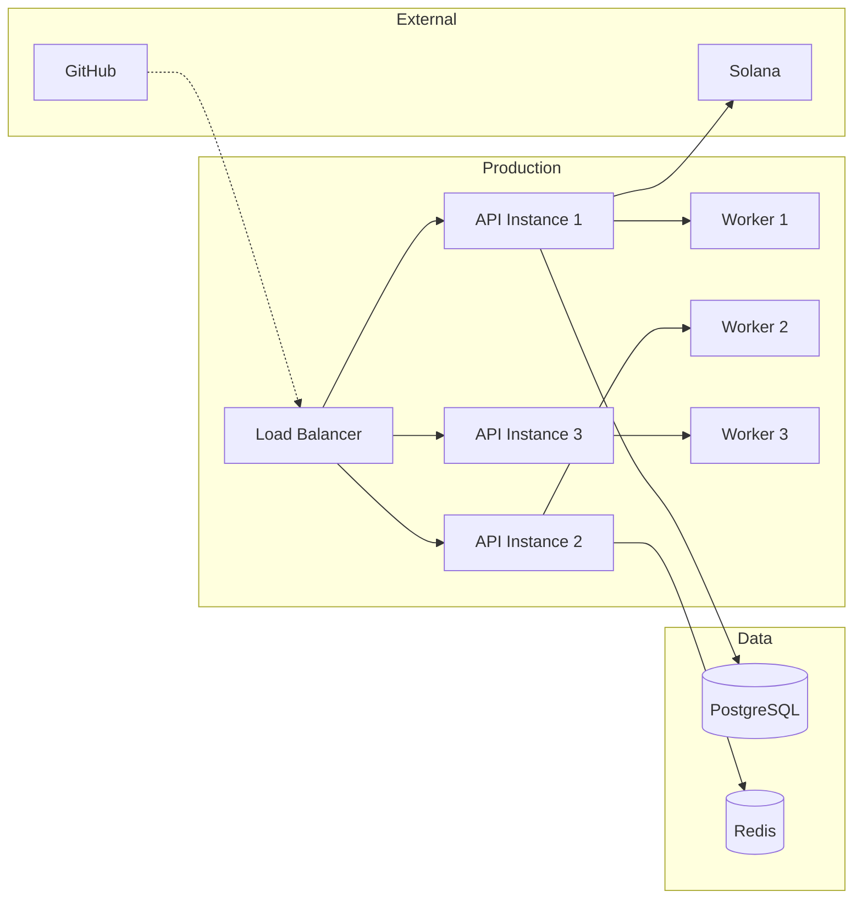

===== FILE ADDED: docs/architecture/monorepo-structure.md =====

Monorepo Structure

Directory Layout

```
ZK-5D-Cryptographic-Badge-Authority-app/
├── .github/                    # GitHub Actions workflows
│   └── workflows/
│       ├── ci.yml
│       ├── cd.yml
│       ├── deploy-*.yml
│       └── governance-gate.yml
│
├── config/                     # Configuration files
│   ├── environments/          # Environment-specific configs
│   │   ├── local.env.example
│   │   ├── dev.env.example
│   │   ├── staging.env.example
│   │   └── prod.env.example
│   ├── secrets/               # Secrets management
│   │   ├── secrets.schema.json
│   │   └── secrets.registry.md
│   └── deploy/                # Deployment configs
│       ├── docker/
│       ├── railway/
│       ├── fly/
│       └── solana/
│
├── src/                        # Source code
│   ├── api/                   # REST API
│   │   ├── controllers/
│   │   ├── middleware/
│   │   └── routes/
│   ├── auth/                  # Authentication
│   │   ├── githubAppAuth.ts
│   │   ├── jwt.ts
│   │   └── permissions.ts
│   ├── badges/                # Badge engine
│   │   ├── badgeEngine.ts
│   │   ├── badgeSchemas.ts
│   │   ├── badge5DModel.ts
│   │   ├── badgeIssuer.ts
│   │   ├── badgeVerifier.ts
│   │   └── badgeRevocation.ts
│   ├── github/                # GitHub integration
│   │   ├── webhookRouter.ts
│   │   ├── eventHandlers/
│   │   └── installation/
│   ├── zk/                    # Zero-knowledge proofs
│   │   ├── circuits/          # Circom circuits
│   │   ├── prover/            # Proof generation
│   │   └── solana/            # Solana program
│   │       ├── program/       # Rust program
│   │       └── client/        # TypeScript client
│   ├── config/                # Configuration
│   │   ├── env.ts
│   │   ├── secrets.ts
│   │   └── appConfig.ts
│   ├── utils/                 # Utilities
│   │   ├── logger.ts
│   │   ├── crypto.ts
│   │   ├── solana.ts
│   │   ├── github.ts
│   │   └── helpers.ts
│   ├── index.ts               # Entry point
│   └── server.ts              # Server setup
│
├── tests/                      # Test suites
│   ├── unit/
│   ├── integration/
│   └── e2e/
│
├── docs/                       # Documentation
│   ├── architecture/
│   ├── api/
│   ├── governance/
│   ├── zk/
│   ├── solana/
│   ├── badges/
│   ├── github-app/
│   ├── ops/
│   └── contributors/
│
├── scripts/                    # Utility scripts
│   ├── build-circuits.sh
│   ├── issue-badges.ts
│   ├── validate-badge-schemas.js
│   └── validate-api-docs.js
│
├── branding/                   # Brand assets
├── .github/                    # GitHub config
├── .gitdigital-*.yml          # Governance rules
├── package.json
├── tsconfig.json
├── docker-compose.yml
├── Dockerfile
└── README.md
```

Module Responsibilities

API Layer (src/api/)

· Controllers: Request handling, validation, response formatting
· Middleware: Auth, rate limiting, error handling, validation
· Routes: Route definitions, permission requirements

Auth Layer (src/auth/)

· GitHubAppAuth: GitHub App authentication, webhook verification
· JWT: Token generation, verification, refresh
· Permissions: Role-based access control

Badge Layer (src/badges/)

· Engine: Eligibility evaluation, schema management
· 5DModel: Badge data structure with 5 dimensions
· Issuer: Proof generation, on-chain storage
· Verifier: Proof verification, expiration checks
· Revocation: Revocation tracking, authority validation

GitHub Layer (src/github/)

· WebhookRouter: Event routing, signature verification
· EventHandlers: PR merged, issues, push, release handlers
· Installation: App install/uninstall, permission checks

ZK Layer (src/zk/)

· Circuits: Circom circuit definitions
· Prover: Witness generation, Groth16 proof creation
· Verifier: Proof validation
· Solana Program: On-chain verification, badge storage

Utils Layer (src/utils/)

· Logger: Winston-based structured logging
· Crypto: Hashing, encryption, random generation
· Solana: Connection utilities, keypair management
· GitHub: API helpers, contribution fetching

Module Dependencies

```
api → auth → badges → zk → solana
          ↓
      github
          
utils → independent utilities
```

Circular Import Prevention: No circular dependencies exist. All modules import from utils, but not vice versa.

===== FILE ADDED: docs/architecture/data-flow.md =====

Data Flow

Badge Issuance Flow

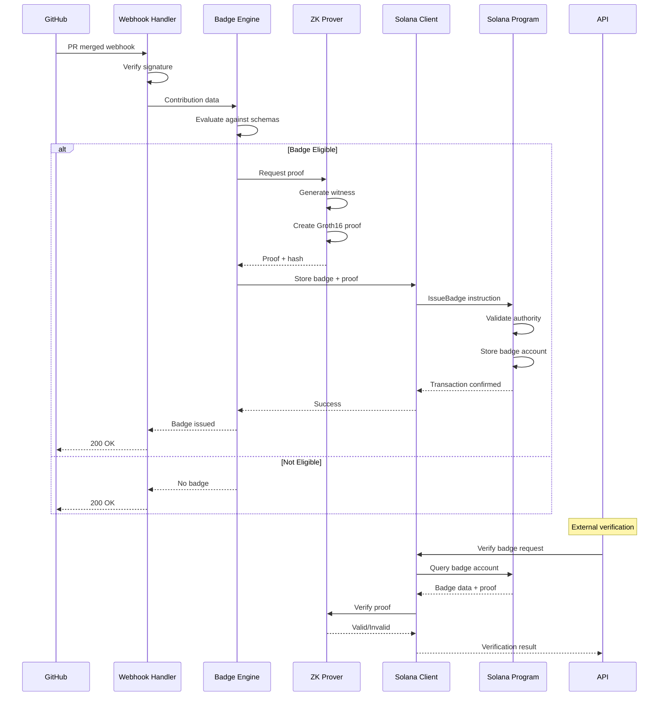

ZK Proof Lifecycle

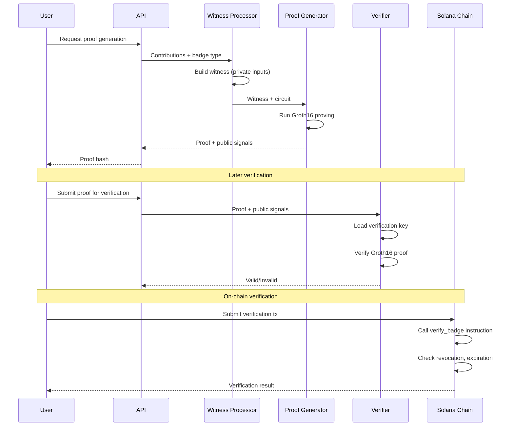

Solana Instruction Flow

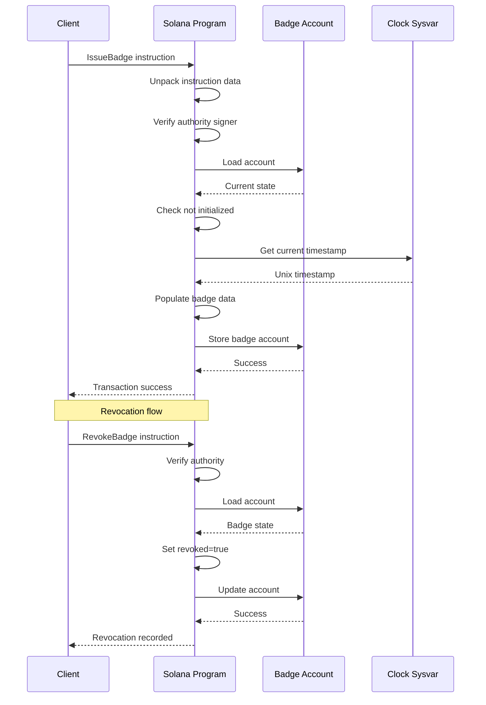

GitHub App Event Flow

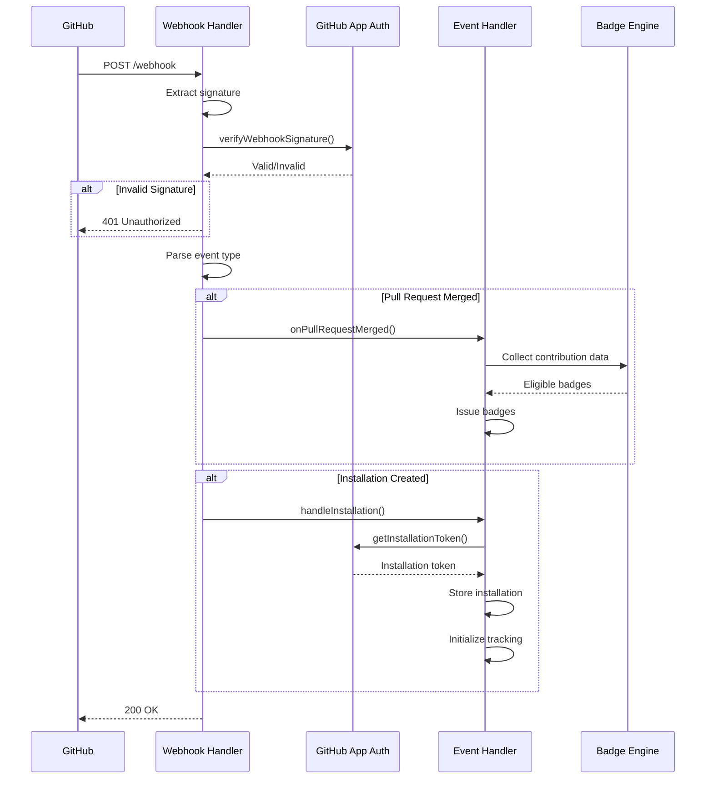

===== FILE ADDED: docs/architecture/diagrams.md =====

Architecture Diagrams

System Context Diagram

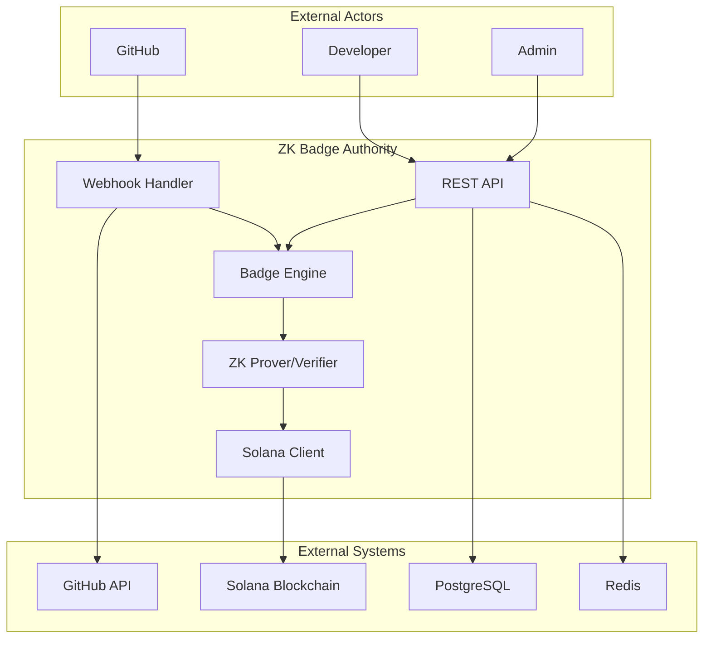

Component Architecture

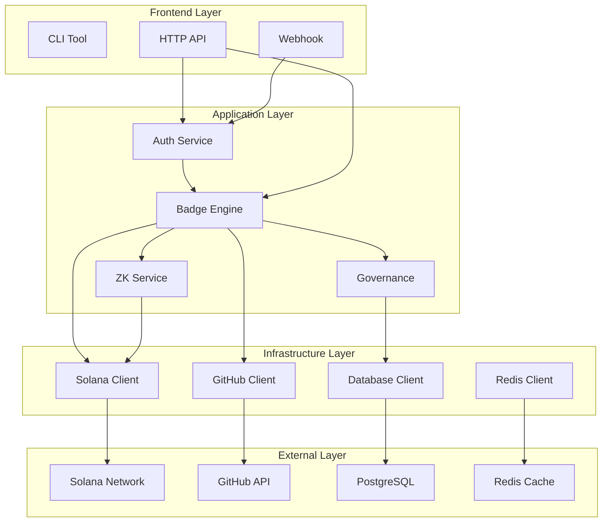

Deployment Architecture

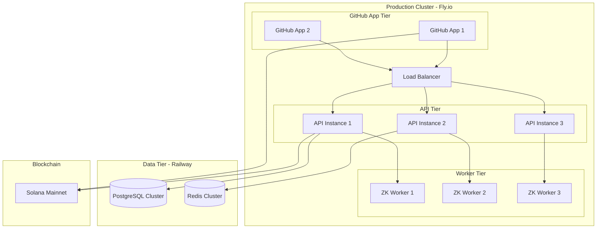

Badge 5D Model

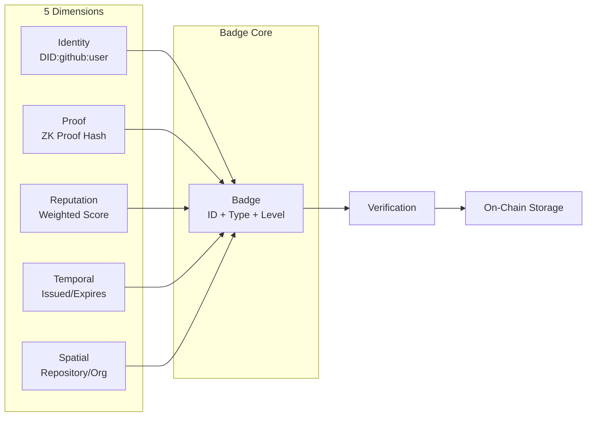

ZK Circuit Architecture

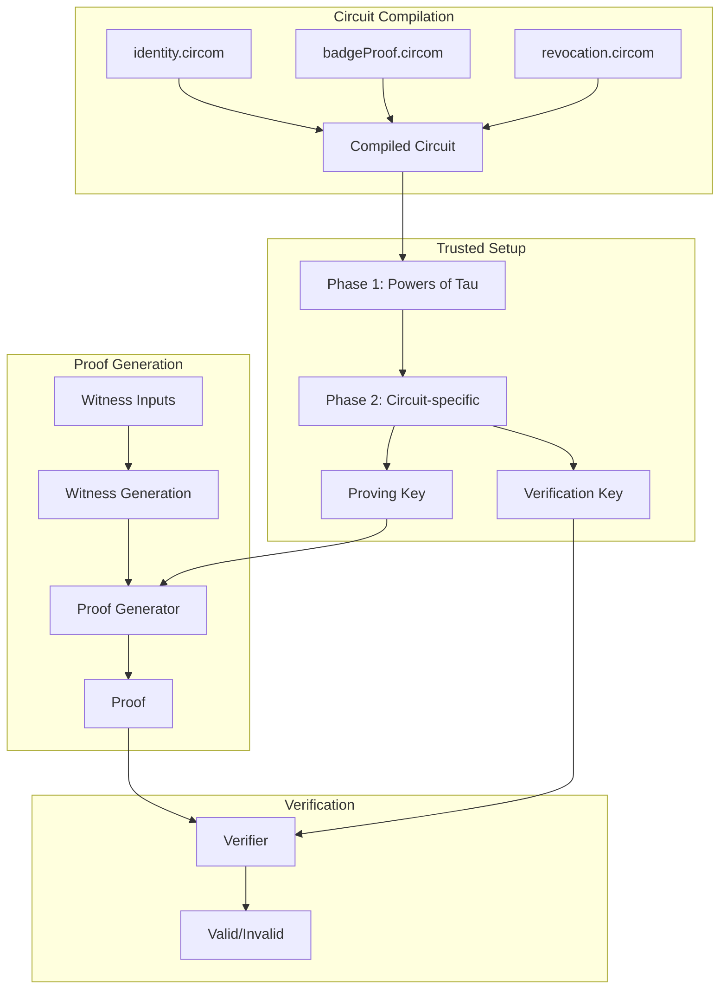

Governance Flow

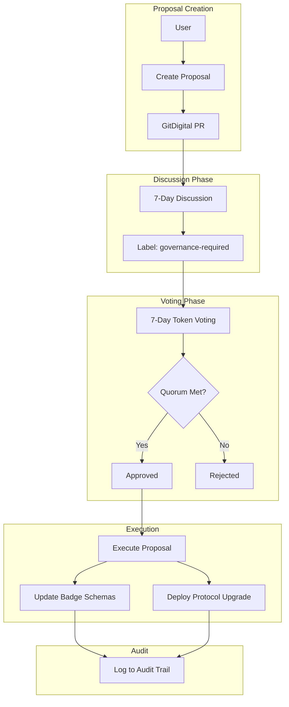

Data Model Relationships

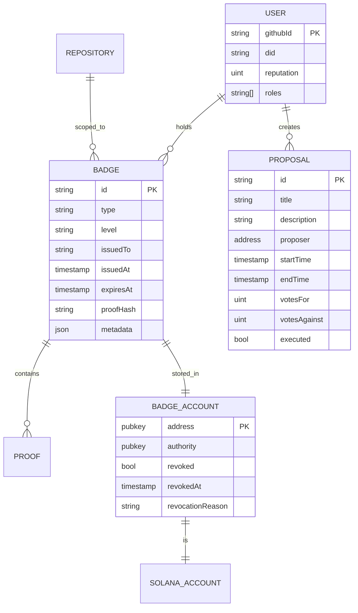

===== FILE ADDED: docs/api/badges.md =====

Badges API

Overview

The Badges API manages badge issuance, verification, and revocation. All endpoints require JWT authentication except public verification endpoints.

Endpoints

GET /api/badges/:badgeId

Retrieve a specific badge by ID.

Authentication: Optional (public badge data)

Parameters:

· badgeId (path): Badge identifier

Response:

```json
{
  "id": "First-Contributor-github:alice-1734567890",
  "type": "contribution",
  "level": "bronze",
  "issuedTo": "github:alice",
  "issuedAt": 1734567890,
  "expiresAt": null,
  "repository": "owner/repo",
  "proofHash": "0xabc123...",
  "metadata": {
    "contributions": {
      "mergedPRs": 1,
      "reviews": 0
    },
    "schema": "First Contributor"
  },
  "identity": "did:github:alice",
  "reputation": 10,
  "temporal": {
    "issued": 1734567890,
    "duration": 0
  },
  "spatial": {
    "scope": "github",
    "contexts": ["owner/repo"]
  }
}
```

Error Responses:

· 404: Badge not found
· 400: Invalid badge ID format

GET /api/badges/user/:userId

Get all badges issued to a user.

Authentication: Optional (public user data)

Parameters:

· userId (path): GitHub username

Response:

```json
{
  "badges": [
    {
      "id": "First-Contributor-github:alice-1734567890",
      "type": "contribution",
      "level": "bronze",
      "issuedAt": 1734567890
    },
    {
      "id": "Regular-Contributor-github:alice-1734568000",
      "type": "contribution",
      "level": "silver",
      "issuedAt": 1734568000
    }
  ],
  "total": 2
}
```

POST /api/badges/issue

Issue a new badge. Requires issuer or admin role.

Authentication: Required (JWT with badge:create permission)

Request Body:

```json
{
  "userId": "github:alice",
  "badgeType": "First Contributor",
  "contributionData": {
    "mergedPRs": 1,
    "repository": "owner/repo",
    "reviews": 0,
    "comments": 0,
    "bugFixes": 0
  }
}
```

Response:

```json
{
  "success": true,
  "badges": [
    {
      "id": "First-Contributor-github:alice-1734567890",
      "type": "contribution",
      "level": "bronze"
    }
  ]
}
```

Validation Rules:

· userId: Must be valid GitHub username format
· badgeType: Must match existing badge schema
· mergedPRs: Must meet badge threshold

POST /api/badges/revoke

Revoke an existing badge. Requires issuer or admin role.

Authentication: Required (JWT with badge:delete permission)

Request Body:

```json
{
  "badgeId": "First-Contributor-github:alice-1734567890",
  "reason": "Fraudulent activity detected"
}
```

Response:

```json
{
  "success": true
}
```

Error Responses:

· 403: Insufficient permissions
· 404: Badge not found
· 400: Already revoked

POST /api/badges/verify

Verify a badge's validity.

Authentication: Optional (public verification)

Request Body:

```json
{
  "badgeId": "First-Contributor-github:alice-1734567890"
}
```

Response:

```json
{
  "valid": true,
  "badge": {
    "id": "First-Contributor-github:alice-1734567890",
    "level": "bronze",
    "issuedAt": 1734567890
  }
}
```

Response (invalid):

```json
{
  "valid": false,
  "reason": "Badge expired"
}
```

Permission Matrix

Endpoint Method Required Permission Default Roles
/badges/:badgeId GET badge:read user, verifier, issuer, admin
/badges/user/:userId GET badge:read user, verifier, issuer, admin
/badges/issue POST badge:create issuer, admin
/badges/revoke POST badge:delete issuer, admin
/badges/verify POST badge:read user, verifier, issuer, admin

Rate Limits

· Public endpoints: 100 requests per 15 minutes per IP
· Authenticated endpoints: 500 requests per hour per user
· Issue/Revoke endpoints: 10 requests per hour per user

===== FILE ADDED: docs/governance/enforcement.md =====

Governance Enforcement

Overview

Governance rules are enforced at multiple levels: code, deployment, and runtime. This document describes how each rule is implemented and verified.

Code-Level Enforcement

Badge Schema Validation

Rule: All badge schemas must be defined in both .gitdigital-badges.yml and badgeSchemas.ts.

Enforcement:

```javascript
// Pre-commit hook
npm run validate:badges

// CI check
.github/workflows/governance-gate.yml
```

Failure: PR cannot merge if schemas mismatch.

Circuit Integrity

Rule: ZK circuits must compile and produce deterministic proofs.

Enforcement:

```bash
# CI step
npm run circuits:compile
npm run circuits:verify
```

Failure: Deployment blocked.

Solana Program Audits

Rule: Program upgrades require audit report.

Enforcement:

```yaml
# deploy-prod.yml
- name: Check audit report
  run: |
    if [ ! -f audits/latest.pdf ]; then
      echo "No audit report found"
      exit 1
    fi
```

Deployment-Level Enforcement

Environment Gates

Environment Required Approvals Audit Required Cool-down
Development 1 (automated) No None
Staging 2 (core team) No 1 hour
Production 3 (multi-sig) Yes (protocol) 24 hours

Implementation:

```yaml
# .github/workflows/deploy-prod.yml
environment: production
  required_reviewers: 
    - security-team
    - governance-council
  wait_timer: 86400  # 24 hours
```

Secret Rotation

Rule: Production secrets rotated quarterly.

Enforcement:

```yaml
# Scheduled workflow
name: Secret Rotation Check
on:
  schedule:
    - cron: '0 0 1 */3 *'  # First day of quarter
jobs:
  check:
    runs-on: ubuntu-latest
    steps:
      - name: Verify rotation
        run: |
          if [ $(date +%s) -gt $(cat .last-rotation) + 7776000 ]; then
            echo "Secrets need rotation"
            exit 1
          fi
```

Runtime Enforcement

Permission Checks

Rule: All API endpoints check permissions via JWT.

Implementation:

```typescript
// src/api/middleware/auth.ts
export const requirePermission = (permission: Permission) => {
  return (req, res, next) => {
    if (!req.user?.permissions.includes(permission)) {
      return res.status(403).json({ error: 'Insufficient permissions' });
    }
    next();
  };
};
```

Rate Limiting

Rule: Rate limits enforced per user/IP.

Implementation:

```typescript
// src/api/middleware/rateLimit.ts
export const rateLimiter = rateLimit({
  windowMs: 15 * 60 * 1000,
  max: 100,
  keyGenerator: (req) => req.user?.userId || req.ip
});
```

Solana Authority Checks

Rule: Only authorized accounts can issue/revoke badges.

Implementation:

```rust
// src/zk/solana/program/instructions.rs
if badge_account_data.authority != *authority.key {
    return Err(BadgeError::Unauthorized.into());
}
```

Audit Logging

Required Events

All governance-sensitive actions are logged:

Event Log Level Retention
Badge issuance INFO 7 years
Badge revocation WARN 7 years
Permission changes INFO 7 years
Failed auth attempts WARN 1 year
Secret access INFO 7 years

Implementation:

```typescript
// src/utils/logger.ts
logger.info('Badge issued', {
  badgeId,
  userId,
  issuer: req.user.userId,
  timestamp: Date.now()
});
```

Audit Trail Format

```json
{
  "timestamp": "2024-01-01T00:00:00Z",
  "event": "badge_issued",
  "actor": "admin@zkbadge.io",
  "action": "create",
  "resource": "badge",
  "resource_id": "badge_123",
  "metadata": {
    "userId": "github:alice",
    "badgeType": "First Contributor"
  },
  "ip": "192.168.1.1",
  "user_agent": "Mozilla/5.0..."
}
```

Compliance Reporting

Monthly Reports

Generated automatically on the 1st of each month:

```yaml
# .github/workflows/compliance-report.yml
name: Compliance Report
on:
  schedule:
    - cron: '0 0 1 * *'
jobs:
  generate:
    runs-on: ubuntu-latest
    steps:
      - name: Generate report
        run: |
          node scripts/generate-compliance-report.js
      - name: Upload to S3
        run: |
          aws s3 cp report.pdf s3://zkbadge-compliance/
```

Report Contents:

· Badge issuance statistics
· Governance proposals and outcomes
· Permission changes
· Security incidents
· Secret rotation status
· Audit log summary

Emergency Procedures

Security Incident

1. Immediate Response: Multi-sig triggers emergency pause
2. Investigation: Core team investigates
3. Mitigation: Deploy fix with emergency approval
4. Post-Mortem: Published within 7 days

Emergency Deployment:

```bash
# Bypass normal governance gates
npm run deploy:emergency -- --reason="Critical security fix"
```

Governance Override

Council can override with 4/5 majority:

```typescript
// Emergency override requires multi-sig
const emergencyOverride = async (proposalId: string) => {
  const signatures = await collectMultiSigSignatures();
  if (signatures.length >= 4) {
    await executeProposal(proposalId);
    logger.warn('Governance override executed', { proposalId });
  }
};
```

===== FILE ADDED: docs/zk/circuits.md =====

ZK Circuits

Overview

The ZK-5D system uses three Circom circuits for different proof types. All circuits use the BN128 curve and Groth16 proving system.

Circuit 1: Identity

Purpose

Proves ownership of a GitHub identity without revealing the private key.

Circuit Definition

```circom
pragma circom 2.0.0;

include "circomlib/circuits/bitify.circom";
include "circomlib/circuits/pedersen.circom";

template Identity() {
    signal input githubId;      // Public: GitHub user ID
    signal input privateKey;    // Private: User's private key
    signal output commitment;   // Public: Commitment hash
    
    component pedersen = Pedersen(256);
    component num2bits = Num2Bits(256);
    
    // Convert githubId to bits
    num2bits.in <== githubId;
    
    // Hash with private key
    for (var i = 0; i < 256; i++) {
        pedersen.in[i] <== num2bits.out[i];
    }
    
    commitment <== pedersen.out[0];
}

component main = Identity();
```

Signals

Signal Type Description
githubId Public GitHub user ID (public signal)
privateKey Private User's private key (witness only)
commitment Public Pedersen hash of githubId + privateKey

Witness Generation

```typescript
const witness = {
  githubId: 12345,  // GitHub user ID
  privateKey: "0x..."  // Private key (never revealed)
};
```

Use Case

· Bind GitHub identity to on-chain badge
· Prevent impersonation
· Enable badge portability across apps

Circuit 2: BadgeProof

Purpose

Proves that a user meets badge criteria without revealing exact contribution counts.

Circuit Definition

```circom
pragma circom 2.0.0;

include "circomlib/circuits/comparators.circom";

template BadgeProof() {
    signal input userId;        // Public: User identifier
    signal input mergedPRs;     // Private: Actual PR count
    signal input reviews;       // Private: Review count
    signal input threshold;     // Public: Required threshold
    
    signal output valid;        // Public: Boolean result
    
    component prComparator = GreaterThan(32);
    prComparator.in[0] <== mergedPRs;
    prComparator.in[1] <== threshold;
    
    component reviewCheck = GreaterThan(32);
    reviewCheck.in[0] <== reviews;
    reviewCheck.in[1] <== 0;  // At least 1 review required
    
    valid <== prComparator.out;
}

component main = BadgeProof();
```

Signals

Signal Type Description
userId Public User ID (for binding)
mergedPRs Private Number of merged PRs
reviews Private Number of reviews performed
threshold Public Required threshold for badge
valid Public Boolean result

Witness Generation

```typescript
const witness = {
  userId: hashToField("github:alice"),
  mergedPRs: 15,  // Actual value (private)
  reviews: 5,     // Actual value (private)
  threshold: 10   // Public threshold
};
// Output: valid = 1 (true)
```

Circuit 3: Revocation

Purpose

Proves that a badge is still valid (not revoked) at a given timestamp.

Circuit Definition

```circom
pragma circom 2.0.0;

include "circomlib/circuits/comparators.circom";

template Revocation() {
    signal input badgeId;               // Public: Badge identifier
    signal input timestamp;             // Public: Current timestamp
    signal input revocationTimestamp;   // Private: Revocation time (0 if never)
    signal output isRevoked;            // Public: Boolean result
    
    component lessThan = LessThan(64);
    lessThan.in[0] <== timestamp;
    lessThan.in[1] <== revocationTimestamp;
    
    isRevoked <== lessThan.out;
}

component main = Revocation();
```

Signals

Signal Type Description
badgeId Public Badge ID
timestamp Public Current timestamp
revocationTimestamp Private Time of revocation (0 if never)
isRevoked Public True if revoked

Circuit Compilation

```bash
# Compile all circuits
npm run circuits:compile

# Outputs:
# - identity.r1cs (R1CS constraint system)
# - identity.wasm (Witness generator)
# - identity.sym (Symbols file)
# - Same for badgeProof and revocation
```

Trusted Setup

Phase 1: Powers of Tau

```bash
# Generate initial parameters
snarkjs powersoftau new bn128 14 pot14_0000.ptau

# Contribute (at least 3 independent contributions)
snarkjs powersoftau contribute pot14_0000.ptau pot14_0001.ptau --name="First contribution"
snarkjs powersoftau contribute pot14_0001.ptau pot14_0002.ptau --name="Second contribution"
snarkjs powersoftau contribute pot14_0002.ptau pot14_0003.ptau --name="Third contribution"

# Verify and prepare
snarkjs powersoftau verify pot14_0003.ptau
snarkjs powersoftau beacon pot14_0003.ptau pot14_beacon.ptau 0102030405060708090a0b0c0d0e0f101112131415161718191a1b1c1d1e1f 10
snarkjs powersoftau prepare phase2 pot14_beacon.ptau pot14_final.ptau
```

Phase 2: Circuit-Specific

```bash
# For each circuit
snarkjs groth16 setup identity.r1cs pot14_final.ptau identity_0000.zkey
snarkjs zkey contribute identity_0000.zkey identity_0001.zkey --name="First contributor"
snarkjs zkey contribute identity_0001.zkey identity_0002.zkey --name="Second contributor"
snarkjs zkey verify identity.r1cs pot14_final.ptau identity_0002.zkey
snarkjs zkey beacon identity_0002.zkey identity_final.zkey 0102030405060708090a0b0c0d0e0f101112131415161718191a1b1c1d1e1f 10

# Export verification key
snarkjs zkey export verificationkey identity_final.zkey verification_key.json
```

Security Considerations

Circuit Audits

All circuits must be audited before production use:

1. Static Analysis: Check for constraint overflow
2. Dynamic Analysis: Test with edge cases
3. Formal Verification: Prove circuit properties
4. Third-party Audit: Independent security review

Input Validation

```circom
// Always validate inputs
signal input value;
component isZero = IsZero();
isZero.in <== value;
// Check that value is within range
```

Deterministic Randomness

```typescript
// Use deterministic randomness for testing only
const randomSeed = "fixed_seed_for_testing";

// Production uses secure random
const random = crypto.randomBytes(32);
```

Circuit Constraints

Circuit Constraints Proof Size Verification Time
Identity 256 200 bytes 200ms
BadgeProof 32 200 bytes 100ms
Revocation 64 200 bytes 150ms

Testing Circuits

```typescript
import { groth16 } from 'snarkjs';

async function testBadgeProof() {
  const { proof, publicSignals } = await groth16.prove(
    'badgeProof_final.zkey',
    {
      userId: 12345,
      mergedPRs: 15,
      reviews: 5,
      threshold: 10
    }
  );
  
  const isValid = await groth16.verify(
    verificationKey,
    publicSignals,
    proof
  );
  
  assert(isValid);
}
```

===== FILE ADDED: docs/solana/account-layouts.md =====

Solana Account Layouts

Badge Account

Layout (2048 bytes)

```rust
pub struct BadgeAccount {
    pub badge: Option<BadgeData>,        // Variable size, max 1024 bytes
    pub authority: Pubkey,               // 32 bytes
    pub issued_at: i64,                  // 8 bytes
    pub revoked: bool,                   // 1 byte
    pub revoked_at: Option<i64>,         // 9 bytes (1 tag + 8)
    pub revocation_reason: Option<String>, // Variable, max 256 bytes
    pub is_initialized_flag: bool,       // 1 byte
}
```

BadgeData Layout

```rust
pub struct BadgeData {
    pub id: String,                      // Variable, max 128 bytes
    pub badge_type: String,              // Variable, max 64 bytes
    pub level: String,                   // Variable, max 32 bytes
    pub issued_to: String,               // Variable, max 64 bytes
    pub proof_hash: String,              // Variable, max 64 bytes
    pub expires_at: Option<i64>,         // 9 bytes
    pub metadata: Vec<u8>,               // Variable, max 512 bytes
}
```

Memory Layout (Borsh Serialization)

Field Offset Size Description
badge_present 0 1 Option tag (0 = None, 1 = Some)
badge_data 1 variable If badge_present == 1
authority variable 32 Public key
issued_at variable+32 8 Timestamp
revoked variable+40 1 Boolean
revoked_at_present variable+41 1 Option tag
revoked_at variable+42 8 If present
revocation_reason_len variable+50 4 String length
revocation_reason variable+54 variable UTF-8 bytes
is_initialized_flag variable+54+len 1 Initialized flag

Serialization Example

```typescript
import { serialize } from 'borsh';

const badgeAccount = {
  badge: {
    id: "First-Contributor-github:alice-1234567890",
    badge_type: "contribution",
    level: "bronze",
    issued_to: "github:alice",
    proof_hash: "0xabc123...",
    expires_at: null,
    metadata: Buffer.from(JSON.stringify({ mergedPRs: 1 }))
  },
  authority: new PublicKey("..."),
  issued_at: 1234567890,
  revoked: false,
  revoked_at: null,
  revocation_reason: null,
  is_initialized_flag: true
};

const serialized = serialize(schema, badgeAccount);
// Size: ~400-500 bytes
```

Governance Account

Layout (4096 bytes)

```rust
pub struct GovernanceAccount {
    pub proposals: Vec<Proposal>,        // Variable, max 10 proposals
    pub council_members: Vec<Pubkey>,    // Max 5 members (160 bytes)
    pub voting_period: i64,              // 8 bytes
    pub is_initialized: bool,            // 1 byte
}
```

Proposal Layout

```rust
pub struct Proposal {
    pub id: u64,                         // 8 bytes
    pub proposer: Pubkey,                // 32 bytes
    pub description: String,             // Variable, max 512 bytes
    pub votes_for: u64,                  // 8 bytes
    pub votes_against: u64,              // 8 bytes
    pub start_time: i64,                 // 8 bytes
    pub end_time: i64,                   // 8 bytes
    pub executed: bool,                  // 1 byte
}
```

Memory Layout

Field Offset Size Description
proposals_len 0 4 Number of proposals
proposals_data 4 variable Serialized proposals
council_len variable 4 Number of council members
council_data variable+4 variable Pubkey array
voting_period variable+4+len 8 Voting period in blocks
is_initialized variable+12+len 1 Initialized flag

Account Derivation

PDA Derivation

```typescript
// Badge account PDA
const [badgePDA, bump] = await PublicKey.findProgramAddress(
  [Buffer.from(badgeId)],
  programId
);

// User badge list PDA
const [userBadgesPDA, bump] = await PublicKey.findProgramAddress(
  [Buffer.from(userId), Buffer.from("badges")],
  programId
);
```

Account Creation

```typescript
const createAccountInstruction = SystemProgram.createAccount({
  fromPubkey: payer.publicKey,
  newAccountPubkey: badgePDA,
  lamports: await connection.getMinimumBalanceForRentExemption(2048),
  space: 2048,
  programId: programId
});
```

Account Validation

Account Ownership

```rust
if badge_account.owner != program_id {
    return Err(ProgramError::IncorrectProgramId);
}
```

Account Initialization

```rust
if badge_account_data.is_initialized() {
    return Err(BadgeError::AlreadyInitialized.into());
}
```

Account Size Validation

```rust
if badge_account.data_len() < BadgeAccount::LEN {
    return Err(ProgramError::InvalidAccountData);
}
```

Rent Exemption

All accounts must be rent-exempt:

```typescript
const rentExemptBalance = await connection.getMinimumBalanceForRentExemption(2048);
// Account must maintain at least this balance
```

Account Closure

```rust
// Transfer lamports to authority and close account
let lamports = badge_account.lamports();
**badge_account.lamports.borrow_mut() = 0;
**authority.lamports.borrow_mut() = lamports;
```

Account Data Migration

When upgrading program:

```rust
// Check account version
if badge_account_data.version == 0 {
    // Migrate from v0 to v1
    badge_account_data.is_initialized_flag = true;
    badge_account_data.version = 1;
}
```
